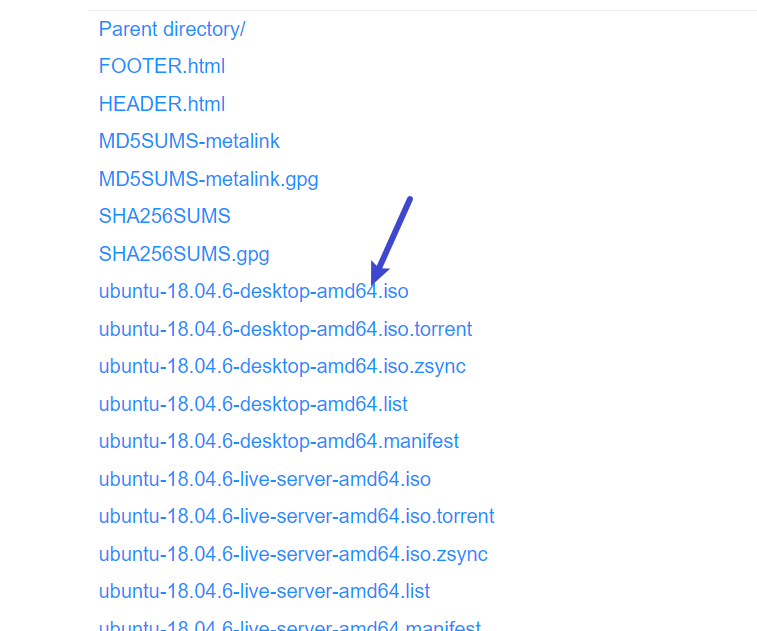
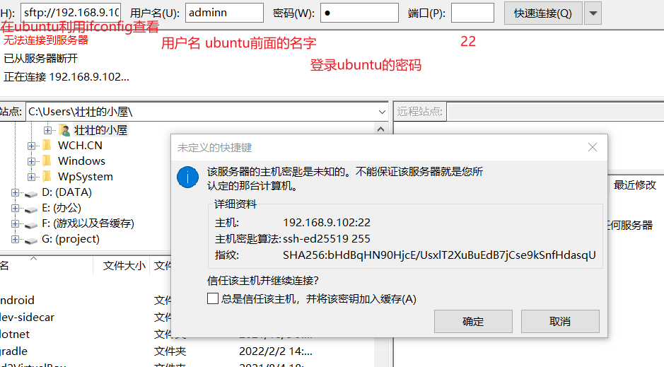
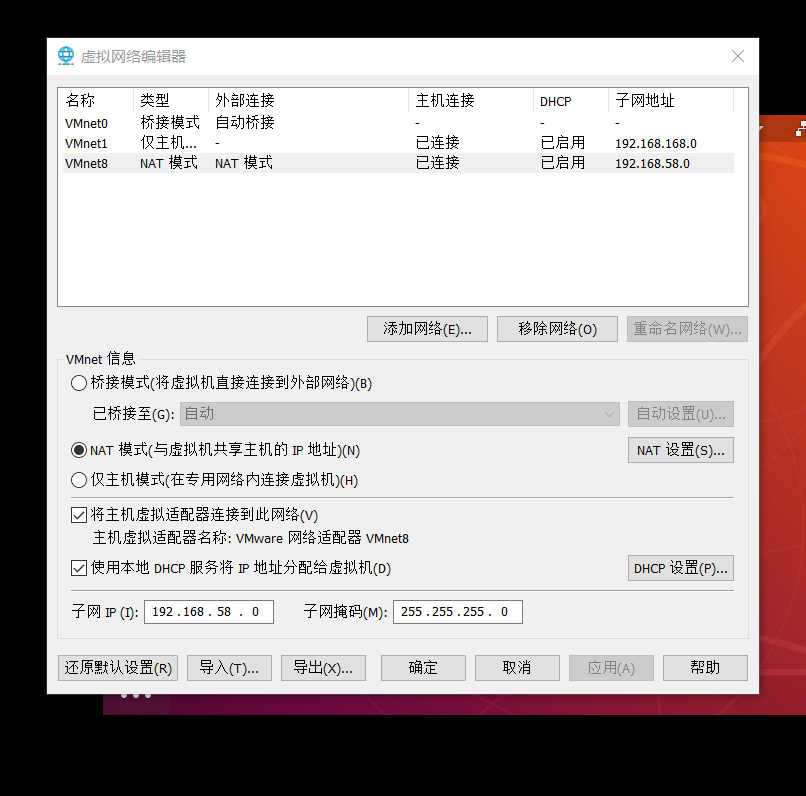
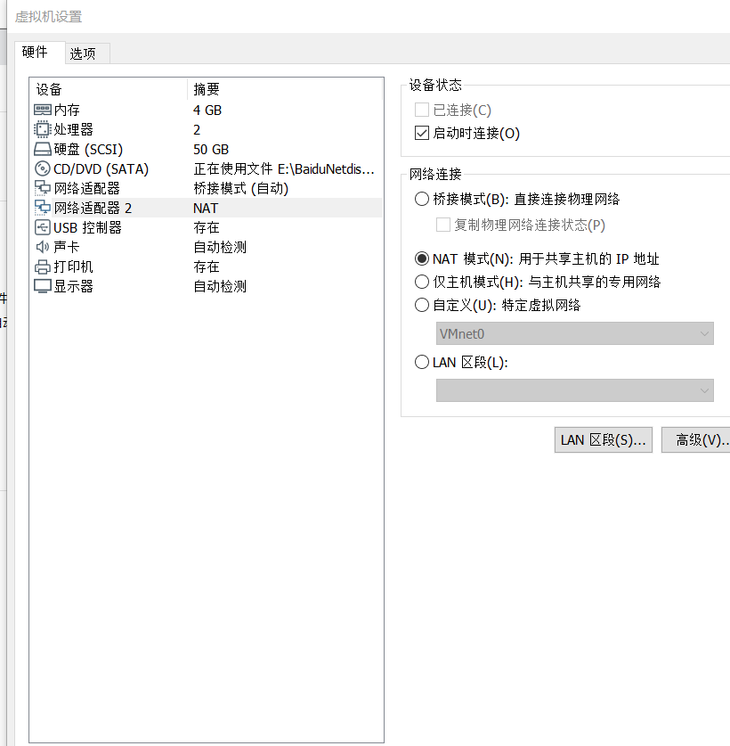
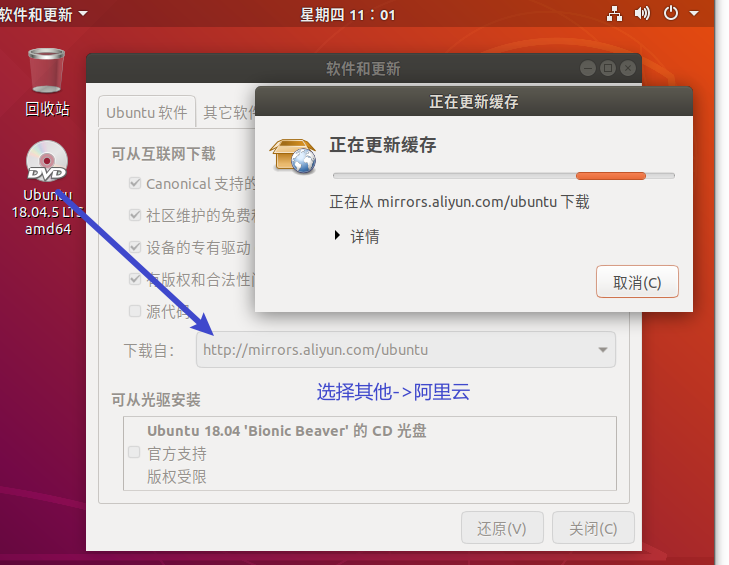

# README

## 乌班图16.04安装

[16.04.7镜像下载](./doc/ubuntu-16.04.7-desktop-amd64.iso)

其他版本镜像下载

```
https://www.ubuntu.com/download（官方下载地址，比较慢）
https://cn.ubuntu.com/（中国官网）
http://mirrors.aliyun.com/ubuntu-releases/（阿里云开源镜像网，推荐）
```



[安装VM15虚拟机](https://www.vmware.com/products/workstation-pro/workstation-pro-evaluation.html)

```
许可证VG5HH-D6E04-0889Y-QXZET-QGUC8
```

[VM下安装乌班图16.04.7参考教程](https://blog.csdn.net/Hongwei_1990/article/details/107570227)

1. 新建虚拟机
2. 不知道的就默认
3. 新建好了以后，编辑虚拟机，将镜像路径添加进去
4. 开机
5. 选择中文，地点选择shanghai

```
注意不要这里下载TOOLS，等安装完成以后手动安装
```

6. 等待安装，安装完成重启（时间较长等待）

## 安装TOOLs

点击安装TOOLS


2. 将DVD下面的TOOLS压缩包复制到HOME

```
利用tar -xf VMxxx进行解压
```

3. 打开终端切换到root用户将vmware文件拖到终端

   ```
   sudo passwd root
   sudo ./vmware-install.pl
   ```

4. 输入yes然后一路回车
5. 安装完以后reboot重启
6. 如果不能使用

```
解决办法1
sudo apt-get install open-vm-tools-desktop
如果提示错误
apt-get update --fix-missing
然后再
sudo apt-get install open-vm-tools-desktop
```

```
解决办法2
sudo apt-get autoremove open-vm-tools
sudo apt-get install open-vm-tools(全部NO)
sudo apt-get install open-vm-tools-desktop
```

## 安装net

```
sudo apt install net-tools
```

查看状态

```
sudo /etc/init.d/ssh status
```

## 安装SSH

```
sudo apt-get install openssh-server
```

## 安装VIM

```
sudo apt-get install vim-gtk
```

```
下列软件包有未满足的依赖关系：
 vim-gtk : 依赖: vim-common (= 2:8.0.1453-1ubuntu1) 但是 2:8.0.1453-1ubuntu1.8 正要被安装
E: 无法修正错误，因为您要求某些软件包保持现状，就是它们破坏了软件包间的依赖关系。


出现该问题时
```

```
sudo apt-get purge vim-common
```


## 连接ubuntu




## 什么是uboot作用是什么

```
就是一个bootloader
初始化DDR（主存）
启动内核启动设备树
linux镜像运行在DDR上
需要将外部存储的linux镜像拷贝到DDR中，再去启动
为系统的启动做准备
PS:uboot里面的数字都是十六进制
```

[uboot官方获取途径](http://www.denx.de/wiki/U-Boot/WebHome)

芯片厂商获取

1. 板子回来后先进行裸机点灯
2. 

查看MMC

```
mmc list
```

打开命令列表

```
help
```

查看某一个命令帮助信息

```
? boot
```

信息查询

```
bdinfo
printev 查看环境变量
setenv设置环境变量，也可以自定义环境变量，也可以删除环境变量
saveenv保存环境变量

```

saveenv使用

```
setenv  bootdelay 5
设置完成以后记得保存
新建环境变量
setenv 变量名 变量值
删除环境变量
setenv 变量名 变量值为空
字符串形式的要用单引号
setenv  bootcmd ''
```

## 内存相关命令

md命令

```
md.b 地址 查看长度
```

nm命令

```
nm.b 地址 修改内容
```

mm命令

```
mm.b 地址 修改内容
相当于nm是地址会递增
```

mw命令

```
mm.b 地址 内容 连续几个地址
```

cp命令

```
cp.b 源地址 目标地址 拷贝几个地址
```

cmp命令

```
cmp.b 地址1 地址2 比较几个地址
```

## 网络命令

ping命令

设置IP地址

```
setenv ipaddr 网段
setenv ethaddr MAC地址
ps:手动设置ubuntu的ip地址防止自动分配
```

nfs网络文件系统

```
将linux内核和根文件通过网络下载到开发板
nfs 下载地址 ip:镜像路径
```

tftp

```
在ubuntu下安装tftp
sudo apt-get install tftp-hpa tftpd-hpa
```

# 共享主机的vpn网络





# 换源



# 安装输入法

按照正点原子QT的输入法进行安装

[安装搜狗输入法](https://shurufa.sogou.com/linux?r=pinyin)

```
1. 在官网下载搜狗输入法安装包，并安装，安装命令 sudo dpkg -i 安装包名
2. 安装输入法依赖

在终端执行

sudo apt install libqt5qml5 libqt5quick5 libqt5quickwidgets5 qml-module-qtquick2

sudo apt install libgsettings-qt1
4、重启电脑、调出输入法
```

