# Linux移植

[配置vim](http://c.biancheng.net/view/3024.html)

[配置内容](https://blog.csdn.net/qq_41113081/article/details/100152358)

```
vim ~/.vimrc
```

## 编译官方的linux

编译st公司提供的linux源码

获取linux源码这里选择5-4版本的，在官方下载的应该是2.1左右的版本

进入源码可以看到和Uboot的源码很像

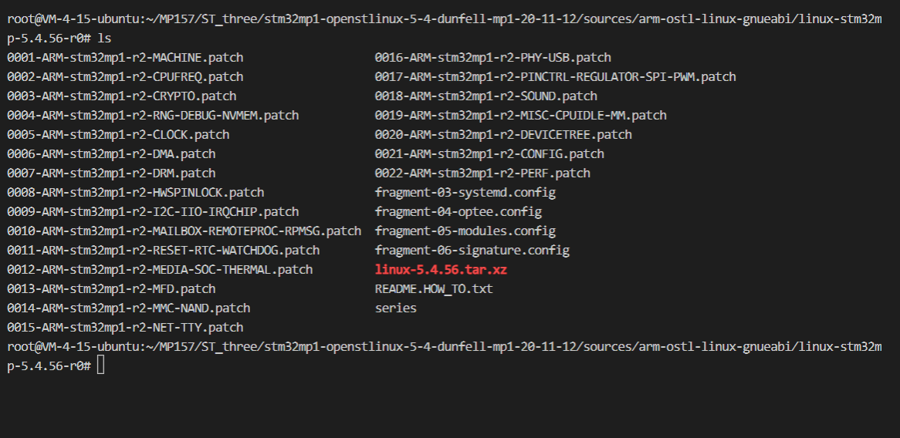

和uboot一样进入目录打补丁

```
cd linux-5.4.31/ //进入 Linux 源码目录
for p in `ls -1 ../*.patch`; do patch -p1 < $p; done //打补丁
```

生成默认的配置文件

```
make ARCH=arm multi_v7_defconfig "fragment*.config" 
```

给.config打补丁

```
for f in `ls -1 ../fragment*.config`; do scripts/kconfig/merge_config.sh -m -r .config $f; done 

yes '' | make ARCH=arm oldconfig
```

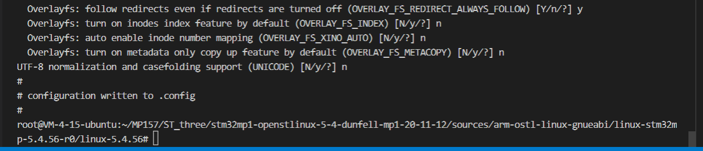

复制配置文件

.config保存着linux内核所有的配置项

```
cp .config ./arch/arm/configs/stm32mp1_atk_defconfig
```

然后cd到./arch/arm/configs/，就可以看到我们复制出来的linux配置文件

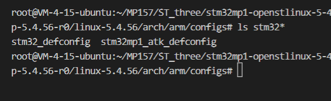

同样将简化目录

```
mkdir my_linux
cp * /root/MP157/led/my_linux/linux-5.4.56 -rf
```

修改Makefile362行左右

```
  ARCH = arm
  CROSS_COMPILE = arm-linux-gnueabihf-
```

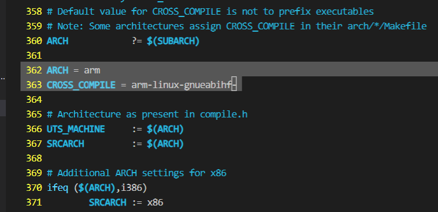

创建脚本文件

```
vim stm32mp157d_atk.sh
```

```
 #!/bin/sh
 make distclean
 make stm32mp1_atk_defconfig
 make menuconfig
 make uImage dtbs LOADADDR=0XC2000040 -j16
```

给权限

```
chmod 777 stm32mp157d_atk.sh
```

出现错误openssl/opensslv.h: No such file or directory错误的解决办法

是因为缺少一些文件需要安装

```
apt-get install yum
sudo apt-get install libssl-dev
```

编译

```
./stm32mp157d_atk.sh
```

编译完成

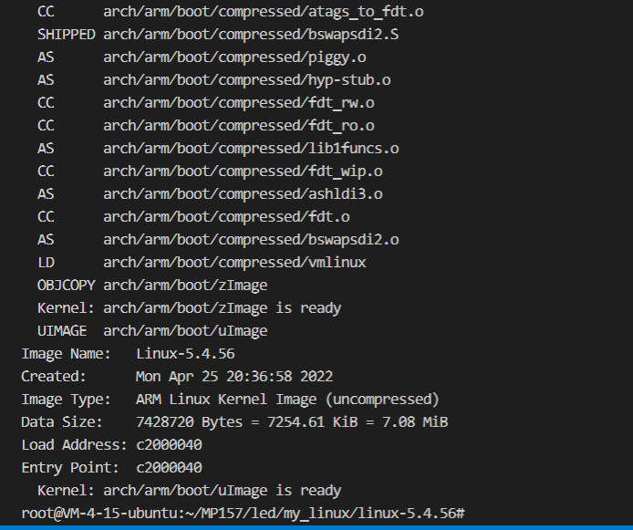

查看生成的产物

```
cd arch/arm/boot/dts

ls stm32mp*.dtb

/root/MP157/led/my_linux/linux-5.4.56/arch/arm/boot

ls
```

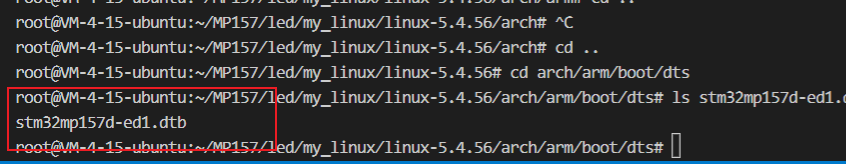

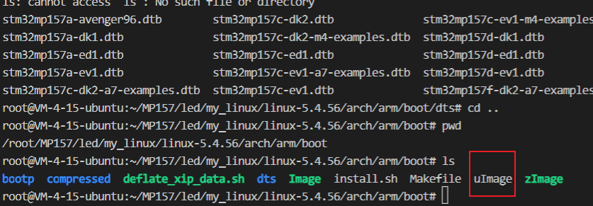

修改网络驱动

将文件motorcomm.c放入一下目录

```
/root/MP157/led/my_linux/linux-5.4.56/drivers/net/phy
```

将文件motorcomm_phy.h放入一下目录

```
/root/MP157/led/my_linux/linux-5.4.56/include/linux
```

修改Makefile

```
cd drivers/net/phy/
obj-$(CONFIG_MOTORCOMM_PHY) += motorcomm.o
```

修改drivers/net/phy/Kconfig 

```
 config MOTORCOMM_PHY
 tristate "Motorcomm PHYs"
 ---help---
 Supports the YT8010, YT8510, YT8511, YT8512 PHYs.
```

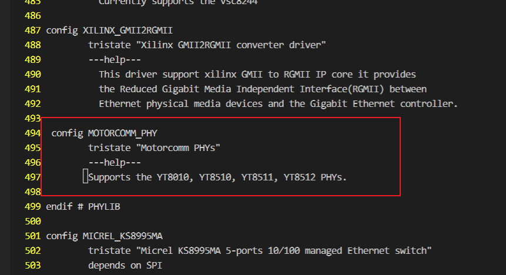

使能YT8511

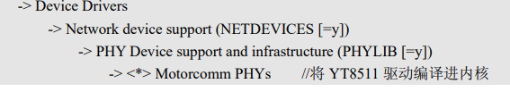

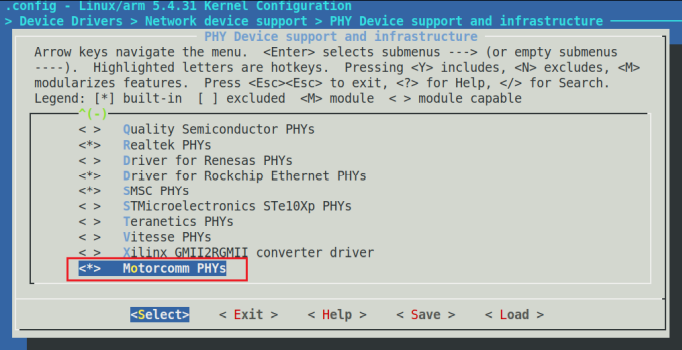

然后编译，出现图形化界面直接退出

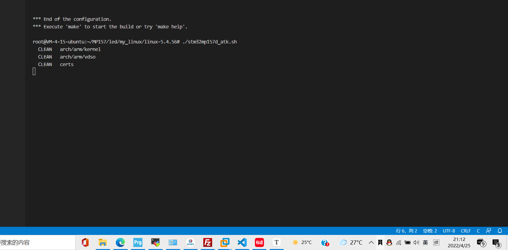

编译成功后查看产物

```
cd arch/arm/boot/dts

ls stm32mp*.dtb

/root/MP157/led/my_linux/linux-5.4.56/arch/arm/boot

ls
```

将uImage和stm32mp157d-ed1.dtb进行烧录

利用tftp烧录

```
setenv bootcmd 'tftp c2000000 uImage;tftp c4000000 stm32mp157d-ed1.dtb;bootm c2000000 - c4000000'

saveenv
```

和之前一样，现在知道为什么会卡了，是因为没有根文件系统

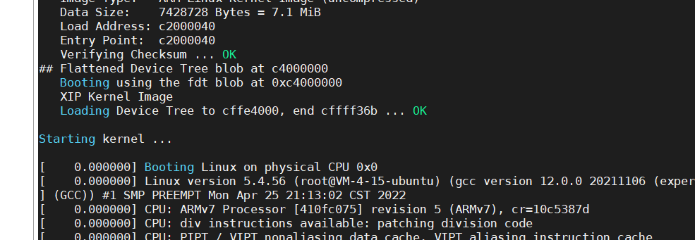

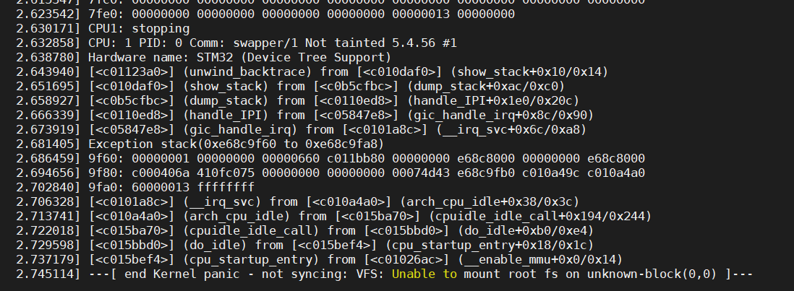

## 开始移植

这是我们之前复制的官方的开发板配置文件

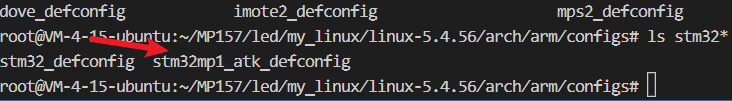

创建设备树头文件

```
cd arch/arm/boot/dts

```

复制官方的头文件

```
cp stm32mp15xx-edx.dtsi stm32mp157d-atk.dtsi
```

创建,原子教程复制的是stm32mp157dc-ed1.dts但是我觉得肯=可能写错了

```
cp stm32mp157d-ed1.dts stm32mp157d-atk.dts
```

将头文件替换一下

```
vim stm32mp157d-atk.dts
```

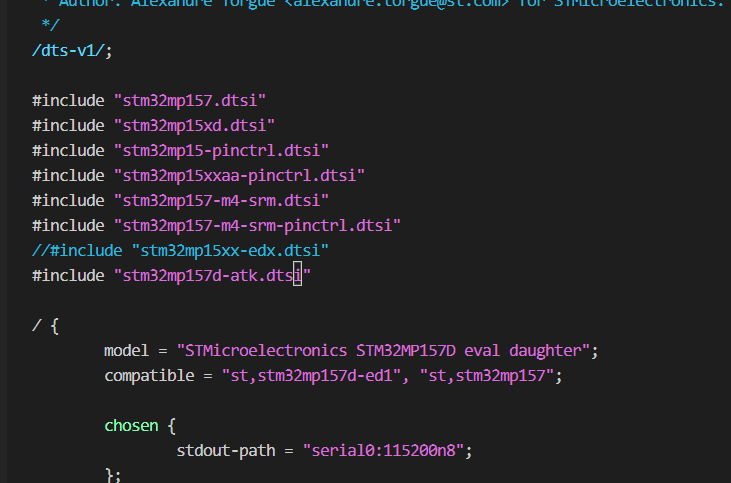

修改stm32mp157d-atk.dtsi 文件

```
vim stm32mp157d-atk.dtsi
```

修改Makefile

```
vim arch/arm/boot/dts/Makefile
```

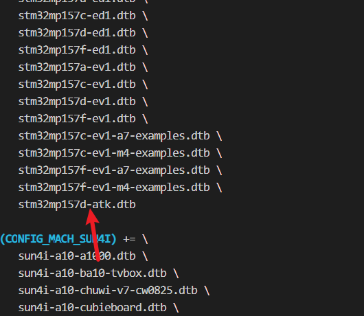

关闭内核验证

```
vim arch/arm/configs/stm32mp1_atk_defconfig
```

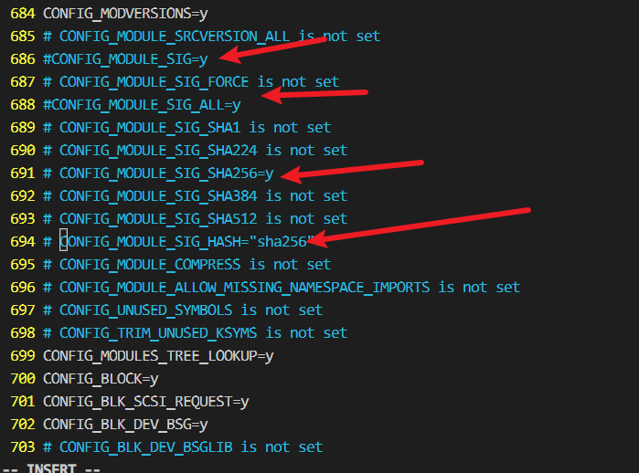

关闭时间戳打印

```
make menuconfig
```

```
-> Kernel hacking 
 -> printk and dmesg options 
->Show timing information on printks //取消选中
```

开始编译

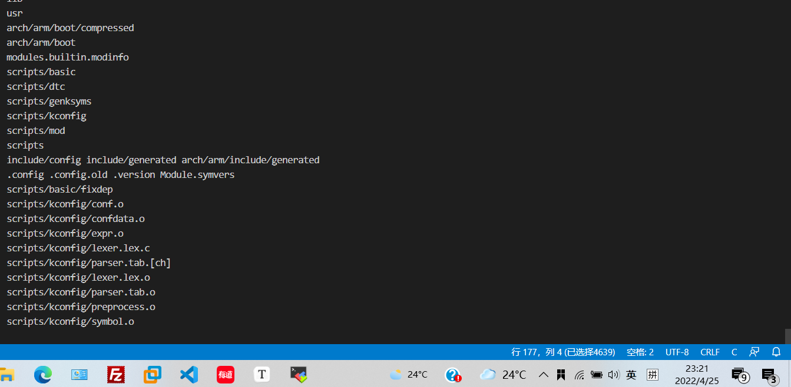

编译成功后烧录测试

下载

```
tftp c2000000 uImage//linu镜像文件
tftp c4000000 stm32mp157d-atk.dtb//设备树文件
bootm c2000000 - c4000000
```

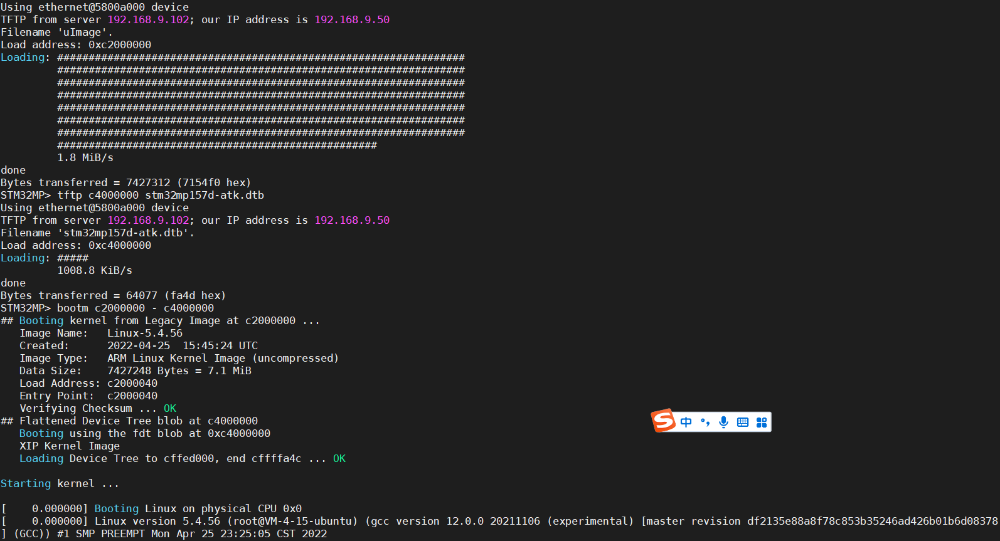

将uImagelinux镜像和设备树文件stm32mp157d-atk.dtb打包在一起

```
mkdir bootfs
//将两个文件拉进去uImage 和 stm32mp157d-atk.dtb 
```

新建磁盘

```
mkdir bootfs
dd if=/dev/zero of=bootfs.ext4 bs=1M count=10
mkfs.ext4 -L bootfs bootfs.ext4
```

dd简介：使用 dd 命令创建一个名为 bootfs.ext4 的磁盘，of 指定磁盘名字为“bootfs.ext4”； bs 指定磁盘输入/输出块大小为 1MB；count 指定磁盘的块数量为 10 个。因此 bootfs.ext4 只能 存放不超过 10MB 的文件，如果要存放的文件总大小超过 10MB，那么就要适当调整 count 参 数的大小。

mkfs.ext4:使用 mkfs.ext4 将 bootfs.ext4 磁盘格式化为 ext4 格式

首先创建一个目录用来挂载前面制作制作出来的 bootfs.ext4，比如我这里创建目录 /mnt/bootfs，命令如下：

```
sudo mkdir /mnt/bootfs
```

接下来使用 mount 命令将 bootfs.ext4 挂载到/mnt/bootfs 目录下，命令如下：

```
sudo mount bootfs.ext4 /mnt/bootfs/
```

将两个文件cp到/mnt/bootfs/

```
sudo cp uImage stm32mp157d-atk.dtb /mnt/bootfs/
```

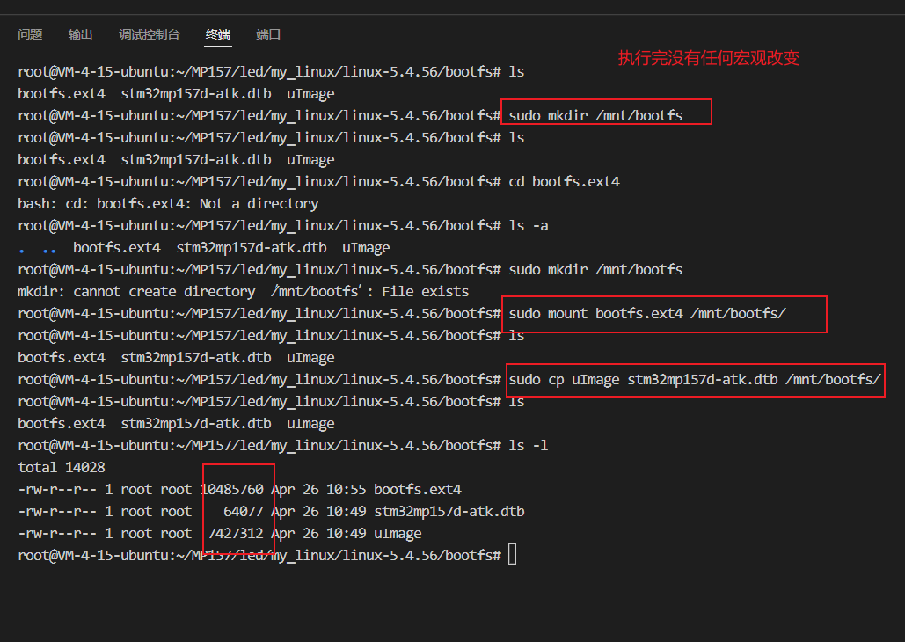

cp之后卸载sudo umount /mnt/bootfs

```
sudo umount /mnt/bootfs
```

利用windows查看bootfs里面的内容

```
ps:这个我没做到，不知道用什么软件进行查看
```

## 烧录

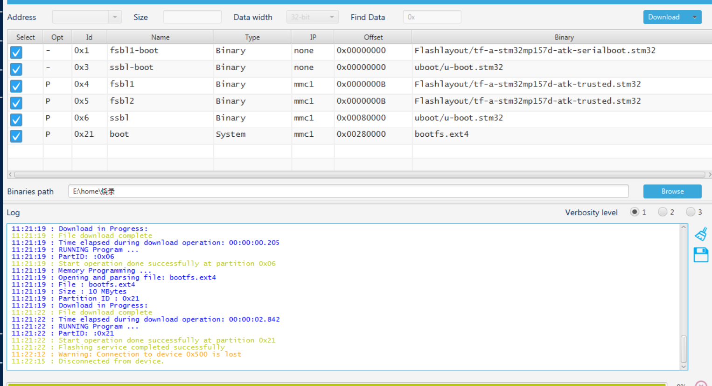

```
ext4ls mmc 1:2
```


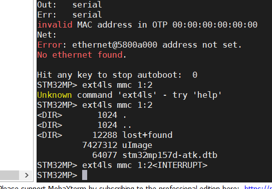

设置环境变量

```
setenv bootcmd 'ext4load mmc 1:2 c2000000 uImage;ext4load mmc 1:2 c4000000 stm32mp157d-atk.dtb;bootm c2000000 - c4000000'

saveenv

boot
```

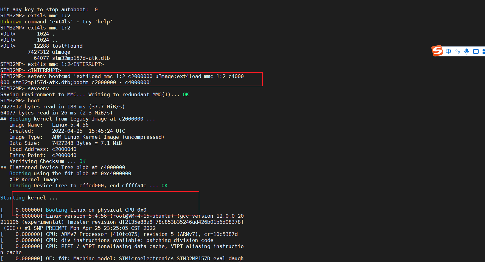

# 二次移植

### 编译st的linux

进入linux源码

```
tar -vxf linux-5.4.31.tar.xz
```

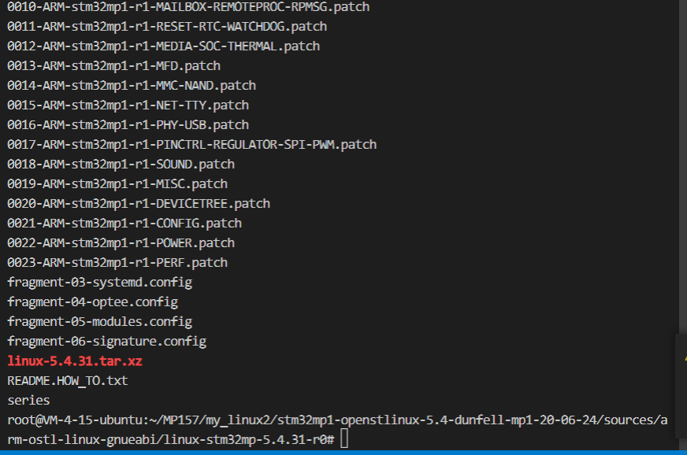

解压完成后进入linux-5.4.31

```
cd linux-5.4.31
打补丁
for p in `ls -1 ../*.patch`; do patch -p1 < $p; done
```

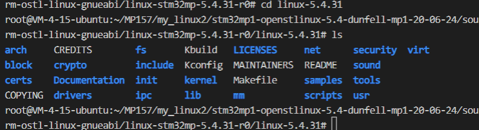

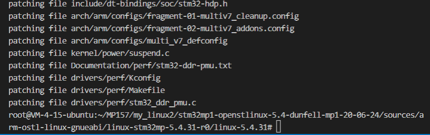

生成默认配置文件,生成.config文件

Linux 内核的所有配置项最终都保存在.config 文件里面

```
make ARCH=arm multi_v7_defconfig "fragment*.config"
```

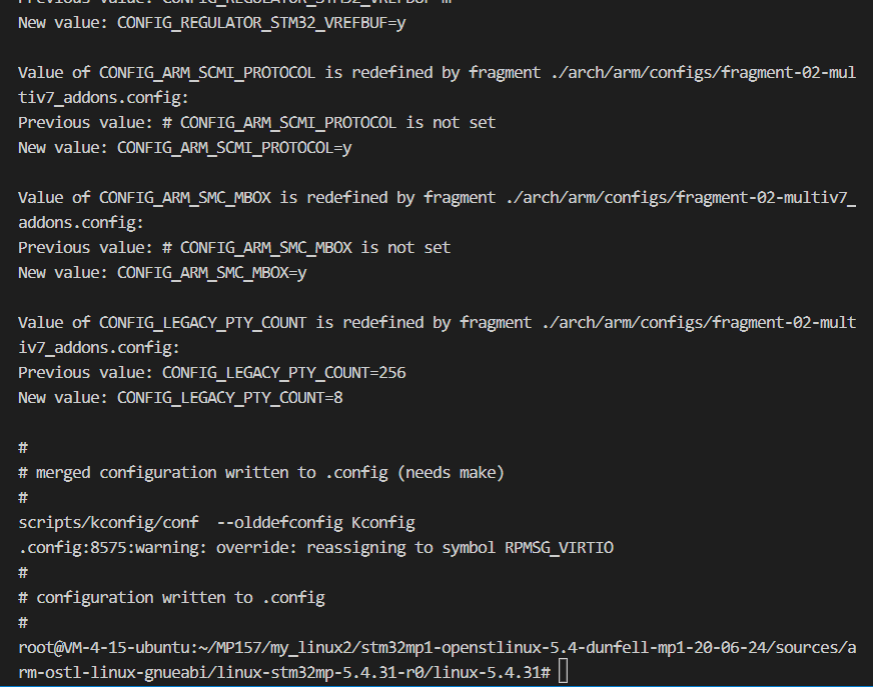

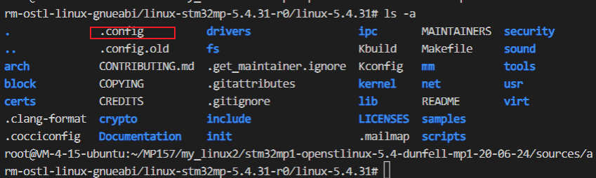

再次打补丁

```
for f in `ls -1 ../fragment*.config`; do scripts/kconfig/merge_config.sh -m -r .config $f; done
yes '' | make ARCH=arm oldconfig
```

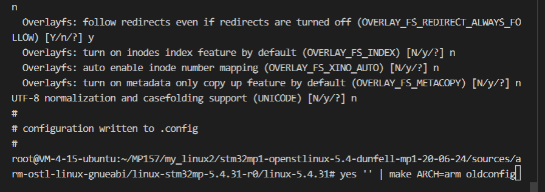

复制出我们的配置项目

```
cp .config ./arch/arm/configs/stm32mp1_atk_defconfig
```

查看

```
cd arch/arm/configs
```

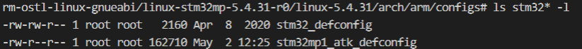

将需要的配置复制出来

```
cp linux-5.4.31 /root/MP157/three/my_three/my_linux -rf
```

仔细看复制的东西，以及路径


修改Makefile

```
vim Makefile
ARCH = arm
CROSS_COMPILE = arm-none-linux-gnueabihf-
```

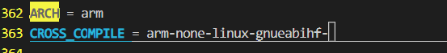

创建stm32mp157d_atk.sh

```
 vim stm32mp157d_atk.sh
 #!/bin/sh
 make distclean
 make stm32mp1_atk_defconfig
 make menuconfig
 make uImage dtbs LOADADDR=0XC2000040 -j16

```

给权限

```
chmod 777 stm32mp157d_atk.sh
./stm32mp157d_atk.sh
```

没编译之前是没有uImage的

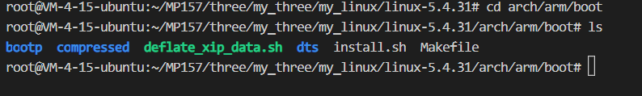

查看编译结果.dbt设备树文件，

```
cd arch/arm/boot
就可以看到uImage 
cd /root/MP157/my_linux/linux-5.4.31/arch/arm/boot/dts
就可以看到设备树文件stm32mp157d-ed1.dtb
PS:我们使用的是stm32mp157d-ed1.dtb 设备树文件
```

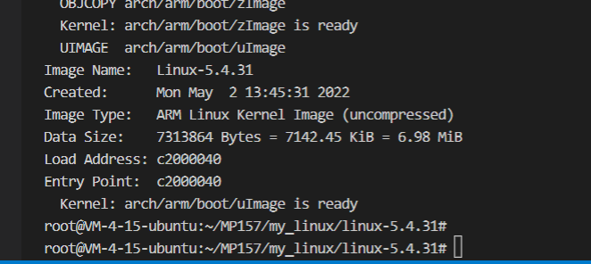

### 网络驱动修改

推荐驱动文件,将motorcomm.c添加到

```
/root/MP157/my_linux/linux-5.4.31/drivers/net/phy
```

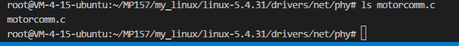

将motorcomm_phy.h添加到

```
/root/MP157/my_linux/linux-5.4.31/include/linux
```

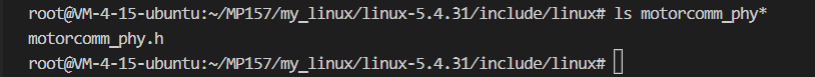

修改Makefile

```
drivers/net/phy/Makefile
```

```
obj-$(CONFIG_MOTORCOMM_PHY) += motorcomm.o
```


修改

```
 drivers/net/phy/Kconfig
```

```
 config MOTORCOMM_PHY
 tristate "Motorcomm PHYs"
 ---help---
 Supports the YT8010, YT8510, YT8511, YT8512 PHYs.

```

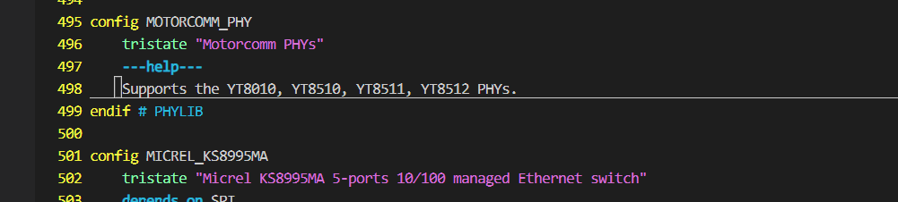

图像化配置

```
make menuconfig
```

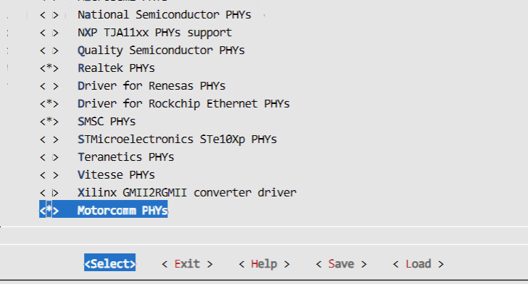

### 添加自己的开发板

进入设备树目录

```
/root/MP157/my_linux/linux-5.4.31/arch/arm/boot/dts
新建设备树头文件
vim stm32mp157d-atk.dtsi
cp stm32mp15xx-edx.dtsi stm32mp157d-atk.dtsi

新建设备树文件
cp stm32mp157c-ed1.dts stm32mp157d-atk.dts
vim stm32mp157d-atk.dts
```

把设备树里面的头文件修改一下

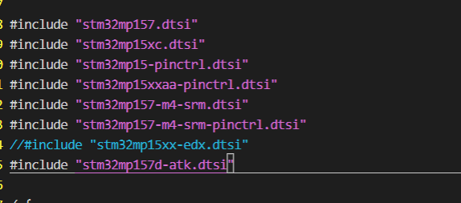

修改设备树头文件

```
vim stm32mp157d-atk.dtsi
//将内容全部替换
```

```
/* Copyright (C) STMicroelectronics 2017 - All Rights Reserved
* Author: Ludovic Barre <ludovic.barre@st.com> for ST.
*/
#include "stm32mp157-m4-srm.dtsi"
#include "stm32mp157-m4-srm-pinctrl.dtsi"
#include <dt-bindings/gpio/gpio.h>
#include <dt-bindings/mfd/st,stpmic1.h>

/ {
 memory@c0000000 {
 device_type = "memory";
 reg = <0xC0000000 0x40000000>;
 };
 
 reserved-memory {
 #address-cells = <1>;
 #size-cells = <1>;
 ranges;
 
 mcuram2: mcuram2@10000000 {
 compatible = "shared-dma-pool";
 reg = <0x10000000 0x40000>;
 no-map;
 };
 
 vdev0vring0: vdev0vring0@10040000 {
 compatible = "shared-dma-pool";
 reg = <0x10040000 0x1000>;
 no-map;
 };
 
 vdev0vring1: vdev0vring1@10041000 {
 compatible = "shared-dma-pool";
 reg = <0x10041000 0x1000>;
 no-map;
 };
 
 vdev0buffer: vdev0buffer@10042000 {
 compatible = "shared-dma-pool";
 reg = <0x10042000 0x4000>;
 no-map;
 };
 
 mcuram: mcuram@30000000 {
 compatible = "shared-dma-pool";
 reg = <0x30000000 0x40000>;
 no-map;
 };
 
 retram: retram@38000000 {
 compatible = "shared-dma-pool";
 reg = <0x38000000 0x10000>;
 no-map;
 };
 };
 
 vddcore: buck1 {
 compatible = "regulator-fixed";
 regulator-name = "vddcore";
 regulator-min-microvolt = <1200000>;
 regulator-max-microvolt = <1350000>;
 regulator-always-on;
 regulator-boot-on;
 };
 
 v3v3: regulator-3p3v {
 compatible = "regulator-fixed";
 regulator-name = "v3v3";
 regulator-min-microvolt = <3300000>;
 regulator-max-microvolt = <3300000>;
 regulator-always-on;
 regulator-boot-on;
 };
 };
 
 &cpu0{
 cpu-supply = <&vddcore>;
 };
 
 &crc1 {
 status = "okay";
 };
 
 &dma1 {
 sram = <&dma_pool>;
 };
 
 &dma2 {
 sram = <&dma_pool>;
 };
 
 &dts {
 status = "okay";
 };
 
 &ethernet0 {
 status = "okay";
 pinctrl-0 = <&ethernet0_rgmii_pins_a>;
 pinctrl-1 = <&ethernet0_rgmii_pins_sleep_a>;
 pinctrl-names = "default", "sleep";
 phy-mode = "rgmii-id";
 max-speed = <1000>;
 phy-handle = <&phy0>;

 mdio0 {
 #address-cells = <1>;
 #size-cells = <0>;
 compatible = "snps,dwmac-mdio";
 phy0: ethernet-phy@0 {
 reg = <0>;
 };
 };
 };

 &hash1 {
 status = "okay";
 };

 &ipcc {
 status = "okay";
 };

 &iwdg2 {
 timeout-sec = <32>;
 status = "okay";
  };

 &rng1 {
 status = "okay";
 };

 &rtc {
 status = "okay";
 };

 &sdmmc1 {
 pinctrl-names = "default", "opendrain", "sleep";
 pinctrl-0 = <&sdmmc1_b4_pins_a>;
 pinctrl-1 = <&sdmmc1_b4_od_pins_a>;
 pinctrl-2 = <&sdmmc1_b4_sleep_pins_a>;
 broken-cd;
 st,neg-edge;
 bus-width = <4>;
 vmmc-supply = <&v3v3>;
 status = "okay";
 };

 &sdmmc2 {
 pinctrl-names = "default", "opendrain", "sleep";
 pinctrl-0 = <&sdmmc2_b4_pins_a>;
 pinctrl-1 = <&sdmmc2_b4_od_pins_a>;
 pinctrl-2 = <&sdmmc2_b4_sleep_pins_a>;
 non-removable;
 st,neg-edge;
 bus-width = <8>;
 vmmc-supply = <&v3v3>;
 keep-power-in-suspend;
 status = "okay";
 };

 &sram {
 dma_pool: dma_pool@0 {
 reg = <0x50000 0x10000>;
 pool;
 };
 };

 &uart4 {
 pinctrl-names = "default", "sleep", "idle";
 pinctrl-0 = <&uart4_pins_a>;
 pinctrl-1 = <&uart4_sleep_pins_a>;
 pinctrl-2 = <&uart4_idle_pins_a>;
 pinctrl-3 = <&uart4_pins_a>;
 /delete-property/dmas;
 /delete-property/dma-names;
 status = "okay";
 };

```

修改Makefile

```
vim Makefile
```

```
stm32mp157d-atk.dtb
```

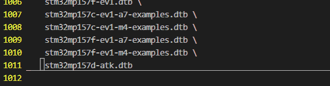

关闭内核模块验证

```
vim arch/arm/configs/stm32mp1_atk_defconfig
```

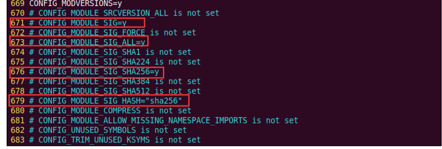

配置内核

```
cd 到linux目录
make menuconfig
```

make menuconfig一共配置了三项

```
//配置网卡
-> Device Drivers 
 -> Network device support (NETDEVICES [=y]) 
 -> PHY Device support and infrastructure (PHYLIB [=y]) 
-> <*> Motorcomm PHYs //将 YT8511 驱动编译进内核

```

```
//关闭内核验证
-> Enable loadable module support (MODULES [=y]) 
->Module signature verification
```

```
//关闭时间戳
-> Kernel hacking 
 -> printk and dmesg options 
->Show timing information on printks //取消选中
```

和上面一样关闭内核验证

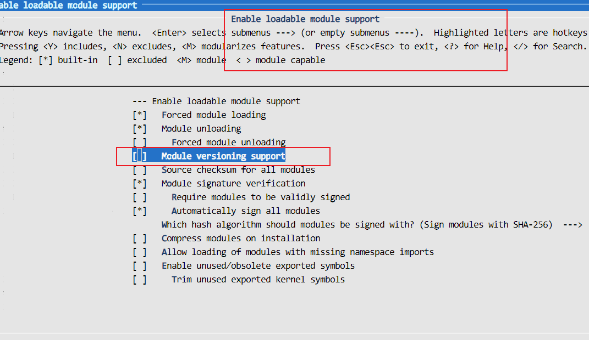

保存配置

```
./arch/arm/configs/stm32mp1_atk_defconfig
```

编译

```
 make stm32mp1_atk_defconfig
 make uImage dtbs LOADADDR=0XC2000040 -j16
```

镜像设备树

```
/root/MP157/my_linux/linux-5.4.31/arch/arm/boot
```

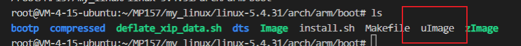

```
/root/MP157/my_linux/linux-5.4.31/arch/arm/boot/dts
```

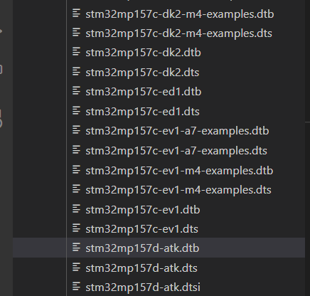

制作.ext4文件  #!/bin/sh

```
dd if=/dev/zero of=bootfs.ext4 bs=1M count=10
mkfs.ext4 -L bootfs bootfs.ext4

sudo mkdir /mnt/bootfs
sudo mount bootfs.ext4 /mnt/bootfs/
sudo cp uImage stm32mp157d-atk.dtb /mnt/bootfs/

sudo umount /mnt/bootfs


```

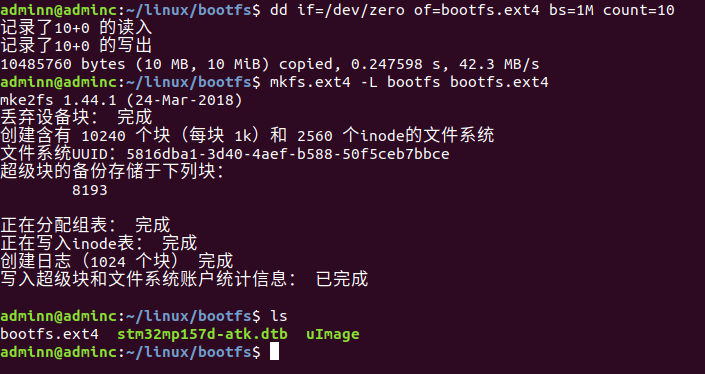

看下.ext4文件


### 路径config

make menuconfig

```
./arch/arm/configs/stm32mp1_atk_defconfig
```

```
/root/MP157/my_linux/linux-5.4.31/arch/arm/configs 
```

编译 stm32mp157d-atk.dts 设备树

