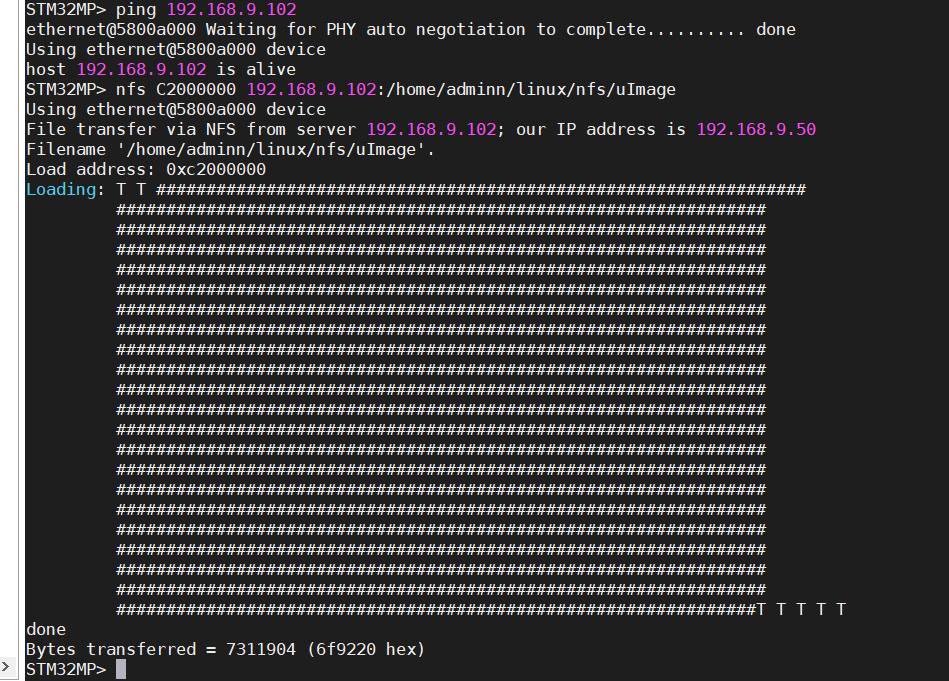
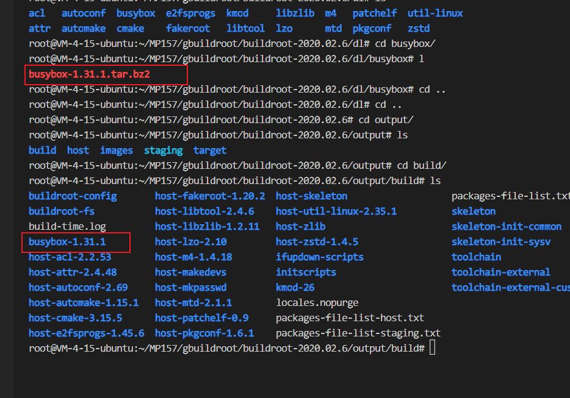

## buildroot

源码获取

[官方](https://buildroot.org/)

例程源码-》7、buildroot 源码-》buildroot-2020.02.6.tar.bz2，

也是官方版本问题

[【正点原子】STM32MP1嵌入式Linux驱动开发指南V2.0.pdf](file:///E:/BaiduNetdiskDownload/【正点原子】STM32MP157开发板（A盘）-基础资料/【正点原子】STM32MP1嵌入式Linux驱动开发指南V2.0.pdf)

创建gbuildroot解压源码

```
mkdir gbuildroot
```


## 开始配置

```
make menuconfig
```


配置1

配置2


配置3


配置4


```
/root/MP157/arm/gcc-arm-9.2-2019.12-x86_64-arm-none-linux-gnueabihf
```


按照原子教程配置的

PS:交叉编译环境哪个需要设置版本号我和原子不一样，我的gcc编译根据是12版本的原子的是9版本的

在这就出错了说是想得到4.20的linux内核但是得到了5.14的，但是在内核选择哪里并没有5.14的

怀疑是Toolchain origin项选择错了，gcc没有12版本的，内核版本没有4.20.x的


## 保存路径选择

```
./configs/stm32mp1_atk_defconfig
make stm32mp1_atk_defconfig
```


使用

```
make stm32mp1_atk_defconfig
```


编译

```
sudo make
```

完成以后


## 烧录

我们使用上面的rootfs.tar利用nfs将根文件系统烧录到开发板

复习nfs使用方法

将rootfs.tar放入我们之前创建好的nfs文件夹下

```
本教程不用的信息，仅做介绍nfs命令的格式
nfs C2000000 192.168.9.102:/home/adminn/linux/nfs/uImage
nfs DDR地址   要下载的文件来源于哪个主机的ip 目录
```

进入uboot模式

使用这条命令可以，

```
setenv bootargs 'root=/dev/nfs nfsroot=192.168.9.102:/home/adminn/linux/nfs,proto=tcp rw ip=192.168.9.50:192.168.9.102:192.168.9.1:255.255.255.0::eth0:off'
```

这条就不行,会出现以下错误，还有一个原因就是没有ping通主机

可以先ping通主机再次boot就可以

```
setenv bootargs 'console=ttySTM0,115200 root=/dev/nfs nfsroot=192.168.9.102:/home/adminn/linux/nfs,proto=tcp rw ip=192.168.9.50:192.168.9.102:192.168.9.1:255.255.255.0::eth0:off'
```


```
bootargs介绍。就是在启动uboot以后将bootargs的参数传给linux 548页
```

```
setenv bootargs 'console=ttySTM0,115200 root=/dev/nfs nfsroot=192.168.9.102:/home/adminn/linux/nfs,proto=tcp rw ip=192.168.9.50:192.168.9.102:192.168.9.1:255.255.255.0::eth0:off'

saveenv

boot
```

```
setenv bootargs 'console=tty1 console=ttySTM0,115200 root=/dev/nfs nfsroot=192.168.9.102:/home/adminn/linux/nfs,proto=tcp rw ip=192.168.9.50:192.168.9.102:192.168.9.1:255.255.255.0::eth0:off'
```

烧录完成，在这又遇到一个问题就是当不使用密码的时候，还是需要我输入密码，但是没有密码啊，所以就进不去，只能从新 make menuconfig，使能密码项


## 配置busybox

```
cd dl/busybox
```


在一下目录下找到解压后的busybox（主要本身就存在的，不需要我们解压）

```
cd output/build
```



进入busybox-1.31.1后执行，原子这里执行的是sudo make busybox-menuconfig命令不行

需要执行

```
sudo make menuconfig
```


### 配置支持中文

这个在busybox移植的时候做过一次而且我刚好把那个文件下载了，真是太好用了

这里我就不做了直接把之前做好的复制进去，[教程链接](./根文件系统的制作.md)

最后需要使能unicode

可以单独编译busyboot

```
sudo make busybox
sudo make
```

查看是否是刚编译的

```
cd output/images
```


## 配置buildroot

使能一些第三方的库比如 FTP 和 SSH 服务等

### 开始FTP ssh 服务器

```
开启之后会下三方包需要一段时间，最好使使用VPN，要不然可能下载不来，没测试过我一直使用的vpn
```


配置完成以后保存make

```
./configs/stm32mp1_atk_defconfig
make stm32mp1_atk_defconfig
PS:这里注意每次保存的时候他都四默认路径，我们必须将其改为自己的路径
```

进行烧录测试

```
ps：烧录之前一定先ping通主机
```

PS:如果是通过 nfs 挂载的根文件系统，那么网络已经初始 化完成了，因此可以直接使用。如果是烧写到 EMMC 里面的，那么就需要先配置网络相关功 能。

###  buildroot 根文件系统测试


这里我之前用的是 arm-linux编译器所以不能之前

换用arm-none-linux编译器就可以了


#### 中文测试

可执行文件可以显示中文目录不可以，但是这属于正常情况应该是串口软件的问题（咨询过原子的售后）

#### 开启自动程序测试

在/etc/init.d/rcS文件夹加入启动hell程序


用ctrl+c竟然杀不掉


#### ping百度

命令不行，原因是开发板连接的电脑，电脑连接的wifi这这样只能ping局域网，不能ping外网（百度淘宝这样的）

将网线插入路由器上

执行分配ip

```
udhcpc
```

## buildroot下的busybox配置

进入busybox目录

```
cd output/build/busybox-1.31.1/
```

执行

```
make menuconfig
sudo make busybox-menuconfig
```

然后进行配置，配置完成以后进行如下界面的保存

```
/root/MP157/led/buildroot/buildroot-2020.02.6/output/build/busybox-1.31.1/configs/stm32mp1_atk_defconfig


./configs/stm32mp1_atk_defconfig
```


保存之后执行

```
make stm32mp1_atk_defconfig
sudo make
```

回到buildroot目录下

```
sudo make busybox-menuconfig
sudo make busybox
sudo make
```

####  depmod 命令测试

```
配置好以后在sbin文件夹下查看
```

这个默认使能我们可以先输入命令试一下，出现这个就是已经使能了，如果出现未找到文件就是没有使能，我们需要在busybox下执行make menuconfig，进行配置


#### vsftpd 测试

编译根文件系统时候发现到这卡住了

最终也是下在成功了/root/MP157/gbuildroot/buildroot-2020.02.6/output/build/vsftpd-3.0.3/vsftpd.conf


```
/etc/vsftpd.conf
```

使能


更改文件的所有者

```
sudo chown root:root vsftpd.conf
sudo chown root:root etc/vsftpd.conf
```


在开发上新建用户

```
adduser zhung
密码123456
```

重启开发板查看进程

```
ps
```


要设置密码才行


完成


#### ssh测试

基本与vsftpd一样

用户

```
sudo chown root:root var/empty//在ubuntu下配置
chown root:root empty//在开发板上配置
```


通过ssh利用乌班图连接开发板


## 设置路径显示

PS1 用于设置命令提示符格式

```
PS1 = ‘命令列表’
命令列表中可选的参数如下：
\!：显示该命令的历史记录编号。
\#：显示当前命令的命令编号。
\$：显示$符作为提示符，如果用户是 root 的话，则显示#号。
\\：显示反斜杠。
\d：显示当前日期。
\h：显示主机名。
\n：打印新行。
\nnn：显示 nnn 的八进制值。
\s：显示当前运行的 shell 的名字。
\t：显示当前时间。
\u：显示当前用户的用户名。
\W：显示当前工作目录的名字。
\w：显示当前工作目录的路径
```

创建脚本文件，添加脚本

```
#!/bin/sh

PS1='[\u@\h]:\w$ '
export PS1
```


## 创建调试文件

加入代码,命令是挂载/sys/kernel/debug 目录，文件系统为 debugfs

```
mount -t debugfs none /sys/kernel/debug
```


验证


## 制作.ext4文件

烧录到EMMC中

```
在root目录下
mkdir rootfs

cd rootfs

dd if=/dev/zero of=rootfs.ext4 bs=1M count=512

mkfs.ext4 -L rootfs rootfs.ext4
完成以后在rootfs目录下生成一个512M大小的rootfs.ext4文件
```


创建挂载点

```
sudo mkdir /mnt/rootf

sudo mount rootfs.ext4 /mnt/rootf/

将rootfs.ext4挂载到/mnt/rootf点上
```


将我们所有的内容都cp到挂载点上

```
cd nfs

sudo cp * /mnt/rootf/ -drf 
///root/MP157/bootbuild/buildroot-2020.02.6/output/images下的rootfs.tar

```


最后将挂载点卸掉

```
sudo umount /mnt/rootf
```

烧录文件的添加


修改uboot的环境变量

```
setenv bootcmd 'ext4load mmc 1:2 c2000000 uImage;ext4load mmc 1:2 c4000000 stm32mp157d-atk.dtb;bootm c2000000 - c4000000'

setenv bootargs 'console=ttySTM0,115200 root=/dev/mmcblk1p3 rootwait rw'

saveenv

boot
```

## 启动网络

从EMMC启动默认不


手动开启

```
ifconfig eth0 up
```


目前还是不能用需要配置

```
ifconfig eth0 192.168.9.50 netmask 255.255.255.0
ifconfig eth0 192.168.10.50 netmask 255.255.255.0
```

如果需要开机自动设置静态 IP 地址，那么就可以在/etc/init.d/Sautorun 中添加如下两行：

```
如果需要开机自动设置静态 IP 地址，那么就可以在/etc/init.d/Sautorun 中添加如下两行：
ifconfig eth0 up //打开 eth0
ifconfig eth0 192.168.1.250 netmask 255.255.255.0 //设置 IP 地址
```

```
如果开发板连接路由器的话就更简单了，不需要我们手动设置静态 IP 地址，直接使用
“udhcpc”命令从路由器获取动态 IP 地址即可
```

利用nfs可以使用ssh服务

利用EMMC就不可以


## 两种启动方法环境变量的设置

从NFS启动

```


没测试过
setenv bootargs 'console=ttySTM0,115200 root=/dev/nfs nfsroot=192.168.10.102:/home/adminn/linux/nfs,proto=tcp rw ip=192.168.10.50:192.168.10.102:192.168.10.1:255.255.255.0::eth0:off'

测试过，后面是改ip所有这两条命令
setenv bootargs 'root=/dev/nfs nfsroot=192.168.9.102:/home/adminn/linux/nfs,proto=tcp rw ip=192.168.9.50:192.168.9.102:192.168.9.1:255.255.255.0::eth0:off'

saveenv

boot


```

从EMMC启动

```

setenv bootcmd 'ext4load mmc 1:2 c2000000 uImage;ext4load mmc 1:2 c4000000 stm32mp157d-atk.dtb;bootm c2000000 - c4000000'


setenv bootargs 'console=ttySTM0,115200 root=/dev/mmcblk1p3 rootwait rw'

saveenv

boot
```


## buildroot配置busy过程

```
之前一直是要么depmod不能使用要么登录不能使用
首先在buildroot下执行
sudo make busybox-menuconfig
配置完成以后保存
./configs/stm32mp1_atk_defconfig
然后进入busybox目录下
make stm32mp1_atk_defconfig
回到buildroot下执行
make stm32mp1_atk_defconfig
sudo make show-targets
sudo make busybox
sudo make
```

## 显示路径

```
vi /etc/profile.d myprofile.sh

#!/bin/sh
PS1='[\u@\h]:\w$ '
export PS1
```

## 开始SSH服务

```
chown root:root empty//在开发板上配置
```

## 设置静态IP

```
vi /etc/init.d/Sautorun
ifconfig eth0 up //打开 eth0
ifconfig eth0 192.168.1.250 netmask 255.255.255.0 //设置 IP 地址
chmod 777 Sautorun
```

## 创建驱动加载目录

```
cd /lib
mkdir modules
cd modules
mkdir 5.4.31
depmod
```


