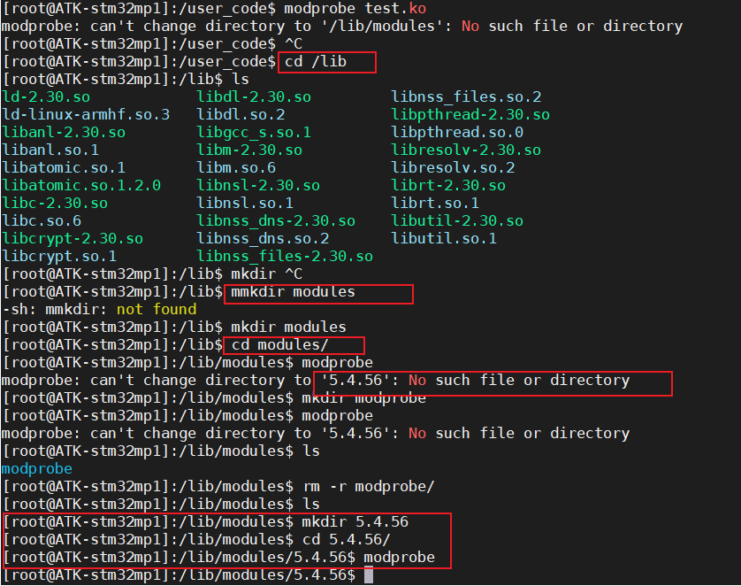
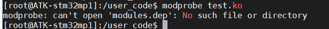
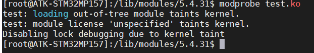

# 驱动开发

最简单的驱动程序，一个加载函数，一个卸载函数

```
#include <linux/module.h>
/**
 * @brief 模块入口
 * 
 */
static int __init test_init(void)
{
  printk("test_init");
	return 0;
}

static void __exit test_exit(void)
{
  printk("test_exit");
}

module_init(test_init);
module_exit(test_exit);

```

Makefile

```
KERNELDIR := /root/MP157/led/my_linux/linux-5.4.56
CURRENT_PATH := $(shell pwd)
obj-m := test.o

build: kernel_modules

kernel_modules:
#MAKE就是make -C是切换到内核路径下 M代表源码的目录
	$(MAKE) -C $(KERNELDIR) M=$(CURRENT_PATH) modules
clean:
	$(MAKE) -C $(KERNELDIR) M=$(CURRENT_PATH) clean
```

make生成的产物，我们用到的就是.ko文件（驱动文件）


模块加载命令,注意一下教程是5.4.56的现在我们使用的是5.4.31
加载模块命令insmod xxx.ko，modprobe xxx.ko
卸载模块命令rmmod xxx.ko，modprobe -r xxx.ko

- insmod xxx.ko

  ```
  此命令不会解决依赖关系，比如A.KO依赖于B.KO用户需要先加载B.KO再加载A.KO
  ```

- modprobe xxx.ko

  ```
  modprobe test.ko
  可以解决依赖关系但是出现以下错误需要自行解决，自行创建文件夹
  ```



- 加载新模块的时候需要解决问题

  ```
  depmod
  ```

  

​	提示内核被污染，是因为没有加标签



加协议

```
MODULE_LICENSE("GPL");
```

scp命令

```
scp /home/space/music/1.mp3 root@www.runoob.com:/home/root/others/music 
scp 想要复制的文件 远程用户名@远程ip:远程命令 
```

