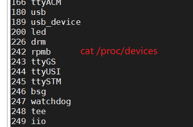
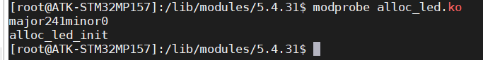

# Linux驱动硬件工作

利用scp命令传送文件

```
scp .\test.c root@1.117.177.177:/root/MP157/code/deriver
```

所以本章的 LED 灯驱动最 终也是对 STM32MP157 的 IO 口进行配置，与裸机实验不同的是，在 Linux 下编写驱动要符合 Linux 的驱动框架。开发板上的 LED0 连接到 STM32MP157 的 PI0 这个引脚上，因此本章实验 的重点就是编写 Linux 下 STM32MP157 引脚控制驱动。

## 地址映射

linux不能直接对物理地址操作（物理地址就是平常参考手册里面的地址），在linux下操作的都是虚拟地址，所以我们需要知道物理地址对应的虚拟地址是多少

我们的开发板上有 1GB 的 DDR3，这 1GB 的 内存就是物理内存，经过 MMU 可以将其映射到整个 4GB 的虚拟空间

物理内存和虚拟内存之间的转换，需要用到 两个函数：ioremap 和 iounmap。

### ioremap 函 数 

va=ioremap （物理地址，字节数量）

用 于 获 取 指 定 物 理 地 址 空 间 对 应 的 虚 拟 地 址 空 间

### iounmap 函数

iounmap （va）

 卸载驱动的时候需要使用 iounmap 函数释放掉 ioremap 函数所做的映射

### I/O 内存访问函数

#### 读操作函数

```
 u8 readb(const volatile void __iomem *addr)
 u16 readw(const volatile void __iomem *addr)
 u32 readl(const volatile void __iomem *addr)
```

#### 写操作函数

```
 void writeb(u8 value, volatile void __iomem *addr)
 void writew(u16 value, volatile void __iomem *addr)
 void writel(u32 value, volatile void __iomem *addr)
```

## 字符设备的创建

```
#include <linux/kernel.h>
#include <linux/module.h>
#include <linux/init.h>
#include <linux/fs.h>
#include <linux/compiler.h>
#include <linux/types.h>

#define LED_MAJOR 200
#define LED_NAME "led"

static ssize_t led_write(struct file *filp, const char __user *buf,
			 size_t count, loff_t *ppos)
{
	return 0;
}
static int led_open(struct inode *inode, struct file *filp)
{
	return 0;
}

static int led_close(struct inode *inode, struct file *filp)
{
	return 0;
}

/*注册驱动的加载*/
static int __init led_init(void)
{
	const struct file_operations led_fops = {
		.owner = THIS_MODULE,
		.write = led_write,
		.open = led_open,
		.release = led_close,
	};
	/*注册字符设备*/
	int ret = register_chrdev(LED_MAJOR, LED_NAME,&led_fops);
  if(ret<0){
    printk("register_chrdev failed\r\n");
    return -EIO;
  }
	printk("led_init\r\n");
	return 0;
}

/*注册驱动的卸载*/

static void __exit led_exit(void)
{
  unregister_chrdev(LED_MAJOR,LED_NAME);
	printk("led_exit\r\n");
}

/*加载 卸载*/
module_init(led_init);
module_exit(led_exit);

/*标签*/
MODULE_LICENSE("GPL");
MODULE_AUTHOR("ZHUANG");

```

```
cat /proc/devices
查看字符设备
```



创建设备节点

```
mknod /dev/led c 200 0
ls /dev/led -l
```

对节点进行操作

```
./ledapp /dev/led 1 开灯
./ledapp /dev/led 0 关灯
```

## 新字符设备的创建

区别自动分配设备号就可以随意创建了，而且此设备号也可以指定。

此设备号有2^10-1个

### 随机分配

```
int alloc_chrdev_region(dev_t *dev, unsigned baseminor, unsigned count, const char *name)
/**
dev主设备号
baseminor从几开始
count需要几个
name名字
**/
```

### 指定主设备号和此设备号

设备号由主设备号和此设备号组成

```
	int major; /*主设备号*/
	int minor; /*此设备号*/
	dev_t devid; /*设备号*/
	major = MAJOR(devid);
	minor = MINOR(devid);
```

如果给定了设备的主设备号和次设备号

```
int register_chrdev_region(dev_t from, unsigned count, const char *name)

/**
一般通过MKDEV获取主设备号，此设备号为0
**/


```

### 取消设备号

```
void unregister_chrdev_region(dev_t from, unsigned count)

/**和alloc_chrdev_region的参数一一对应
from 设备号
count 需要几个
**/
```

cedv结构体

file_operations结构体

cdev_init初始化结构体

cdev_add向内核添加



加载

```
手动创建节点
mknod /dev/led c 241 0
```

以上的都有一个问题

```
手动创建节点
mknod /dev/led c 241 0
```

自动创建设备节点

```
/*自动常见设备节点，利用mdev机制是udev的简化版由busybox提供*/
```

创建类，创建设备

这样加载模块之后会自动创建设备节点，我们就可以直接使用

```
./ledapp /dev/led 1 开灯
./ledapp /dev/led 0 关灯
```

