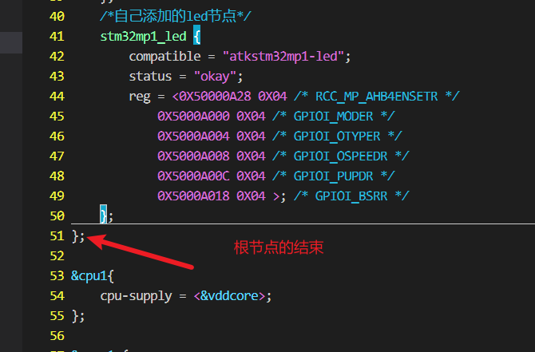
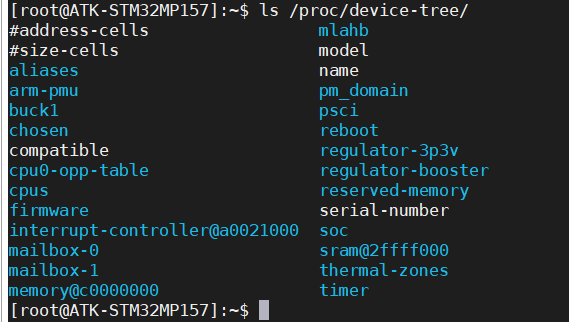
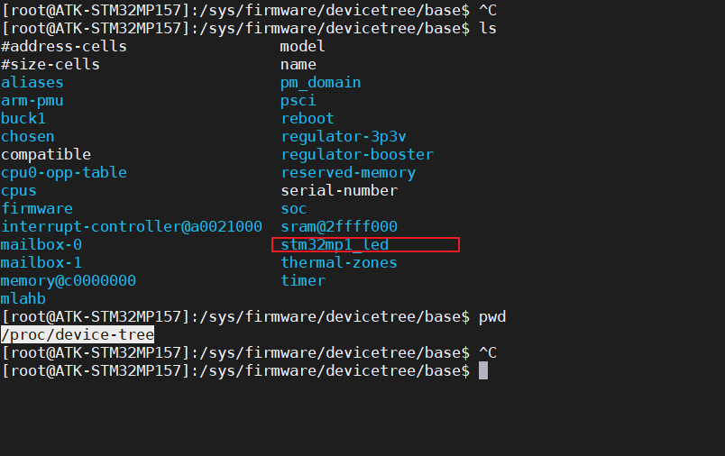

# Linux设备树开发

我的理解：

​	设备树主要是linux内核启动时去执行的.c文件

设备树：内核启动的时候会解析设备树，最终在根文件系统下可以看到设备的节点信息

基本上外设的初始化都做好了，我们只需要在自己的dts文件中&名字，然后进行配置就可以了例如：

```
PS:在根节点外添加
```


```
cd /proc/device-tree
```

修改设备树文件

```
/root/MP157/my_linux/linux-5.4.31/arch/arm/boot/dts
```

```
vim stm32mp157d-atk.dts

 stm32mp1_led {
 compatible = "atkstm32mp1-led";
 status = "okay";
 reg = <0X50000A28 0X04 /* RCC_MP_AHB4ENSETR */
 0X5000A000 0X04 /* GPIOI_MODER */
 0X5000A004 0X04 /* GPIOI_OTYPER */
 0X5000A008 0X04 /* GPIOI_OSPEEDR */
 0X5000A00C 0X04 /* GPIOI_PUPDR */
 0X5000A018 0X04 >; /* GPIOI_BSRR */
 };

```



添加完成以后回到内核目录,对设备树就进行编译

```
make dtbs
```

烧录，在开发板的的/proc/device-tree目录下查看设备节点

```
cd /proc/device-tree
```

没加led的

加led的



## 编写驱动程序

```
#include <linux/types.h>
#include <linux/kernel.h>
#include <linux/delay.h>
#include <linux/ide.h>
#include <linux/init.h>
#include <linux/module.h>
#include <linux/errno.h>
#include <linux/gpio.h>
#include <linux/fs.h>
#include <linux/cdev.h>
#include <linux/device.h>
#include <linux/of_address.h>

#include <asm/mach/map.h>
#include <asm/uaccess.h>
#include <asm/io.h>

/*led设备结构体*/
// struct led_dev_t{
//   struct cdev cdev;
//   dev_t devid;
//   struct class *class;
//   int major;
//   int minor;
// }led_dev;

#define LED_MAJOR 200
#define LED_NAME "led"

#define LED_ON 1
#define LED_OFF 0

#define COUNT 1
dev_t devid; /*设备号*/

// /*物理地址*/
// #define PERIPH_BASE (0x40000000)
// #define MPU_AHB4_PERIPH_BASE (PERIPH_BASE + 0x10000000)
// #define RCC_BASE (MPU_AHB4_PERIPH_BASE + 0x0000)
// #define RCC_MP_AHB4ENSETR (RCC_BASE + 0XA28)
// #define GPIOI_BASE (MPU_AHB4_PERIPH_BASE + 0xA000)
// #define GPIOI_MODER (GPIOI_BASE + 0x0000)
// #define GPIOI_OTYPER (GPIOI_BASE + 0x0004)
// #define GPIOI_OSPEEDR (GPIOI_BASE + 0x0008)
// #define GPIOI_PUPDR (GPIOI_BASE + 0x000C)
// #define GPIOI_BSRR (GPIOI_BASE + 0x0018)

/* 映射后的寄存器虚拟地址指针 */
static void __iomem *MPU_AHB4_PERIPH_RCC_PI;
static void __iomem *GPIOI_MODER_PI;
static void __iomem *GPIOI_OTYPER_PI;
static void __iomem *GPIOI_OSPEEDR_PI;
static void __iomem *GPIOI_PUPDR_PI;
static void __iomem *GPIOI_BSRR_PI;

static struct cdev led_cdev;
struct class *led_class;
struct device *led_device;

struct dtsled_dev{
  struct device_node *nd; /*设备节点*/
};
struct dtsled_dev dtsled; /* 设备树led 设备 */

static ssize_t led_write(struct file *filp, const char __user *buf,
			 size_t count, loff_t *ppos)
{
	int retvalue;
	int val;
	unsigned char databuf[1];

	retvalue = copy_from_user(databuf, buf, count);
	if (retvalue < 0) {
		printk("led_write failed\r\n");
		return -EFAULT;
	}
	/*判断开灯关灯*/
	if (databuf[0] == LED_ON) {
		val = readl(GPIOI_BSRR_PI);
		val |= (1 << 16);
		writel(val, GPIOI_BSRR_PI);
	}
	if (databuf[0] == LED_OFF) {
		val = readl(GPIOI_BSRR_PI);
		val |= (1 << 0);
		writel(val, GPIOI_BSRR_PI);
	}
	return 0;
}

static int led_open(struct inode *inode, struct file *filp)
{
	return 0;
}

static int led_close(struct inode *inode, struct file *filp)
{
	return 0;
}

static const struct file_operations led_fops = {
	.owner = THIS_MODULE,
	.write = led_write,
	.open = led_open,
	.release = led_close,
};

/*加载函数*/
static int __init alloc_led_init(void)
{
	int ret;
	int val;
	int major = 0; /*主设备号*/
	int minor = 0; /*此设备号*/
	const char *str;
	struct property *proper;
	uint32_t regdata[12];

	/*1.获取设备树中的设备属性*/
	dtsled.nd = of_find_node_by_path("/stm32mp1_led");
	if (dtsled.nd == NULL) {
		printk("stm32mp1_led node nost find\r\n");
		return -EINVAL;
	} else {
		printk("stm32mp1_led node fine\r\n");
	}
	/*2.获取 compatible 属性内容*/
	proper = of_find_property(dtsled.nd, "compatible", NULL);
	if (proper == NULL) {
		printk("compatible of_find_property failed\r\n");
	} else {
		printk("compatible = %s\r\n", (char *)proper->value);
	}
	/*3.获取 status 属性内容*/
	ret = of_property_read_string(dtsled.nd, "status", &str);
	if (ret < 0) {
		printk("status of_property_read_string failed\r\n");
	} else {
		printk("status = %s\r\n", str);
	}
	/* 4、获取 reg 属性内容 */
	ret = of_property_read_u32_array(dtsled.nd, "reg", regdata, 12);
	if (ret < 0) {
		printk("reg of_property_read_u32_array failed\r\n");
	} else {
		uint8_t i = 0;
		printk("reg data:\r\n");
		for (i = 0; i < 12; i++)
			printk("%#X ", regdata[i]);
		printk("\r\n");
	}
	/*1.地址映射*/
	//每个寄存器是32位的所以参数为4
	MPU_AHB4_PERIPH_RCC_PI = of_iomap(dtsled.nd, 0);
	GPIOI_MODER_PI = of_iomap(dtsled.nd, 1);
	GPIOI_OTYPER_PI = of_iomap(dtsled.nd, 2);
	GPIOI_OSPEEDR_PI = of_iomap(dtsled.nd, 3);
	GPIOI_PUPDR_PI = of_iomap(dtsled.nd, 4);
	GPIOI_BSRR_PI = of_iomap(dtsled.nd, 5);
	/*2.初始化*/
	val = readl(MPU_AHB4_PERIPH_RCC_PI);
	val &= ~(1 << 8); // GPIOI是第八位
	val |= (1 << 8);
	writel(val, MPU_AHB4_PERIPH_RCC_PI);

	/*3.设备PI0为输出模式*/
	val = readl(GPIOI_MODER_PI);
	val &= ~(3 << 0);
	val |= (1 << 0);
	writel(val, GPIOI_MODER_PI);

	/*4.设备PI0为推完输出*/
	val = readl(GPIOI_OTYPER_PI);
	val &= ~(3 << 0);
	val |= (1 << 0);
	writel(val, GPIOI_OTYPER_PI);

	/*设备PI0高速*/
	val = readl(GPIOI_OSPEEDR_PI);
	val &= ~(3 << 0);
	val |= (1 << 0);
	writel(val, GPIOI_OSPEEDR_PI);

	/*设备PI0上拉*/
	val = readl(GPIOI_PUPDR_PI);
	val &= ~(3 << 0);
	val |= (1 << 0);
	writel(val, GPIOI_PUPDR_PI);

	/*默认打开LED*/
	val = readl(GPIOI_BSRR_PI);
	val |= (1 << 16);
	writel(val, GPIOI_BSRR_PI);

	/*如果主设备号被指定*/
	if (major) {
		devid = MKDEV(major, 0);
		ret = register_chrdev_region(devid, COUNT, "led");
	} else {
		ret = alloc_chrdev_region(&devid, 0, COUNT,
					  "led"); /*申请设备号*/
		major = MAJOR(devid);
		minor = MINOR(devid);
	}
	if (ret < 0) {
		printk("alloc_chrdev_regions failed\r\n");
		return ret;
	}

	/*注册字符设备*/
	cdev_init(&led_cdev, &led_fops);
	/*向内核添加字符设备*/
	ret = cdev_add(&led_cdev, devid, COUNT);
	if (ret < 0)
		printk("cdev_add failed\r\n");
	printk("major%dminor%d\r\n", major, minor);
	/*自动常见设备节点，利用mdev机制是udev的简化版由busybox提供*/
	led_class = class_create(THIS_MODULE, LED_NAME);
	if (IS_ERR(led_class))
		return PTR_ERR(led_class);

	led_device = device_create(led_class, NULL, devid, NULL, LED_NAME);
	if (IS_ERR(led_device))
		return PTR_ERR(led_device);
	printk("alloc_led_init\r\n");
	return 0;
}

/*卸载函数*/
static void __exit alloc_led_exit(void)
{
	int val;
	val = readl(GPIOI_BSRR_PI);
	val |= (1 << 0);
	writel(val, GPIOI_BSRR_PI);
	/*取消地址映射*/
	iounmap(MPU_AHB4_PERIPH_RCC_PI);
	iounmap(GPIOI_MODER_PI);
	iounmap(GPIOI_OTYPER_PI);
	iounmap(GPIOI_OSPEEDR_PI);
	iounmap(GPIOI_PUPDR_PI);
	iounmap(GPIOI_BSRR_PI);

	/*删除字符设备*/
	cdev_del(&led_cdev);
	/*注销设备号*/
	unregister_chrdev_region(devid, COUNT);
	/*摧毁设备*/
	device_destroy(led_class, devid);
	/*摧毁类*/
	class_destroy(led_class);

	printk("alloc_led_exit\r\n");
};

/*模块加载和卸载*/
module_init(alloc_led_init);
module_exit(alloc_led_exit);

/*标签*/
MODULE_LICENSE("GPL");

```

## 设备树点灯和驱动点灯的区别

```
设备树点灯是创建节点，将物理地址写到了节点里面，在init里面利用of_find_node_by_path(/节点名字)将节点的信息读取出来
```

## compatible参数的提取与使用

```
	proper = of_find_property(dtsled.nd, "compatible", NULL);
	if (proper == NULL) {
		printk("compatible of_find_property failed\r\n");
	} else {
		printk("compatible = %s\r\n", (char *)proper->value);
	}
```

## status参数的提取与使用

```
	ret = of_property_read_string(dtsled.nd, "status", &str);
	if (ret < 0) {
		printk("status of_property_read_string failed\r\n");
	} else {
		printk("status = %s\r\n", str);
	}
```

## reg参数的提取与使用

```
ret = of_property_read_u32_array(dtsled.nd, "reg", regdata, 12);

也可以直接使用
of_iomap(np, index);
np：设备节点。
index：reg 属性中要完成内存映射的段，如果 reg 属性只有一段的话 index 就设置为 0
```


## 制作bootfs.ext4

```
dd if=/dev/zero of=bootfs.ext4 bs=1M count=10
mkfs.ext4 -L bootfs bootfs.ext4
sudo mkdir /mnt/bootfs
sudo mount bootfs.ext4 /mnt/bootfs/
sudo cp uImage stm32mp157d-atk.dtb /mnt/bootfs/
sudo umount /mnt/bootfs


```

