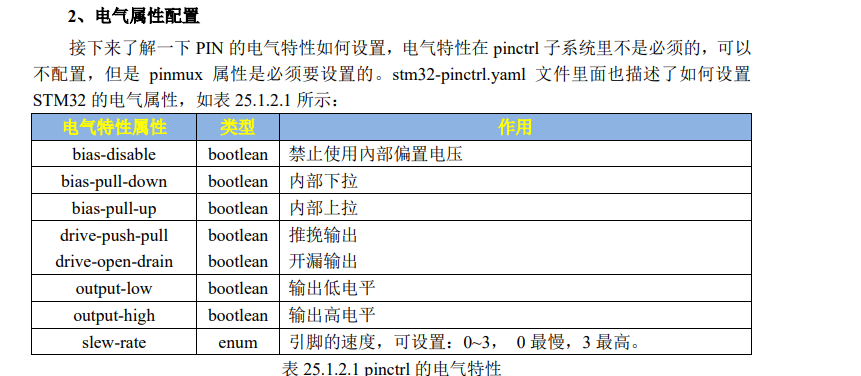
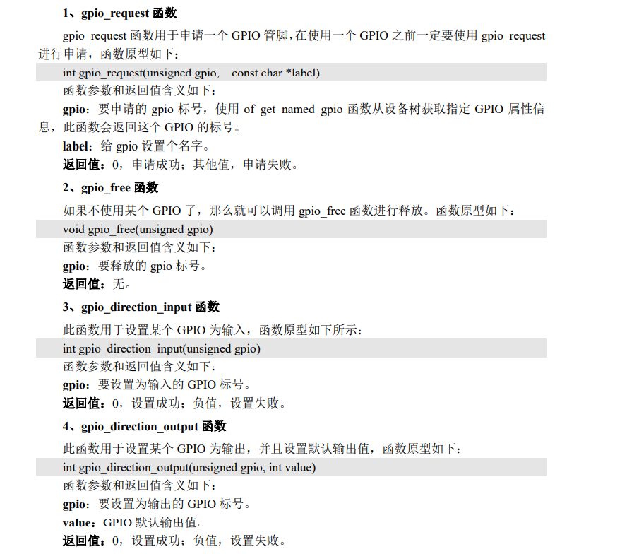
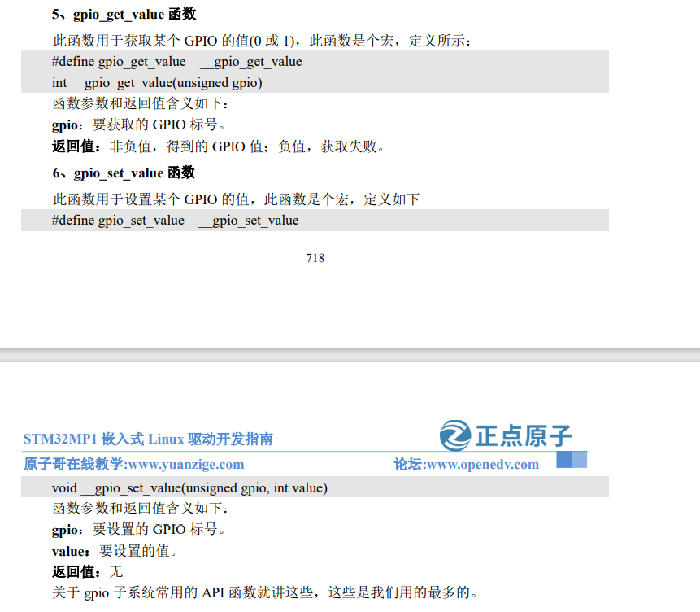
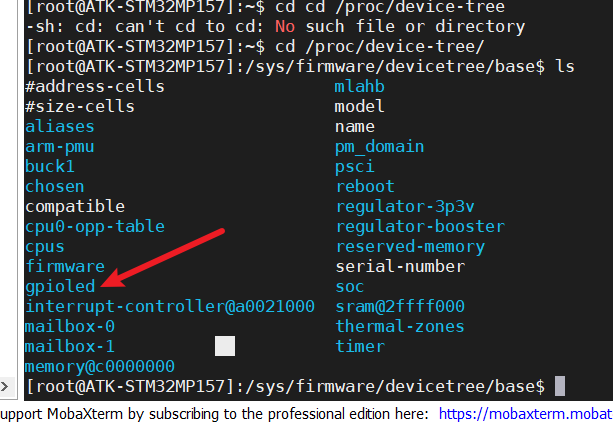

# pinctrl 子系统

pinctrl 子系统主要工作内容如下：

 ①、获取设备树中 pin 信息。

 ②、根据获取到的 pin 信息来设置 pin 的复用功能 

③、根据获取到的 pin 信息来设置 pin 的电气特性，比如上/下拉、速度、驱动能力等。 

对于我们使用者来讲，只需要在设备树里面设置好某个 pin 的相关属性即可，其他的初始 化工作均由 pinctrl 子系统来完成，pinctrl 子系统源码目录为 drivers/pinctrl。

```
vim vim stm32mp151.dtsi//查看pinctrl系统
vim stm32mp15-pinctrl.dtsi//查看默认的pin配置
```

## 复用功能

打开《STM32MP157A&D 数据手册》，一个 IO 最大有 16种复用方法：AF0~AF15，打开第 4章“Pinouts, pin description and alternate functions”

## pin的电气属性



# gpio子系统





## 在设备树下添加led节点

```
 gpioled {
 compatible = "alientek,led";
 status = "okay";
 led-gpio = <&gpioi 0 GPIO_ACTIVE_LOW>;
 };
//led-gpio = <&gpioi 0 GPIO_ACTIVE_LOW>;
//gpioi用的是哪个端口，0哪个引脚，什么电平有效GPIO_ACTIVE_LOW
```

```
//修改好以后重新制作bootfs
cp stm32mp157d-atk.dtb /root/MP157/my_linux/bootfs
```

启动后在/proc/device-tree查看到我们刚刚加入的节点

```
cd /proc/device-tree
```

