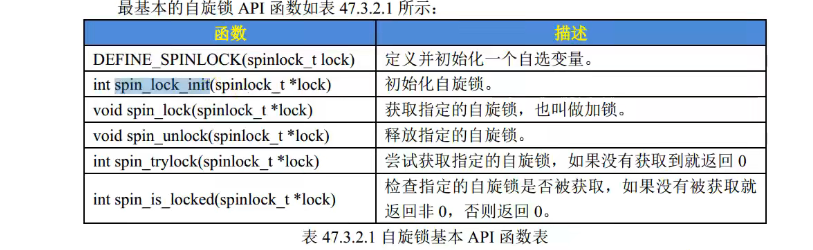
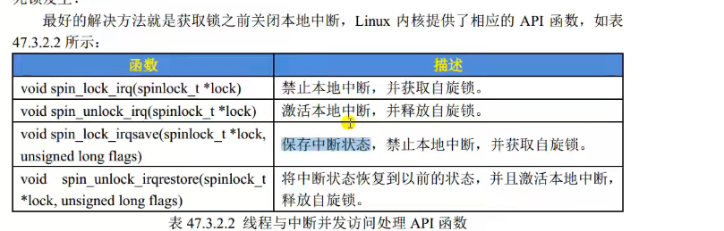
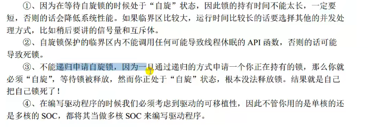
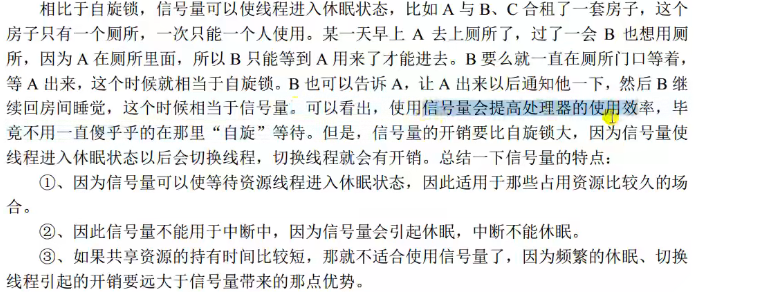
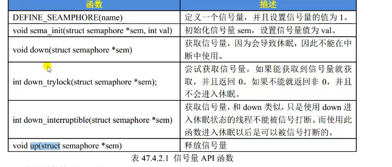
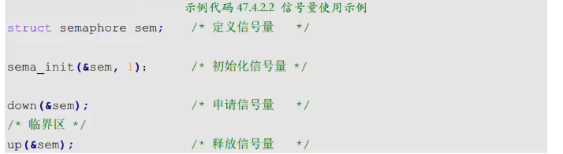
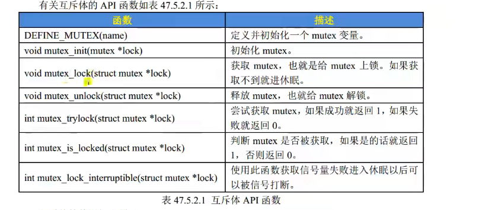
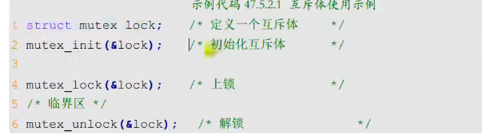
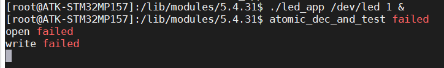

# 并发与竞争

多个人同时使用一个资源。就是并发，产生竞争

## linux系统

多任务

中断

抢占

多核

## 竞争什么？

竞争的是资源，资源是什么，资源就是数据。

保护的就是除了本身其他地方还会用到的数据，最常见的就是全局变量

## 介绍

原子操作，信号量，自旋锁，互斥体

### 原子操作

原子操作就是不能再进一步分割的操作。常用于变量后位操作

原子整形操作API函数

```
//原来的,对于全局变量可以用这样的方法，
直接将int num，换成atomic_t num就可以了
int num；
//原子整形
atomic_t num;
//初始化
atomic_set(num,0);
```

原子位API函数

```
int num
直接set_bin(num);
```

### 自旋锁

A线程，B线程

A线程占用锁后，B获取不到锁就需要等待。等待的时候还是在占用资源，所以不能长时间上锁，适用于短时间的加锁。

#### spinlock_t结构体

```
spinlock_t结构体
spinlock_t lock;
PS:注意避免死锁的出现，上锁的时候不能产生使用睡眠和造成阻塞的发生
```



线程与线程

线程与中断（线程运行时，关闭本地中断）



中断与中断

#### 总结自旋锁



### 信号量

相比自旋锁，线程可以进入休眠状态



#### 信号量结构体semaphore

```
semaphore结构体
```



#### 使用流程



### 互斥体

#### 互斥体结构体mutex

不能再中断上使用，可以调用休眠

```
mutex
```



#### 使用流程



## 实验

### 原子操作，

```
atomic_dec_and_test(atomic_t *v;)//从 v 减 1，如果结果为 0 就返回真，否则返回假
```



### 自旋锁，

```
自选锁是一直在等待，所以一般用一个标志位来判断
spin_lock(&gpio_led_dev.lock);//上锁
  if(gpio_led_dev.led_dev_status){//设备不能用
    spin_unlock(&gpio_led_dev.lock);//解锁
    return -EBUSY;
  }
  //可以使用中断的上锁和解锁函数
```

```
spinlock_t lock; //定义锁
spin_lock_init(&gpio_led_dev.lock);//初始化锁
spin_lock(&gpio_led_dev.lock);//上锁
spin_unlock(&gpio_led_dev.lock);//解锁
```

### 信号量，

```
#include <linux/semaphore.h>
 struct semaphore sem;//定义信号量
 sema_init(&gpio_led_dev.sem,1);//初始化信号量
 down(&gpio_led_dev.sem);//减1
 up(&gpio_led_dev.sem);//加1
 PS:会等第一个运行完以后，第二个直接运行
```

### 互斥体的实验

```
struct mutex lock; //定义互斥体
mutex_init(&gpioled.lock);初始化互斥体
mutex_lock(&gpioled.lock)//减1不能被信号打断
mutex_unlock(&dev->lock);//加1
if (mutex_lock_interruptible(&gpioled.lock)) {//可以被信号打断
 return -ERESTARTSYS;
 }

```


