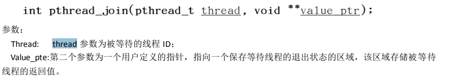
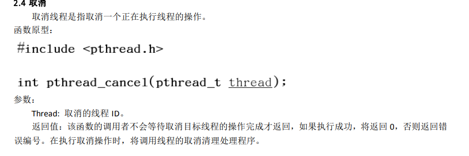
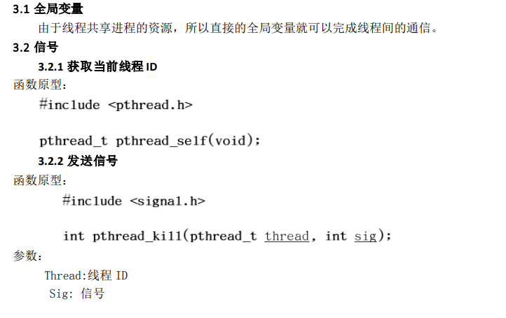

# linux线程操作

头文件#include<pthread.h>

## 线程的创建

```
pthread_t pthread1_id, pthread2_id;///*定义线程的id*/
void pthread1_fun(void)
{
  pthread_join(pthread1_id, NULL);
}
void pthread2_fun(void)
{
  pthread_join(pthread2_id, NULL);
}
void main(void)
{
  printf("创建线程\r\n");
  pthread_create(&pthread1_id, NULL, pthread1_fun, NULL);
  //pthread1_id 创建成功后的id NULL线程的属性 pthread1_fun线程的入口函数 NULL传给入口函数的参数
  pthread_create(&pthread2_id, NULL, pthread2_fun, NULL);
}
```

## 线程退出的三种方式

1. 创建完成后开始运行，子函数结束后自动退出

2. 调用exit函数退出，但是会将整个进程退出

3. 调用pthread_exit退出，只会退出当前线程

   ```
   pthread_exit();参数指向返回值的指针，不明白等待函数
   ```

## 等待函数

pthread_join 函数可以用于将当前线程挂起，等待某个线程的结束

```
PS这个类似freertos的osdelay
第二个参数定义个int就行类似ret
```



## 取消函数

```
也就是一旦调用立即生效
PS这个类似freertos的删除任务
```



## 清理函数栈

pthread_cleanup_push调用后就将fun压到清理函数栈中，

然后pthread_cleanup_pop就决定要不要清理

```
pthread_cleanup_push(fun,(void *)1);//入口函数，传给入口函数的参数
pthread_cleanup_pop(1);//参数 execute 表示执行到 pthread_cleanup_pop()时，是否在弹出清理函数的同时执行该函数，
为 0 表示不执行，非 0 为执行；这个参数并不影响异常终止时清理函数的执行。

例如malloc了一段空间，我就可以在fun函数中调用free();来清理malloc申请的内存。
pthread_cleanup_pop(0),就是调用fun不清理
pthread_cleanup_pop(1),就是调用fun清理
如果调用了取消线程或者调用了退出则pthread_cleanup_pop不管用
```

## 线程间通信

```
```



## 获取线程id函数

```
pthread_t pthread_self(void);
返回自己线程的线程号
```

## 检查线程id是否相等

```
int pthread_equal(pthread_t t1, pthread_t t2);

```

## 给线程加属性

在之前我们创建的线程的时候

```
 pthread_create(&pthread1_id, NULL, pthread1_fun, NULL);
 第二个参数写的NULL 也就是没有给线程添加属性
 
```

添加属性，注意在退出的时候要销毁

```
pthread_attr_t attr;//首先定义属性变量
pthread_attr_setstacksize(&attr, 4096);//给线程设置栈空间
pthread_create(&pthread1_id, &attr, pthread1_fun, NULL);

//销毁
pthread_attr_destroy(&attr);
```

## 获取线程的优先级

pthread_attr_

## 让全局变量变为线程局部变量

```
static __thread char buf[512];
这样初始化以后，就成为了线程的局部变量，线程与线程之间资源不共享
```

## 线程上锁

```
static pthread_mutex_t mutex;
pthread_mutex_lock(&mutex); //互斥锁上锁
pthread_mutex_unlock(&mutex);//互斥锁解锁
```

## 优先级

获取调度方法可以设备的优先级

  其实，普通进程的调度，是CPU根据进程优先级算出时间片，这样并不能一定保证高优先级的进程一定先运行，只不过和优先级低的进程相比，通常优先级较高的进程获得的CPU时间片会更长而已。其实，如果要想保证一个线程运行完在运行另一个线程的话，就要使用多线程的同步技术，信号量，条件变量等方法。而不是绝对依靠优先级的高低，来保证。


```
  int num = sched_get_priority_max(SCHED_FIFO);
  printf("max%d\r\n", num);
  num = sched_get_priority_min(SCHED_FIFO);
  printf("min%d\r\n", num);
```

SCHED_OTHER 是不支持优先级使用的，它最大和最小优先级都是0。
SCHED_FIFO 和 SCHED_RR 支持优先级的使用，他们分别为1和99，数值越大优先级越高

## 编译的时候要在后面加上 – lpthread。

```
gcc pthread_create.c -lpthread
```


