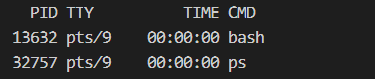

# 进程的学习

pts/9代表的是哪种方式启动的ubuntu，我是利用vscode，所以就是pts/9



PID子进程 PPID父进程


树形查看进程 

ps -ef f

ps -T

查看线程的ID


## 僵尸进程


## 孤儿进程


在第一个父进程下，再次创建进程

则再次常见的进程和现在的进程属于同一父进行下


如果在子进程下创建再次创建进程则，再次创建的父进程的父进程是第一次创建的父进程


在子进程下创建线程


# socket

## socket创建套接字函数

```
#include <sys/types.h>
#include <sys/socket.h>
socket(int domain, int type, int protocol);//返回值网络描述符，类似open的返回值
domain：通信域，ipV4还是IPV6等等，ipv4就直接填写AF_INET

```

domain

```
AF_UNIX,AF_UNIX
AF_INET
AF_INET6
AF_IPX
AF_NETLINK
AF_X25
AF_X25
AF_ATMPVC
AF_APPLETALK
AF_PACKET
AF_ALG
```


type

```
SOCK_STREAM
SOCK_DGRAM
SOCK_SEQPACKET
SOCK_RAW
SOCK_RDM
SOCK_PACKET
```


## bind将IP与套接字绑定函数

```
int bind (int __fd, __CONST_SOCKADDR_ARG __addr, socklen_t __len)

__fd:网络描述符
__CONST_SOCKADDR_ARG： const struct sockaddr *结构体包括ip端口 协议族
socklen_t ：结构体的大小
```

```
上述的结构体
struct sockaddr_in {
 sa_family_t sin_family; /* 协议族 */
 in_port_t sin_port; /* 端口号 */
 struct in_addr sin_addr; /* IP 地址 */
 unsigned char sin_zero[8];
};
```

## listen监听函数

```
listen()函数
listen()函数只能在服务器进程中使用，让服务器进程进入监听状态，等待客户端的连接请求，listen()函
数在一般在 bind()函数之后调用，在 accept()函数之前调用，它的函数原型是：
int listen(int sockfd, int backlog);
sockfd:网络描述符
backlog：TCP连接是一个过程，当A连接主机是B也来连接，但是此时A正在连接所以B会被放在等待连接的队列中backlog确定等待连接的最大个数
```

## accept()函数获取客户端请求并且连接

```
listen是提供了主机可以与从机建立连接的接口
accept才是使主机与从机连接的接口
int accept(int sockfd, struct sockaddr *addr, socklen_t *addrlen);

PS:连接成功返回一个新的套接字，该套接字与socket返回的套接字并不相同，该套接字用于主机和从机的信息交互
struct sockaddr *addr ：连接成功后返回客户端的ip端口信息
socklen_t*addrlen： struct sockaddr *addr的大小
```

## 客户端connect()函数

```
int connect(int sockfd, const struct sockaddr *addr, socklen_t addrlen);
sockfd:创建的套接字
const struct sockaddr *add：服务器的ip端口
addrlen：const struct sockaddr *add的大小
```

## read()函数

## recv()函数

```
ssize_t recv(int sockfd, void *buf, size_t len, int flags);
flags:一般设置0
```


## write()函数

## send()函数

```
ssize_t send(int sockfd, const void *buf, size_t len, int flags);
flags：
```


## close()关闭套接字

## ip地址转换二进制

```
点分十进制的 IP 地址譬如 192.168.1.110、192.168.1.50

点分十进制字符串和二进制地址之间的转换函数主要有：inet_aton、inet_addr、inet_ntoa、inet_ntop、
inet_pton 这五个在我们的应用程序中使用它们需要包含头文件<sys/socket.h>、<arpa/inet.h>以及
<netinet/in.h>
```

## inet_pton()函数将点分十进制转化为二进制

```
#define IPV4_ADDR "192.168.1.222"
int main(void)
{
 struct in_addr addr;
 inet_pton(AF_INET, IPV4_ADDR, &addr);
 printf("ip addr: 0x%x\n", addr.s_addr);
 exit(0);
}
```

## inet_ntop()函数二进制转换点分十进制

```
int main(void)
{
 struct in_addr addr;
 char buf[20] = {0};
 addr.s_addr = 0xde01a8c0;
 inet_ntop(AF_INET, &addr, buf, sizeof(buf));
 printf("ip addr: %s\n", buf);
 exit(0);
}
```


