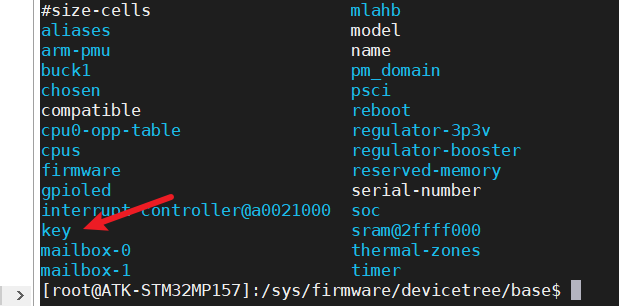

# 按键实验

本实验利用设备树的GPIO子系统进行

## 修改设备树

```
/root/MP157/my_linux/linux-5.4.31/arch/arm/boot/dts
vim stm32mp157d-atk.dts
```

```
//在根节点下添加
key {
 compatible = "alientek,key";
 status = "okay";
 key-gpio = <&gpiog 3 GPIO_ACTIVE_LOW>;
 };
```

```
make dtbs
cp stm32mp157d-atk.dtb /root/MP157/my_linux/bootfs
```

## 查看节点

```
cd /proc/device-tree
ls
```

