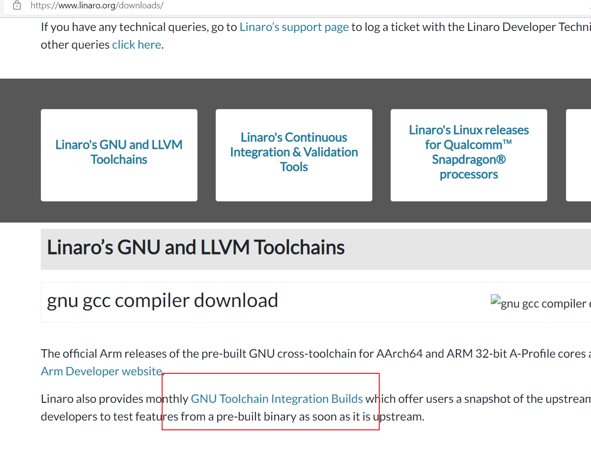
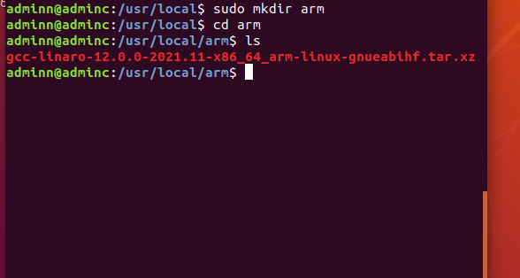
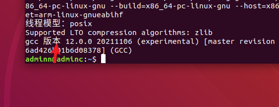
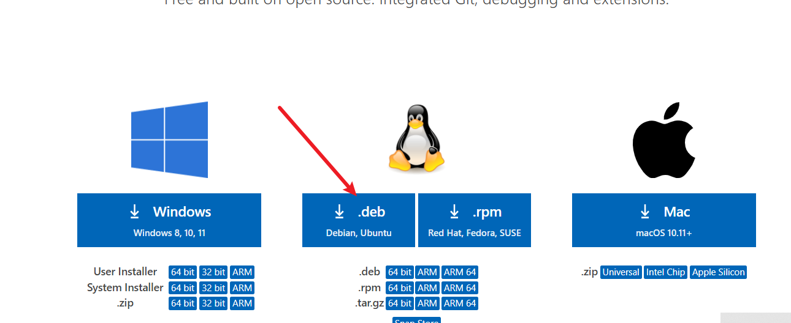
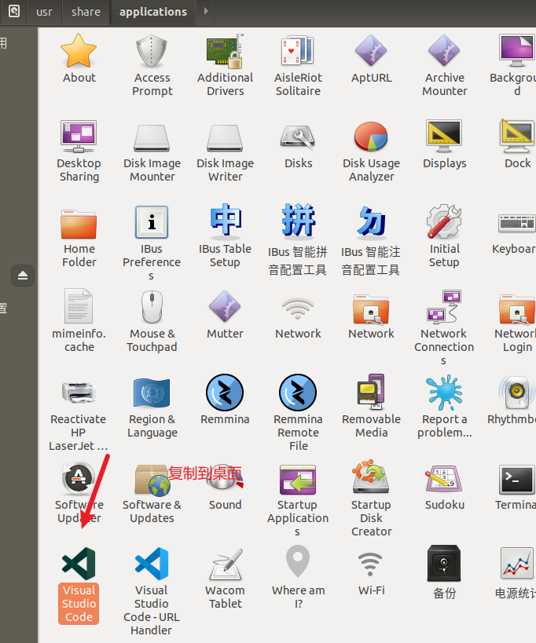

# README

## 工具的准备

| 准备内容                            | 手册                                                         | 页码 |
| ----------------------------------- | ------------------------------------------------------------ | ---- |
| FileZilla 软件widow和ubuntu文件互传 | [【正点原子】STM32MP1嵌入式Linux驱动开发指南V2.0.pdf](file:///E:/BaiduNetdiskDownload/09、文档教程(非常重要)/【正点原子】STM32MP1嵌入式Linux驱动开发指南V2.0.pdf) | 146  |
| 交叉编辑器的下载                    | [【正点原子】STM32MP1嵌入式Linux驱动开发指南V2.0.pdf](file:///E:/BaiduNetdiskDownload/09、文档教程(非常重要)/【正点原子】STM32MP1嵌入式Linux驱动开发指南V2.0.pdf) | 153  |
| stm32wrapper4dbg编译工具            | [【正点原子】STM32MP1嵌入式Linux驱动开发指南V2.0.pdf](file:///E:/BaiduNetdiskDownload/09、文档教程(非常重要)/【正点原子】STM32MP1嵌入式Linux驱动开发指南V2.0.pdf) | 214  |
| uboot编译需要的库文件               | sudo apt-get install libncurses5-dev bison flex              |      |

## 源码的准备

| 源码       | 手册                                                         | 页码 |
| ---------- | ------------------------------------------------------------ | ---- |
| TF-A的修改 | [【正点原子】STM32MP1嵌入式Linux驱动开发指南V2.0.pdf](file:///E:/BaiduNetdiskDownload/09、文档教程(非常重要)/【正点原子】STM32MP1嵌入式Linux驱动开发指南V2.0.pdf) | 239  |
| uboot      | [【正点原子】STM32MP1嵌入式Linux驱动开发指南V2.0.pdf](file:///E:/BaiduNetdiskDownload/09、文档教程(非常重要)/【正点原子】STM32MP1嵌入式Linux驱动开发指南V2.0.pdf) | 261  |
|            |                                                              |      |

## 官网资源

| 资源名称              | 网址                                                         | 备注 |
| --------------------- | ------------------------------------------------------------ | ---- |
| TF-A源码              | [TrustedFirmware-A (TF-A) - Trusted Firmware](https://www.trustedfirmware.org/projects/tf-a/) |      |
| uboot                 | [WebHome < U-Boot < DENX](http://www.denx.de/wiki/U-Boot/)   |      |
| ARM交叉编译工具的下载 | [Builds & Downloads - Linaro](https://www.linaro.org/downloads/) |      |

## 源码简介

### TF-A源码

```
传统的 ARM 软件框架：uboot、linux kernel和根文件系统。三大巨头
TF-A的作用就是在Uboot启动之前进行的进行的安全启动
对于32位系统来说TF-A的流程
bl1：第 1 个阶段，一般为芯片内部 ROM 代码。
bl2：第 2 个阶段，可信启动固件。
bl32：EL3 运行时(Runtime)软件。
bl33：非安全固件，比如 uboot（之后依然是Linux内核，根文件系统）
```

## 交叉编译工具

下载



安装



解压

```
sudo tar -vxf gcc-linaro-12.0.0-2021.11-x86_64_arm-linux-gnueabihf.tar.xz 
```

修改环境变量

打开

```
sudo vi /etc/profile
```

最后一行添加$PATH取原来的值：追加

```
export PATH=$PATH:/usr/local/arm/gcc-linaro-12.0.0-2021.11-x86_64_arm-linux-gnueabihf/bin
```

然后重启

检查安装成功

```
arm-linux-gnueabihf-gcc -v
```



安装vs code

[Download Visual Studio Code - Mac, Linux, Windows](https://code.visualstudio.com/Download)



解压

```
sudo dpkg -i code_1.66.2-1649664567_amd64.deb
```

创建桌面快捷方式



## 安装gcc使得vscode可以运行c程序

```
sudo apt install gcc
```

## 烧写固件到SD

每个厂家对芯片支持的falsh分区要求不同，所以需要对falsh进行指定的分区

安装SetupSTM32CubeProgrammer-2.5.0.linux

```
chmod +x SetupSTM32CubeProgrammer-2.5.0.linux
```

安装java环境

```
sudo apt-get install openjdk-8-jre
```

添加环境变量

```
sudo vi /etc/profile
export PATH=$PATH:/usr/local/STMicroelectronics/STM32Cube/STM32CubeProgrammer/bin/
```

使能环境变量，每次使用前都需要

```
source /etc/profile
```

图形化

```
sudo tar xf jre-8u331-linux-x64.tar.gz -C /usr/lib/jvm/
```

```
sudo update-alternatives --install /usr/bin/java java /usr/lib/jvm/jre1.8.0_331/bin/java 1000

```

```
sudo update-alternatives --config java
选择1000对应的模式序号
```

```
sudo update-alternatives --config java
```

usb连接stm

```
sudo apt-get install libusb-1.0.0-dev
```


