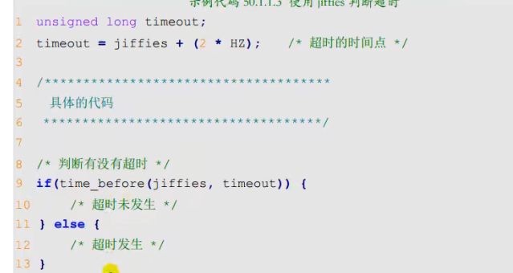

# 定时器

图形化配置系统时钟

## 默认100HZ也就是10ms


## 全局计数的变量

```
jiffies 表示系统运行的 jiffies 节拍数
时间(单位s)就是=jiffies/HZ
```


## 超时的判断



## 节拍和ms的转换


## 自动关闭定时器

当定时器溢出后会关闭定时器，所以如果想周期性的进行计数，就需要在溢出后手动开启定时器

## 定时器的使用

```
 int time_period; /* 定时周期,单位为 ms */
 struct timer_list timer; /* 定义一个定时器 */
 gpio_led_dev.time_period=1000;/*设置周期1s,在open时*/
 
 
 init_timer();///初始化定时器
 gpio_led_dev.timer.expires = jiffies+msecs_to_jiffies(500);//500ms进一次timer_fun
  gpio_led_dev.timer.function = timer_fun;//很像中断回调函数
 del_timer(&gpio_led_dev.timer);//删除
```

