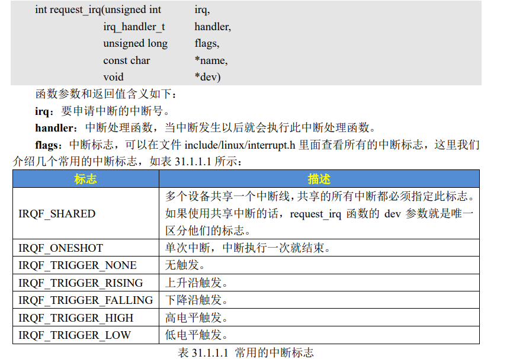
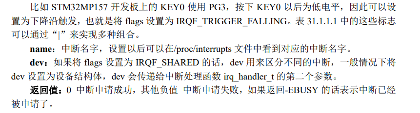
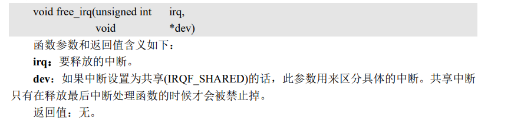
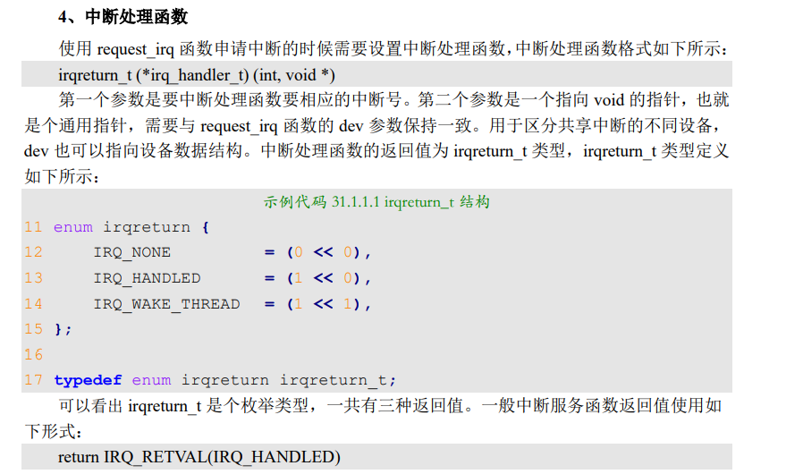
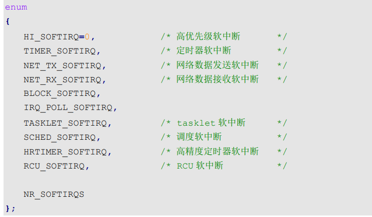
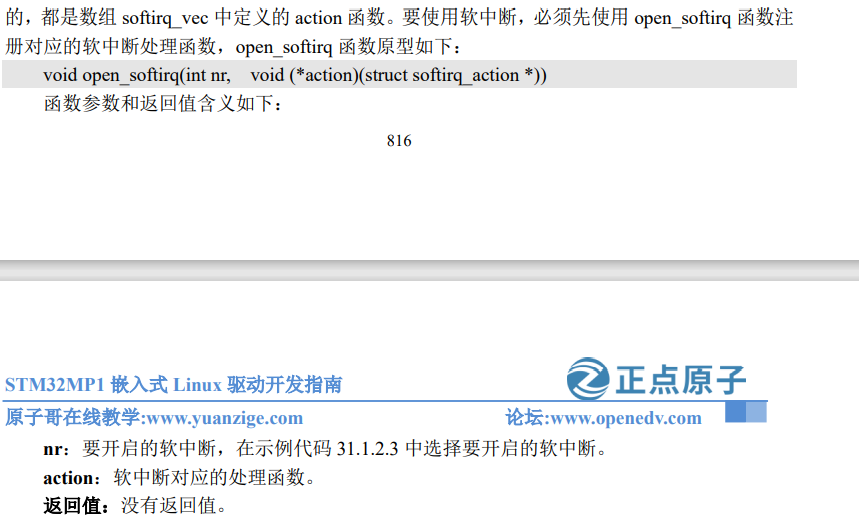
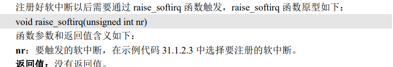
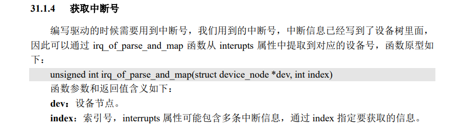
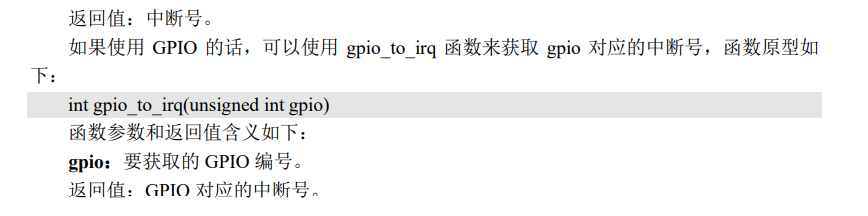

# 中断实验

\#include <linux/interrupt.h>

\#include <linux/of_irq.h>

每个中断都有一个中断号，使用哪个中断就需要向内核申请

## request_irq申请中断





## free_irq 函数

如果中断不是共享的，那么 free_irq 会删除中断处理函数并且禁止中断



## 中断处理函数



## 中断的使能与失能

```
void enable_irq(unsigned int irq)
void disable_irq(unsigned int irq)
void disable_irq_nosync(unsigned int irq)//相对disable_irq是调用后立即返回，不在执行
local_irq_enable()//全局中断的使能
local_irq_disable()//全局中断的失能
local_irq_save(flags)//禁止全局中断
local_irq_restore(flags)//使能全局中断

```

## 中断的上半部下半部

利用request_irq申请的就是上半部

```
1、如果要处理的内容不希望被其他中断打断，那么可以放到上半部。
2.如果要处理的任务对时间敏感，可以放到上半部。
3.、如果要处理的任务与硬件有关，可以放到上半部
4.、如果要处理的任务与硬件有关，可以放到上半部

PS:上半部处理很简单，直接编写中断处理函数就行了，关键是下半部该怎么做呢？Linux 内核提供了多种下半部机制
```

## 软中断实现下半部

```
软中断一共有10个
```



### open_softirq注册软中断

```
open_softirq
```



### 触发中断raise_softirq



### 获取中断号





## 工作队列实现下半部

# 实现按键中断

### 修改设备树

首先修改设备树的gpio配置添加中断属性

通过 interrupt-parent 和 interrupts 这两个属性即可设 置某个 GPIO 的中断功能

IRQ_TYPE_EDGE_BOTH 定义在文件 include/linux/irq.h 中

```
表示gpiog1 下降沿触发
```


```
//表示gpiog3 上升都下降沿触发
interrupt-parent = <&gpiog>;
interrupts = <3 IRQ_TYPE_EDGE_BOTH>;
```

```
vim stm32mp157d-atk.dts
make dtbs
cp stm32mp157d-atk.dtb /root/MP157/my_linux/bootfs
```

### 查看中断

```
cat /proc/interrupts
```

如果使用下半部只需要在中断上半部服务函数中调用下半部的函数就可以了

就向在中断服务函数中执行了一个子函数。具体有什么区别不是很清楚