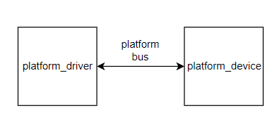
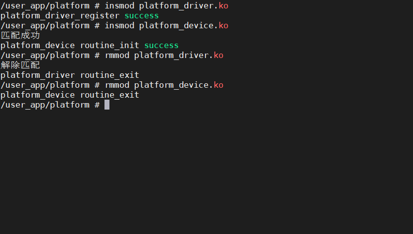

# platform总线

## 无设备树

100行代码学会使用platform驱动与设备的匹配。

 Linux系统的驱动框架主要就是三个主要部分组成，驱动、总线、设备。

想学会一个知识点必然要先学会使用它。

使用platform总线的目的就是让驱动与设备进行匹配，当匹配成功后会执行驱动程序中的probe函数。入门选手知道这个就可以了，深究只会越学越乱。先会用，再深究！



​									图 驱动-总线-设备三者的关系

platform_driver.c

```c
#include <linux/init.h>
#include <linux/interrupt.h>
#include <linux/module.h>
#include <linux/notifier.h>
#include <linux/of.h>
#include <linux/platform_device.h>

/**
 * @brief 用于与设备树进行匹配
 *
 */
static const struct of_device_id routine_dt_ids[] = {
    {
        .compatible = "routine-platform",
    },
    {/* sentinel */}};

/**
 * @brief 当驱动与设备匹配成功后执行该函数
 *
 * @param pdev
 * @return int
 */
static int routine_probe(struct platform_device *pdev)
{
    printk("匹配成功\r\n");
    return 0;
}

static int routine_remove(struct platform_device *pdev)
{
    printk("解除匹配\r\n");
    return 0;
}

static struct platform_driver routine_driver = {
    .driver = {
        .owner = THIS_MODULE,
        .name = "routine-platform",
        .of_match_table = routine_dt_ids,
    },
    .probe = routine_probe,
    .remove = routine_remove,
};

static int __init routine_init(void)
{
    int ret;
    ret = platform_driver_register(&routine_driver);
    if (ret)
        printk("platform_driver_register file\n");
    else
        printk("platform_driver_register success\n");
    return ret;
}

static void __exit routine_exit(void)
{
    platform_driver_unregister(&routine_driver);
    printk("platform_driver routine_exit \r\n");
}

module_init(routine_init);
module_exit(routine_exit);

MODULE_LICENSE("GPL");

```

platform_device.c

```c
#include <linux/module.h>
#include <linux/platform_device.h>

static void routine_release(struct device *dev)
{
}
static struct platform_device routine_device = {
    .name = "routine-platform",
    .dev.release = routine_release,
};

static int __init routine_init(void)
{
    if (platform_device_register(&routine_device) == 0)
    {
        printk("platform_device routine_init success\r\n");
    }
    return 0;
}

static void __exit routine_exit(void)
{
    platform_device_unregister(&routine_device);
    printk("platform_device routine_exit\r\n");
}
module_init(routine_init);
module_exit(routine_exit);

MODULE_LICENSE("GPL");

```

下图可以看出，当驱动，和设备都加载成功后会执行routine_probe(),当有一方卸载后会执行routine_remove()函数。



## 有设备树

当linux内核支持设备树时，就可以使用设备数来代替platform_device.c的工作，具体怎么代替的，设备树怎么工作的，先不要管，先回用再说。

platform_driver.c不需要改动。

platform_device.c可以直接删除

在设备树的根节点下添加

```
	routine_platform{
		compatible = "routine-platform";
		status = "okay";
	};
```

PS:具体怎么添加根据开发平台的不同相对的设备树文件不同，自行百度

添加好以后重新编译设备树，烧录，重启，然后加载驱动文件

可以发现仅仅加载了驱动文件就匹配成功并执行了probe函数。

