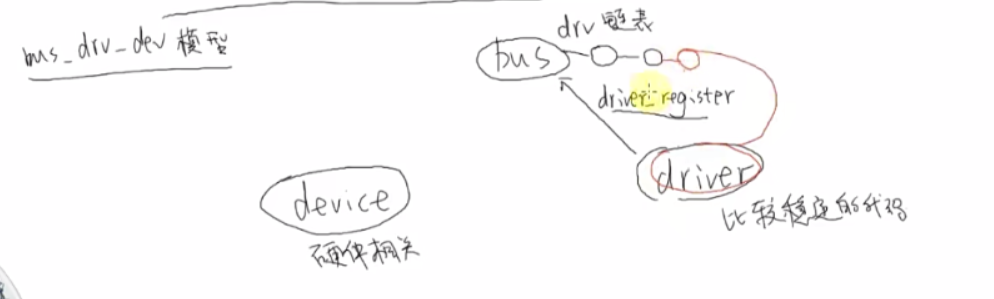
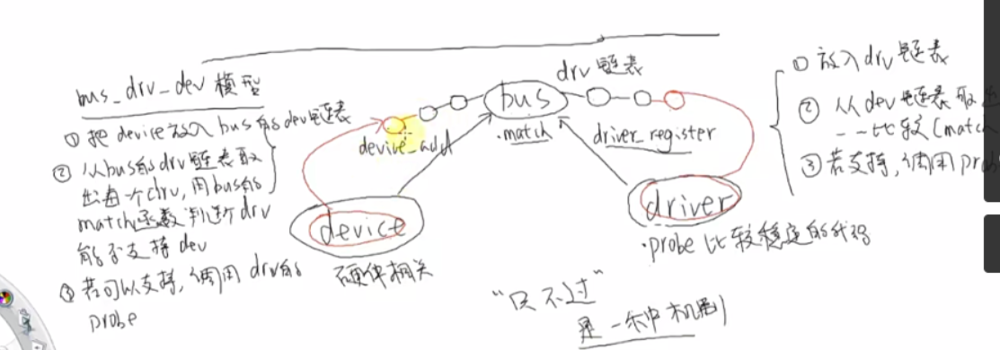
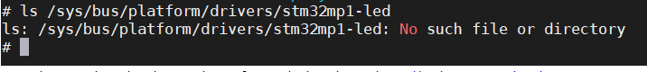
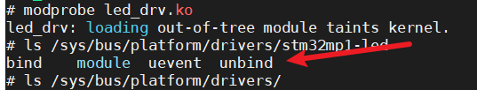
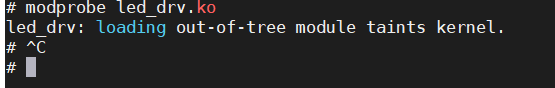
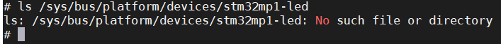
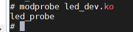
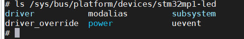
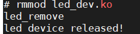

# 设备与驱动

设备模块

主要写硬件相关的东西，物理地址等

驱动模块根据设备模块提供的硬件资源在pro函数中进行功能实现

设备结构体

PS:名字要和驱动结构体对应

```
/**
 * @brief  platform 设备结构体
 *
 */
static struct platform_device leddevice = {
    .name = "stm32mp1-led",
    .id = -1,
    .dev = {
        .release = &led_release,
    },
    .num_resources = ARRAY_SIZE(led_resources),
    .resource = led_resources,

};
```

```
platform_device_register(&leddevice);//注册
platform_device_unregister(&leddevice);//卸载
```

驱动模块

主要写内核的调用，地址映射与上层app交互等

驱动结构体

```
/* platform 驱动结构体 */
static struct platform_driver led_driver = {
		.driver = {
		.name = "stm32mp1-led", /* 驱动名字，用于和设备匹配 */
},
		.probe = led_probe,
		.remove = led_remove,
};
```

```
platform_driver_register(&led_driver);//注册
platform_driver_unregister(&led_driver);//卸载
```

## linux驱动的分离与分层

bus-drv-dev模型

1. 总线bus（虚拟的）

2. 驱动drive（比较稳定的代码）

3. 设备device（具体的从设备硬件相关的）

主控制器也就是总线驱动一般由厂商编写对外提供读写接口

设备驱动由开发人员编写

```
platform_driver_register();//调用该函数会将2驱动放在总线下面的某个链表里面
```



```
platform_device_register()//调用该函数会将3放入总线里面的某个链表里面
```

然后进行比较在bus里面有一个match函数，如果支持调用驱动的probe函数



linux驱动的分离与分层，这是一种机制，驱动的机制具体做什么在probe里面开发人员完成

### 代码实现设备的注册

```c++
/**
 * 1.分配
 * 2.设置
 * 3.注册
 */

#include <linux/types.h>
#include <linux/kernel.h>
#include <linux/delay.h>
#include <linux/ide.h>
#include <linux/init.h>
#include <linux/module.h>
#include <linux/errno.h>
#include <linux/gpio.h>
#include <linux/cdev.h>
#include <linux/device.h>
#include <linux/of_gpio.h>
#include <linux/semaphore.h>
#include <linux/timer.h>
#include <linux/irq.h>
#include <linux/wait.h>
#include <linux/poll.h>
#include <linux/fs.h>
#include <linux/fcntl.h>
#include <linux/platform_device.h>
#include <asm/mach/map.h>
#include <asm/uaccess.h>
#include <asm/io.h>

static void led_release(struct device *dev)
{
  printk("led device released!\r\n");
}


/* 寄存器物理地址 */
#define PERIPH_BASE (0x40000000)
#define MPU_AHB4_PERIPH_BASE (PERIPH_BASE + 0x10000000)
#define RCC_BASE (MPU_AHB4_PERIPH_BASE + 0x0000)
#define RCC_MP_AHB4ENSETR (RCC_BASE + 0XA28)
#define GPIOI_BASE (MPU_AHB4_PERIPH_BASE + 0xA000)
#define GPIOI_MODER (GPIOI_BASE + 0x0000)
#define GPIOI_OTYPER (GPIOI_BASE + 0x0004)
#define GPIOI_OSPEEDR (GPIOI_BASE + 0x0008)
#define GPIOI_PUPDR (GPIOI_BASE + 0x000C)
#define GPIOI_BSRR (GPIOI_BASE + 0x0018)
#define REGISTER_LENGTH 4

/**
 * @brief 设备资源信息，也就是 LED0 所使用的所有寄存器
 *
 */
static struct resource led_resources[] = {
    [0] = {
        .start = RCC_MP_AHB4ENSETR,
        .end = (RCC_MP_AHB4ENSETR + REGISTER_LENGTH - 1),
        .flags = IORESOURCE_MEM,//哪一类资源
    },
    [1] = {
        .start = GPIOI_MODER,
        .end = (GPIOI_MODER + REGISTER_LENGTH - 1),
        .flags = IORESOURCE_MEM,
    },
    [2] = {
        .start = GPIOI_OTYPER,
        .end = (GPIOI_OTYPER + REGISTER_LENGTH - 1),
        .flags = IORESOURCE_MEM,
    },
    [3] = {
        .start = GPIOI_OSPEEDR,
        .end = (GPIOI_OSPEEDR + REGISTER_LENGTH - 1),
        .flags = IORESOURCE_MEM,
    },
    [4] = {
        .start = GPIOI_PUPDR,
        .end = (GPIOI_PUPDR + REGISTER_LENGTH - 1),
        .flags = IORESOURCE_MEM,
    },
    [5] = {
        .start = GPIOI_BSRR,
        .end = (GPIOI_BSRR + REGISTER_LENGTH - 1),
        .flags = IORESOURCE_MEM,
    },
};


/**
 * @brief  platform 设备结构体
 *
 */
static struct platform_device leddevice = {
    .name = "stm32mp1-led",
    .id = -1,
    .dev = {
        .release = &led_release,
    },
    .num_resources = ARRAY_SIZE(led_resources),
    .resource = led_resources,

};

/**
 * @brief 注册一个dev设备，注册好以后在bus下面的dev下面的某个链表里面
 * 
 * @return int 
 */
static int __init leddevice_init(void)
{
  return platform_device_register(&leddevice);
}

static void __exit leddevice_exit(void)
{
  platform_device_unregister(&leddevice);
}

module_init(leddevice_init);
module_exit(leddevice_exit);
MODULE_LICENSE("GPL");
```

### 代码实现驱动的注册

```c++
/**
 * 1.分配platform_driver结构体
 * 2.设置platform_driver结构体
 * 3.注册
 *
 */
#include <linux/types.h>
#include <linux/kernel.h>
#include <linux/delay.h>
#include <linux/ide.h>
#include <linux/init.h>
#include <linux/module.h>
#include <linux/errno.h>
#include <linux/gpio.h>
#include <linux/cdev.h>
#include <linux/device.h>
#include <linux/of_gpio.h>
#include <linux/semaphore.h>
#include <linux/timer.h>
#include <linux/irq.h>
#include <linux/wait.h>
#include <linux/poll.h>
#include <linux/fs.h>
#include <linux/fcntl.h>
#include <linux/platform_device.h>
#include <asm/mach/map.h>
#include <asm/uaccess.h>
#include <asm/io.h>

static int led_probe(struct platform_device *dev)
{
  /*根据platform_device的资源机芯io操作*/
  /*注册字符设备*/
  printk("led_probe\r\n");
  return 0;
}

static int led_remove(struct platform_device *dev)
{
  /*卸载字符设备*/
  printk("led_remove\r\n");
  return 0;
}

static struct platform_driver led_driver = {
    .driver = {
        .name = "stm32mp1-led", /* 驱动名字，用于和设备匹配 */
    },
    .probe = led_probe,
    .remove = led_remove,
};

/**
 * @brief 注册一个driver设备，注册好以后在bus下面的driver下面的某个链表里面
 *
 * @return int
 */
static int __init leddriver_init(void)
{
  return platform_driver_register(&led_driver);
}

static void __exit leddriver_exit(void)
{
  platform_driver_unregister(&led_driver);
}

module_init(leddriver_init);
module_exit(leddriver_exit);
MODULE_LICENSE("GPL");
```

加载驱动模块前查看该目录下是否存在stm32mp1-led节点

```
ls /sys/bus/platform/drivers/
```



加载模块后再次查看



加载驱动会发现并没有执行led_probe函数,这是因为设备驱动并没加载



```
ps:打印这条loading信息是因为标签没有加
MODULE_AUTHOR("ALIENTEK");
MODULE_INFO(intree, "Y");
```

接下来加载设备驱动，同样加载之前先查看

```
ls /sys/bus/platform/devices/stm32mp1-led
```



加载设备驱动



执行了probe函数并且在/sys/bus/platform/devices目录下出现了stm32mp1-led节点



这里面的driver就是上面我们加载的驱动模块

以上实验我们先加载驱动程序，如果先加载设备程序也是一样的效果

卸载设备


