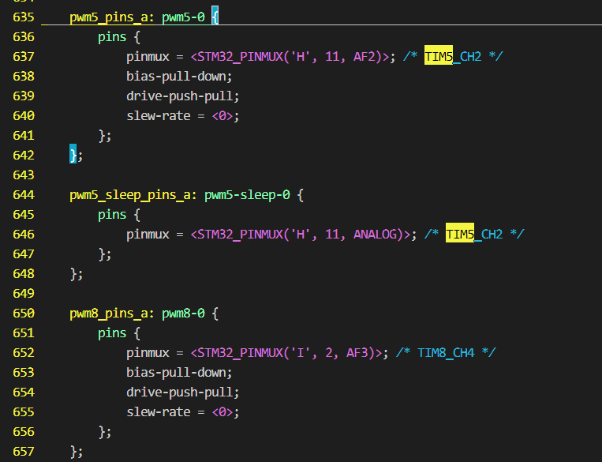
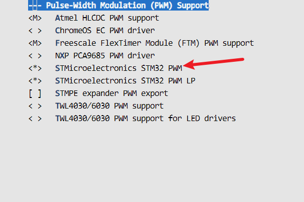
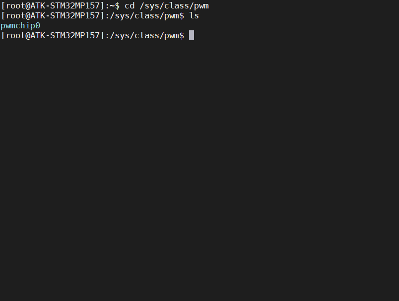
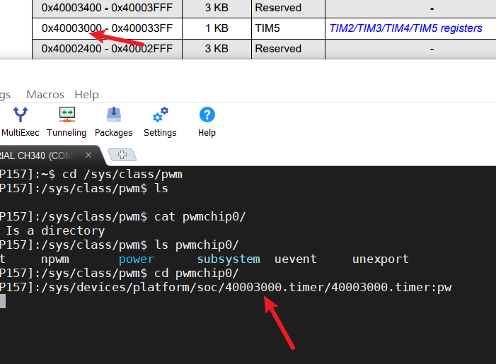
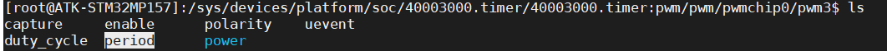

# PWM设置PI0LED

PWM的驱动程序已经由内核完成

```
drivers/pwm/pwm-stm32.c
```

## 在pinctrl子系统下添加TI5_CH4

### 为PI0添加PWM功能

打开  stm32mp15-pinctrl.dtsi可以看到TI5_CH4并没有这个设备节点，我们仿照TI5_CH2给TI5_CH4设置PWM功能



```
     pwm5_pins_a: pwm5-0 {                                                                                                         
          pins {
              pinmux = <STM32_PINMUX('H', 11, AF2)>; /* TIM5_CH2 */
              bias-pull-down;
              drive-push-pull;
              slew-rate = <0>;
          };
      };
```

## 修改设备树

```
//根节点外添加
&timers5
{
  status = "okay";
  /delete-property/dmas;
  /delete-property/dma-names;
pwm1:pwm
  {
    pinctrl-0 = <&pwm1_pins_a>;
    pinctrl-1 = <&pwm1_sleep_pins_a>;
   	pinctrl-names = "default", "sleep";
	#pwm-cells = <2>;
    status = "okay";
  };
};

```

## 完成以后使能PWM

```
> Device Drivers 
-> Pulse-Width Modulation (PWM) Support 
-> <*> STMicroelectronics STM32 PWM //选中

```



## 烧录并查看pwm

```
cd /sys/class/pwm
```



## 确定地址是不是TIM5



```
echo 3 > /sys/class/pwm/pwmchip0/export
//打开TIM5_CH4
PS:pwmchip0是整个TIM5的pwm，所以确定某一路就需要输出以上命令
```

## 查看pwm的属性



```
capture捕获
enable使能
polarity极性
uevent事件
duty_cycle占空比
period周期
power控制
```

```
//极性正常的就是高电平有效
设置pwm的周期属性
echo 5000 > /sys/class/pwm/pwmchip0/device/pwm/pwmchip0/pwm3/period
设置pwm的占空比属性
echo 0 > /sys/class/pwm/pwmchip0/device/pwm/pwmchip0/pwm3/duty_cycle
echo 5000 > /sys/class/pwm/pwmchip0/device/pwm/pwmchip0/pwm3/duty_cycle
使能PWM3
echo 1 >/sys/class/pwm/pwmchip0/device/pwm/pwmchip0/pwm3/enable
失能PWM3
echo 0 >/sys/class/pwm/pwmchip0/device/pwm/pwmchip0/pwm3/enable
//极性反转
echo "inversed" > /sys/class/pwm/pwmchip0/pwm3/polarity
//极性恢复
echo "normal" > /sys/class/pwm/pwmchip0/pwm3/polarity
```

## app程序

```
/*/sys/class/pwm/pwmchip0/pwm3*/
#include <stdio.h>
#include <stdlib.h>
#include <unistd.h>
#include <fcntl.h>
char *file_name[6] = {
  // "1.txt",
  // "period.txt",
  // "duty_cycle.txt",
    "/sys/class/pwm/pwmchip0/pwm3",//pwm_path
    "/sys/class/pwm/pwmchip0/pwm3/period",//period_path
    "/sys/class/pwm/pwmchip0/pwm3/duty_cycle",//duty_cycle_path
};

int pwm_config(char *period, char *duty_cycle)
{
  int fd;
  int ret;
  fd = open(file_name[1], O_WRONLY);
  if (fd < 0)
  {
    printf("open period failed\r\n");
  }
  ret = write(fd, period, 4);
  if (ret < 0)
  {
   perror("write error");
  }
  close(fd);
  fd = open(file_name[2], O_WRONLY);
  if (fd < 0)
  {
    printf("open duty_cycle failed\r\n");
  }
  ret = write(fd, duty_cycle, 4);
  if (ret < 0)
  {
    perror("write error");
  }
  close(fd);
}

int main(void)
{
  int fd;
  char period[10]={0}, duty_cycle[10]={0};
  printf("请输入pwm的周期\r\n");
  scanf("%s", period);
  getchar();
  printf("请输入pwm的占空比\r\n");
  scanf("%s", duty_cycle);
  pwm_config(period, duty_cycle);
}

```

## 总结：

```
1.在pinctrl子系统下增加引脚的pwm功能
2.在自己的设备树下对io进行配置
```

