# IIC驱动

## IIC总线驱动

### IIC驱动AP3216C

查看原理图得知AP3216C挂载在IIC5上

在pinctrl设备树下修改配置（ST已经修改好的）

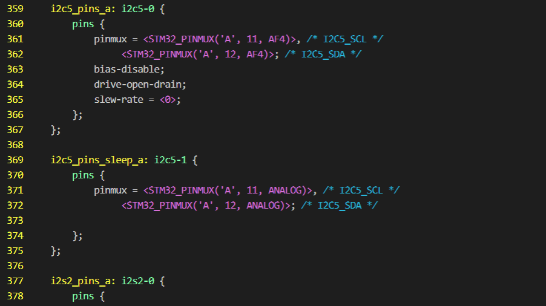

```c
默认下使用i2c5_pins_a
sleep下使用i2c5_pins_sleep_a也就是在低功耗模式下使用
```

### 在157的设备树下i2c5


### 修改自己的设备树

```
&i2c5{
	pinctrl-names = "default","sleep";
	pinctrl-0 = <&i2c5_pins_a>;
	pinctrl-1 = <&i2c5_pins_sleep_a>;
	status = "okay";
	
	ap3216c@1e{
		compatible = "alientwk,ap3216c";
		reg=<0x1e>;
	};
};
```

查看节点,确认地址一致

这个是内核提供的IIC功能也就是IIC总线驱动

```
/sys/bus/i2c/devices
```

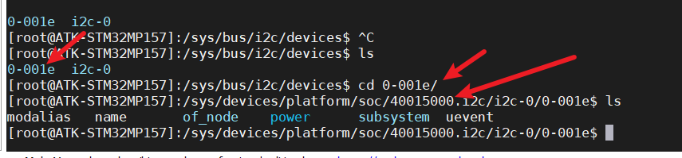

## IIC设备驱动

```
设备驱动在IIC设备树节点写增加设备节点，本实验中在“修改自己的设置树下已经做了这一步”，然后就写编写设备驱动
```

### AP3216C介绍

一个接近传感器，光传感器，红外LED

I2C驱动速度400khz

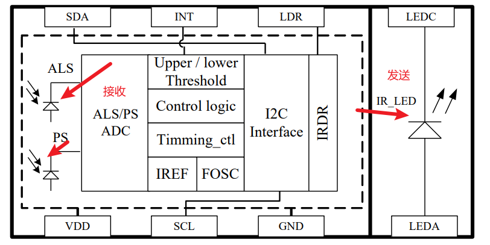

### 设备地址

​	The slave address of this device is 0x1E

IR红外数据寄存器0X0A低八位

IR红外数据寄存器0X0B高八位

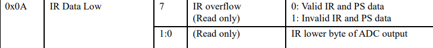

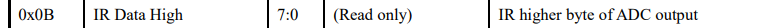

光传感器ALS数据寄存器

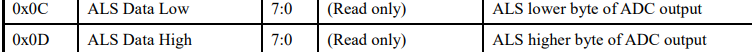

PS接近传感器

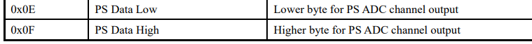

## i2c设备驱动查看路径

模块不加载设备不会创建

```
cd /sys/bus/i2c/drivers
```

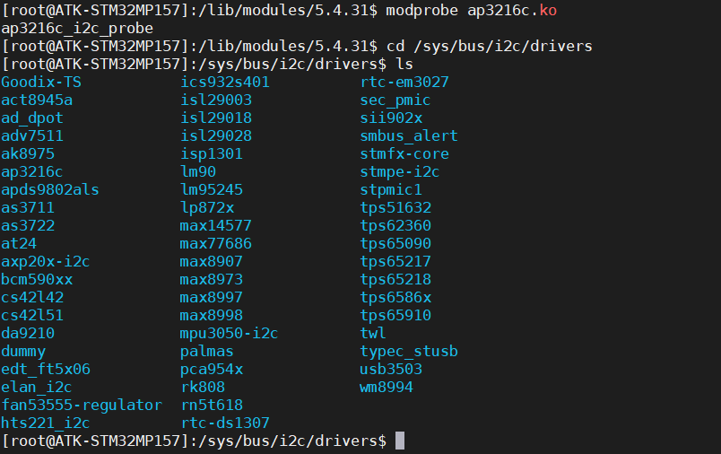

杂项字符设备注册流程

```
1.文件结构体包括函数
static const struct file_operations ap3216c_fops = {
    .owner = THIS_MODULE,
    .open = ap3216c_open,
    .release = ap3216c_release,
};
static int ap3216c_open(struct inode *inode, struct file *filp)
{
  filp->private_data = &ap3216c_dev;
  printk("led_read\r\n");
  return 0;
}

static int ap3216c_release(struct inode *inode, struct file *filp)
{
  // struct gpio_dev* dev=filp->private_data;
  printk("led_close\r\n");
  return 0;
}
2.杂项结构体
static struct miscdevice ap3216c_misc_dev = {
    MISC_DYNAMIC_MINOR,
    "ap3216c",
    &ap3216c_fops,
};
3.注册杂项字符设备
  int ret;
  ret = misc_register(&ap3216c_misc_dev);
  if (ret < 0)
  {
    printk("misc_register failed\r\n");
    return -1;
  }
 4.卸载杂项字符设备
misc_deregister(&ap3216c_misc_dev);
```

```
PS字符设备不是必要的而是我们这里需要做实验，具体iic谁被具体分析
```

## 初始化AP3216C

实现iic的数据传输

```
struct ap3216c_dev_t
{
  struct i2c_client *ap3216c_client;//这个是i2c的关键结构体
  struct ap3216c_value_t ap3216c_value;//这个是本次实验的数据存储结构体
};
struct ap3216c_dev_t ap3216c_dev;

high_value = i2c_smbus_read_byte_data(ap3216c_dev.ap3216c_client, AP3216C_IR_DATA_HIGH);//读数据
//i2c的关键结构体，地址
i2c_smbus_write_byte_data(ap3216c_dev.ap3216c_client, AP3216C_SYSTEM_CONFIGURATION, 0x04);//写数据
//i2c的关键结构体，地址，写的数据
```

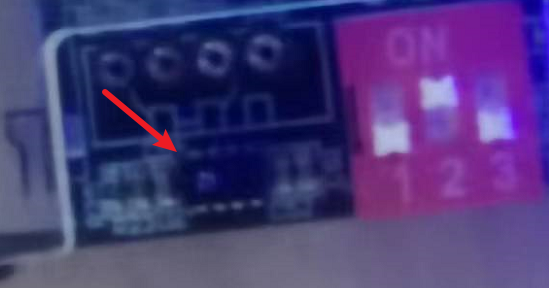

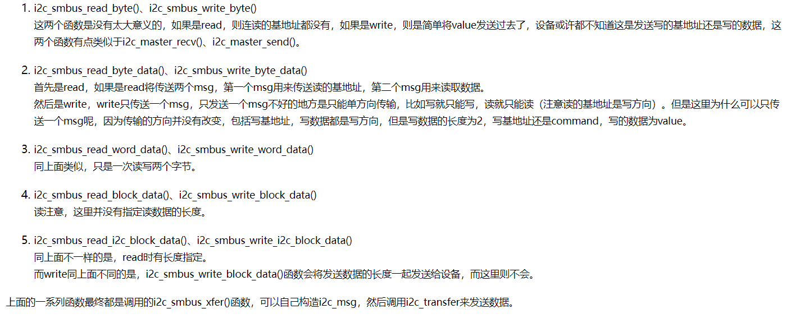

运行测试

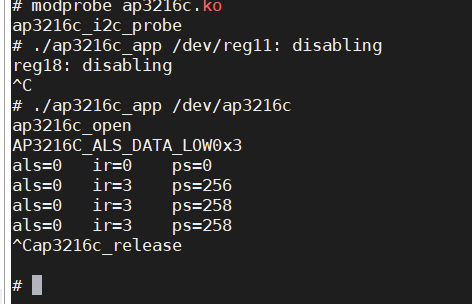

# 韦东山老师IIC

IIC两线时钟线，和数据线，是半双工

IIC主从通信：所有的数据都是主机发送从机回应

因为IIC可以挂载多个IIC所以发送的数据中就存在7位的从机地址，这样从机设备对应上后才会回复

写命令：从机地址+数据写在哪里的地址+数据

数据在SCL低电平变化，SCL高电平稳定：这样可以保证从机检测的信号是稳定的。

```c++
数据帧
起始信号+7位从机地址+1位读写选择+第九个脉冲时（从机回应主机释放SDA 从机拉低SDA）+停止信号
```

写的时候前8个SCL由主机驱动SDA，第9个时钟从机回应

读的时候前8个SCL由主机驱动SDA， 第9个时钟主机回应

响应信号的产生：没8位数据发送完成后，接收方都会产生响应信号

停止信号的产生：

1. 当从机不能响应从机地址时或者第九个脉冲SDA没有被拉低，那么主机发送停止信号或者重新发送起始信号
2. 从机接收器在传输过程中不能接受更多数据时不会发送响应，这是主机意识到这点后，那么主机发送停止信号或者重新发送起始信号
3. 主机作为接收器，在接收到最后一个字节后，也不会发送响应信号，此时从机释放SDA，主机发送停止信号

# IIC之框架驱动

APP:open read write

设备驱动：drv_open drv_read drv_write

IIC总线驱动：识别并且提供读写函数知道怎么收发数据

硬件：AT24C02

platform平台设备总线为了实现总线、设备、驱动框架

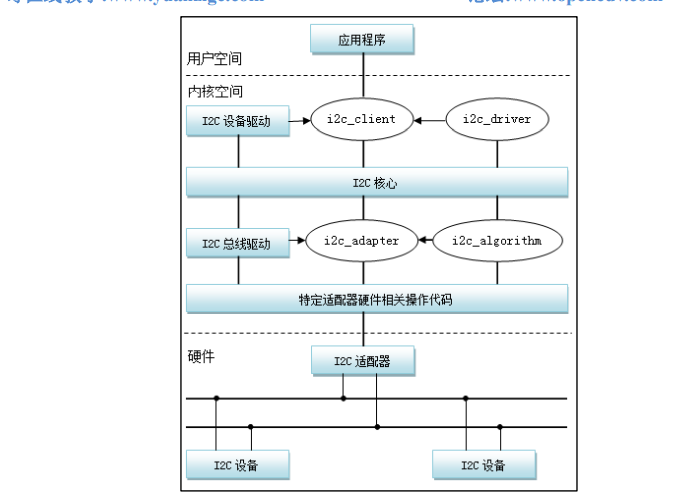

IIC分为三大部分 ：

IIC核心

```
I2C 核心提供了 I2C 总线驱动（适配器）和设备驱动的注册、注销方法，I2C 通信方法
(algorithm)与具体硬件无关的代码，以及探测设备地址的上层代码等；
```

IIC设备驱动：例如AT24C02这个从机设备要怎么工作

```
在设备树下有设备节点，设备驱动中需要与节点进行匹配，匹配成功以后会执行probe这个函数
```

IIC总线驱动：可以理解为怎么驱动IIC工作的，理解成为开发板提供了IIC功能

```
一般由芯片厂商编写 I2C 总线驱动是 I2C 适配器的软件实现，提供 I2C 适配器与从设备间完成数据通信的能力
```

最简单的设备驱动

```c++
/**
* 该程序只向IIC-Core注册了IIC设备节点
* cd /sys/bus/i2c/drivers该目录下可以看到设备节点被成功创* 建
* 如果想使用上层app控制该设备收发数据，那么就要进行字符设备* 创建的那一套了
*/
#include <linux/types.h>
#include <linux/kernel.h>
#include <linux/delay.h>
#include <linux/ide.h>
#include <linux/init.h>
#include <linux/module.h>
#include <linux/errno.h>
#include <linux/gpio.h>
#include <linux/fs.h>
#include <linux/cdev.h>
#include <linux/device.h>
#include <linux/miscdevice.h>
#include <linux/i2c.h>
#include <asm/mach/map.h>
#include <asm/uaccess.h>
#include <asm/io.h>
/**
 * 1. 分配i2c_driver结构体
 * 2. 设置i2c_driver结构体
 * 3. 注册一个设备
 *
 */

/**
 * @brief 设备树匹配列表
 *
 */
static const struct of_device_id ap3216c_dt_match[] = {
    {.compatible = "alientwk,ap3216c"},
    {},
};

/**
 * @brief 当设备树文件与设备树驱动程序匹配成功后会执行该函数
 * 
 * @param i2c 
 * @param id 
 * @return int 
 */
static int ap3216c_i2c_probe(struct i2c_client *i2c,
                             const struct i2c_device_id *id)
{
  printk("ap3216c_i2c_probe\r\n");
  return 0;
}

static int ap3216c_i2c_remove(struct i2c_client *i2c)
{
  printk("ap3216c_i2c_remove\r\n");
  return 0;
}

static struct i2c_driver ap3216c_i2c_driver = {
    .driver = {
        .name = "ap3216c",
        .of_match_table = ap3216c_dt_match,
    },
    .probe = ap3216c_i2c_probe,
    .remove = ap3216c_i2c_remove,
};

static int __init ap3216c_init(void)
{
  /**
   * @brief 向IIC核心注册IIC设备
   * 
   */
  return i2c_add_driver(&ap3216c_i2c_driver);;
}

static void __exit ap3216c_exit(void)
{
  i2c_del_driver(&ap3216c_i2c_driver);
}

module_init(ap3216c_init);
module_exit(ap3216c_exit);


/*标签*/
MODULE_LICENSE("GPL");
MODULE_AUTHOR("ALIENTEK");
MODULE_INFO(intree, "Y");

```


