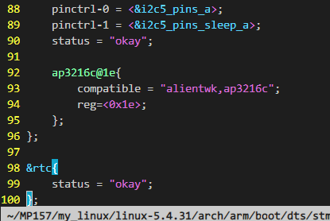
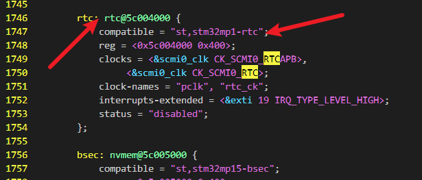
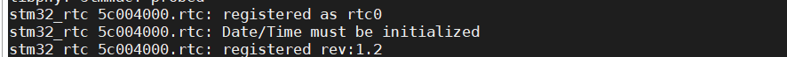

# 外设使用方法

```
只要使用到外设
第一步编写设备树，确定基地址是否正确
	在设备树下一定有一个compatible属性，这个属性的内容将在驱动代码中进行匹配，我们可以搜索属性的内容找到匹配的代码
第二步编写驱动
第三步应用层实现
```

以RTC为例

```
一般status属性都是失能的也就是没有开启该功能，如果需要使用我们就需要在自己的设备树下将该属性okay设置方法也很简单如下
 &rtc {
 	status = "okay";
 };

```



## 设备树下信息

```
st,stm32mp1-rtc
```




## 内核代码


修改设备树后编译启动内核



输入date查看初始化的时间

```
date
date -s "2022-05-11 19:40:00"//设备初始时间
设备完成以后内核就会安装这个时间往下记时
hwclock -w //将当前系统时间写入到 RTC 里面，这样重启开发板时间也不会丢失，纽扣电池的的作用
```

[linux内核中表示时间的结构体 - metootxy - 博客园 (cnblogs.com)](https://www.cnblogs.com/metootxy/archive/2013/06/03/3116006.html)

```
struct rtc_time
{
  int tm_sec;
  int tm_min;
  int tm_hour;
  int tm_mday;
  int tm_mon;
  int tm_year;
  int tm_wday;
  int tm_yday;
  int tm_isdst;
};
```

## APP

```
#include <stdio.h>
#include <string.h>
#include <unistd.h>
#include <stdlib.h>
#include <fcntl.h>
#include<sys/ioctl.h>
#define RTC_RD_TIME	_IOR('p', 0x09, struct rtc_time) 


struct rtc_time
{
  int tm_sec;
  int tm_min;
  int tm_hour;
  int tm_mday;
  int tm_mon;
  int tm_year;
  int tm_wday;
  int tm_yday;
  int tm_isdst;
};

struct rtc_time tm;
int main(int argc, char *argv[])
{
  int fd;
  char *filename;
  unsigned char databuf[1];
  int retvalue;
  int cmd = RTC_RD_TIME;

  filename = argv[1];
  fd = open(filename, O_RDWR);
  if (fd < 0)
  {
    printf("open failed\r\n");
  }
  while (1)
  {
    ioctl(fd, cmd, &tm); /* 读取RTC时间 */
    printf("读取一次\r\n");
    printf("日期%d.%d.%d\r\n",tm.tm_year+1900,tm.tm_mon+1,tm.tm_mday);
    printf("时间%d:%d:%d\r\n",tm.tm_hour,tm.tm_min,tm.tm_sec);

    sleep(1);
  }
  close(fd);
  return 0;
}
```

