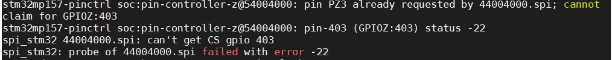
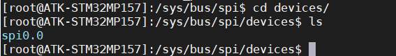
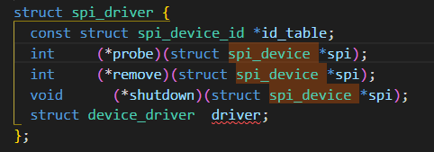
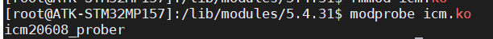
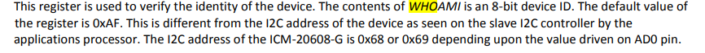

# SPI驱动ICM-20608-G

## 设备树的修改

### 一查看原理图

```
我们看到使用的是SPI1
PZ0       PZ1       PZ2         PZ3
SPI_SCK   SPI_MISO  SPI_MOSI    NSS
```


### 二查看设备树

```
我们可以看到默认是disabled
```


### 三查看pinctrl子系统

```
ps：这个不能按照教程更改，如果修改会出现端口被占用的问题
```



正确的更改方式


```
spi1_pins_a
spi1_sleep_pins_a
pinmux = <STM32_PINMUX('Z', 1, AF5)>; /* SPI1_MISO */
cs-gpios = <&gpioz 3 GPIO_ACTIVE_LOW>;
spi-max-frequency = <8000000>;
```

### 四在自己的设备树下开启spi1功能

```
cd /root/MP157/my_linux/linux-5.4.31/arch/arm/boot/dts
vim stm32mp157d-atk.dts
cp stm32mp157d-atk.dtb /root/MP157/my_linux/bootfs
```


```
cs-gpios代表的是硬件片选
cs-gpio代表软件片选
区别就是当spi进行通信的时候是否需要我们将cs线拉低
cs-gpio需要我们编写拉低拉高程序
cs-gpios不需要我们编写拉低拉高程序
```


### 五内核使能SPI控制器

```
./arch/arm/configs/stm32mp1_atk_defconfig

make dtbs uImage LOADADDR=0XC2000040 -j32

cp stm32mp157d-atk.dtb /root/MP157/my_linux/bootfs

cp uImage /root/MP157/my_linux/bootfs
```


### 六查看原先的spi目录

```
至此设备树修改完成，并且成功添加了icm20608设备
```



## 驱动代码的编写

### 一SPI设备驱动的注册

```
spi设备的注册：向内核注册一个spi设备
一个spi_driver 驱动可以对应多个spi_device 

和IIC一样加载驱动会执行probe函数
卸载驱动会执行remove函数
```



当加载驱动文件后并且与设备树匹配以后就会执行probe函数



[注册字符设备](./icm_0.c)

### 外设ID

```
0xAF
```



### 测试SPI通信

测试spi通信是否正常读取一下ID

### 内存申请

kzalloc大小限制128KB

有申请就有释放

```
  tx_data = kzalloc(len + 1, GFP_KERNEL);
  kfree(tx_data);
```

