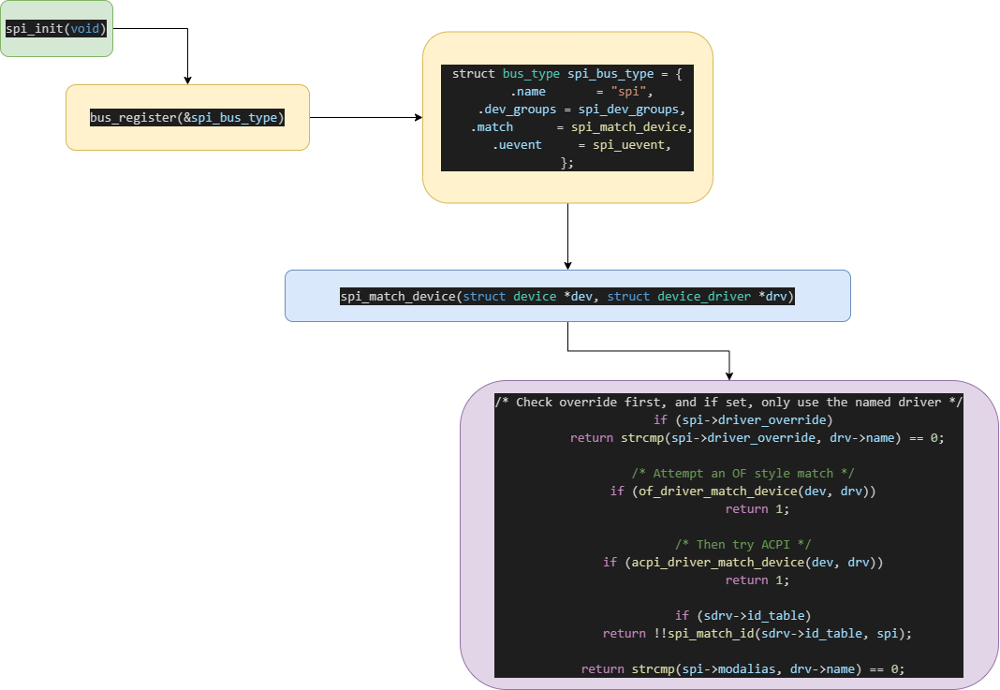
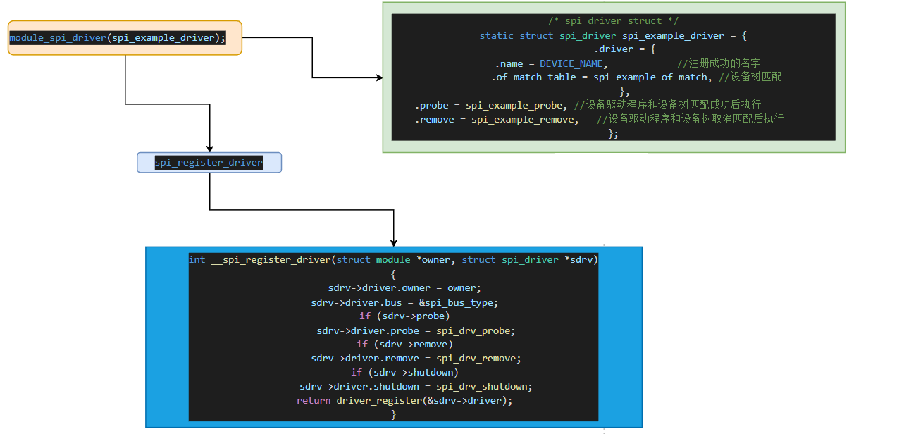
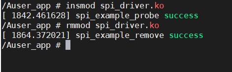
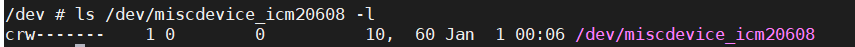
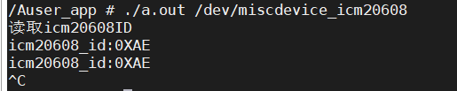

# SPI驱动

SPI驱动包括：设备驱动和控制器驱动。本文对设备驱动进行讲解

关于控制器驱动参考[SPI控制器驱动.md](./SPI控制器驱动.md)

## SPI总线框架分析

为什么设备树和设备驱动会匹配成功呢？

解释：这是因为linux内核提供了SPI总线。在系统开始运行时，内核会执行spi_init()利用该函数向内核注册SPI总线，在SPI总线注册时，向总线注册了spi_match_device函数，该函数的工作就是驱动与设备的匹配



匹配成功后为什么会执行probe函数？

解释：在设备驱动文件中，调用module_spi_driver(spi_example_driver)函数，将probe函数注册到linux的driver框架下



坚信一件事：程序都是一句一句跑起来的，不能一口气吃成胖子。

## SPI设备驱动

所以SPI设备驱动被我分成了一下几部分

1. 设备驱动程序和设备树进行匹配
2. 字符设备的创建
3. 配置（初始化）SPI设备（ICM20608）
4. 将读取到数据发送到用户空间

## 第一步：先让设备驱动程序和设备树进行匹配

### 1. 驱动程序

```c
#include <linux/module.h>
#include <linux/cdev.h>
#include <linux/spi/spi.h>
#include <linux/uaccess.h>

//所有spi_example字符串都可被替换成任意名称

#define DEVICE_NAME "spidev" /* Device name */
#define DEVICE_TREE_COMPATIBLE "imx6ull,icm20608" //设备树匹配属性名称

static int spi_example_probe(struct spi_device *spidev)
{
	printk("spi_example_probe success\r\n");
	return 0;
}

static int spi_example_remove(struct spi_device *spidev)
{
	printk("spi_example_remove success\r\n");
	return 0;
}

/* 传统匹配方式ID列表 */
static const struct spi_device_id icm20608_id[] = { { DEVICE_TREE_COMPATIBLE,
						      0 },
						    {} };

/* 设备树匹配表 */
static const struct of_device_id spi_example_of_match[] = {
	{
		.compatible = DEVICE_TREE_COMPATIBLE,
	},
	{ /* Sentinel */ }
};

/* spi driver struct */
static struct spi_driver spi_example_driver = {
	.probe = spi_example_probe,	//设备驱动程序和设备树匹配成功后执行
	.remove = spi_example_remove,	//设备驱动程序和设备树取消匹配后执行
	.driver = {
		.owner = THIS_MODULE,
		.name = DEVICE_NAME,			//注册成功的名字
		.of_match_table = spi_example_of_match,	//设备树匹配
	},
	.id_table = icm20608_id,
};

//SPI驱动入口，出口函数
module_spi_driver(spi_example_driver);

MODULE_LICENSE("GPL");
```

### 2. 设备树

在设备树下添加icm20608设备节点

```
arch/arm/boot/dts/imx6ull-self.dts
```

```dtd
 &ecspi3 {
		fsl,spi-num-chipselects = <1>;   /* 当前片选数量为1  因为只接了一个设备*/
		cs-gpio = <&gpio1 20 GPIO_ACTIVE_LOW>; 
		pinctrl-names = "default";
		pinctrl-0 = <&pinctrl_ecspi3>;
		status = "okay";

		/* icm20608 */
		icm20608: icm20608@0 {    /* 连接在spi3 的 第0个通道上 */
			compatible = "imx6ull,icm20608";
			spi-max-frequency = <8000000>;  /* 最大时钟频率为8MHz*/
			reg = <0>;
	};
};
```

当我们设置好设备树，以及驱动程序后。当加载程序时会调用spi_match_device进行匹配，匹配成功后就会执行spi_example_probe函数，卸载的时候就会执行spi_example_remove



然后就是linux的驱动，总线，设备那一套流程了。

## 第二步：匹配成功后，实现字符设备的创建

要想对spi设备进行数据传输，需要创建字符设备驱动

```c
#include <linux/module.h>
#include <linux/cdev.h>
#include <linux/spi/spi.h>
#include <linux/uaccess.h>

#include <linux/module.h> 
#include <linux/cdev.h> 
#include <linux/spi/spi.h> 
#include <linux/uaccess.h> 

#include <linux/device.h>
#include <linux/errno.h>
#include <linux/fs.h>
#include <linux/init.h>
#include <linux/miscdevice.h>
#include <linux/mutex.h>
#include <linux/types.h>
#include <mtd/mtd-abi.h>

//###########################################字符设备开始###########################################
#define DRIVER_NAME "miscdevice_icm20608"
#define PFX DRIVER_NAME ": "

static int routine_open(struct inode *inode, struct file *filp)
{
    return 0;
}

static ssize_t routine_read(struct file *filp, char __user *buf, size_t cnt, loff_t *offt)
{
    return 0;
}

static ssize_t routine_write(struct file *filp, const char __user *buf, size_t cnt, loff_t *offt)
{
    return 0;
}

static int routine_release(struct inode *inode, struct file *filp)
{
    return 0;
}

/* 设备操作函数 */
static struct file_operations routine_fops = {
    .owner = THIS_MODULE,
    .open = routine_open,
    .read = routine_read,
    .write = routine_write,
    .release = routine_release,
};

static struct miscdevice routine_device = {
    .minor = MISC_DYNAMIC_MINOR,
    .name = DRIVER_NAME,
    .fops = &routine_fops,
};

int misc_dev_register(void)
{
	int ret;
    ret = misc_register(&routine_device);
    if (ret)
    {
        printk(PFX "unable to register a misc device\n");
        return ret;
    }
    return 0;
}

//###########################################字符设备结束###########################################

//所有spi_example字符串都可被替换成任意名称

#define DEVICE_NAME "spidev" /* Device name */
#define DEVICE_TREE_COMPATIBLE "imx6ull,icm20608" //设备树匹配属性名称

static int spi_example_probe(struct spi_device *spidev)
{
	printk("spi_example_probe success\r\n");
	misc_dev_register();//注册字符设备
	return 0;
}

static int spi_example_remove(struct spi_device *spidev)
{
	printk("spi_example_remove success\r\n");
	misc_deregister(&routine_device);//杂项设备卸载
	return 0;
}

/* 传统匹配方式ID列表 */
static const struct spi_device_id icm20608_id[] = { { DEVICE_TREE_COMPATIBLE,
						      0 },
						    {} };

/* 设备树匹配表 */
static const struct of_device_id spi_example_of_match[] = {
	{
		.compatible = DEVICE_TREE_COMPATIBLE,
	},
	{ /* Sentinel */ }
};

/* spi driver struct */
static struct spi_driver spi_example_driver = {
	.probe = spi_example_probe,	//设备驱动程序和设备树匹配成功后执行
	.remove = spi_example_remove,	//设备驱动程序和设备树取消匹配后执行
	.driver = {
		.owner = THIS_MODULE,
		.name = DEVICE_NAME,			//注册成功的名字
		.of_match_table = spi_example_of_match,	//设备树匹配
	},
	.id_table = icm20608_id,
};

//SPI驱动入口，出口函数
module_spi_driver(spi_example_driver);

MODULE_LICENSE("GPL");
```



## 第三步字符设备创建完成后，就要开始对icm20608操作

1. 利用linux api函数（spi相关函数）对icm20608进行读写
2. 首先读取icm20608id号

```c
//参考drivers/spi/spi-tle62x0.c
#include <linux/module.h>
#include <linux/cdev.h>
#include <linux/spi/spi.h>
#include <linux/uaccess.h>

#include <linux/module.h>
#include <linux/cdev.h>
#include <linux/spi/spi.h>
#include <linux/uaccess.h>

#include <linux/device.h>
#include <linux/errno.h>
#include <linux/fs.h>
#include <linux/init.h>
#include <linux/miscdevice.h>
#include <linux/mutex.h>
#include <linux/types.h>
#include <mtd/mtd-abi.h>

#include <linux/of.h>
#include <linux/of_gpio.h>
#include <linux/gpio.h>

#include <linux/delay.h>

struct icm20608_dev_t {
	struct device_node *nd;
	void *private_data;
	int cs_gpio;
	struct gpio_desc *cs_desc;
	struct spi_device *spi;
};

struct icm20608_dev_t icm20608_dev;

//###########################################字符设备开始###########################################
#define DRIVER_NAME "miscdevice_icm20608"
#define PFX DRIVER_NAME ": "

static int routine_open(struct inode *inode, struct file *filp)
{
	return 0;
}

static ssize_t routine_read(struct file *filp, char __user *buf, size_t cnt,
			    loff_t *offt)
{
	return 0;
}

static ssize_t routine_write(struct file *filp, const char __user *buf,
			     size_t cnt, loff_t *offt)
{
	return 0;
}

static int routine_release(struct inode *inode, struct file *filp)
{
	return 0;
}

/* 设备操作函数 */
static struct file_operations routine_fops = {
	.owner = THIS_MODULE,
	.open = routine_open,
	.read = routine_read,
	.write = routine_write,
	.release = routine_release,
};

static struct miscdevice routine_device = {
	.minor = MISC_DYNAMIC_MINOR,
	.name = DRIVER_NAME,
	.fops = &routine_fops,
};

int misc_dev_register(void)
{
	int ret;
	ret = misc_register(&routine_device);
	if (ret) {
		printk(PFX "unable to register a misc device\n");
		return ret;
	}
	return 0;
}

//###########################################字符设备结束###########################################

//###########################################spi 读写函数 开始###########################################

static uint8_t icm20608_read_reg(struct spi_device *spidev, uint8_t reg,
				 uint8_t *data, uint8_t len)
{
	int ret;
	uint8_t tx_data[2] = { 0 };
	uint8_t rx_data[2] = { 0 };
	struct spi_transfer transfer = { 0 };
	struct spi_message message;

	tx_data[0] = reg | 0x80;

	transfer.tx_buf = tx_data;
	transfer.rx_buf = rx_data;
	transfer.len = len + 1; //长度是发生的长度+读取的长度

	// 将 CS 引脚置为低电平以开始 SPI 事务
	gpiod_set_value(icm20608_dev.cs_desc, 0);

	spi_message_init(&message);
	spi_message_add_tail(&transfer, &message);

	// 执行 SPI 事务
	ret = spi_sync(spidev, &message);

	// 将 CS 引脚置为高电平以结束 SPI 事务
	gpiod_set_value(icm20608_dev.cs_desc, 1);

	//只需要读取的数据
	memcpy(data, rx_data + 1, len);

	if (ret < 0) {
		printk("处理 SPI 通信错误\r\n");
		return ret;
	}

	return 0;
}

static uint8_t icm20608_write_reg(struct spi_device *spidev, uint8_t reg,
				  uint8_t *data, uint8_t len)
{
	int ret;
	uint8_t tx_data[2] = { 0 };
	struct spi_transfer transfer = { 0 };
	struct spi_message message;

	// 将 CS 引脚置为低电平以开始 SPI 事务
	gpiod_set_value(icm20608_dev.cs_desc, 0);

	tx_data[0] = reg & ~0x80; //icm20608规定读寄存器最高位为0

	transfer.tx_buf = tx_data;
	transfer.len = 1; //只发一个寄存器地址
	spi_message_init(&message);
	spi_message_add_tail(&transfer, &message);

	// 执行 SPI 事务
	ret = spi_sync(spidev, &message);

	transfer.tx_buf = data;
	transfer.len = len; //数据长度
	spi_message_init(&message);
	spi_message_add_tail(&transfer, &message);

	// 执行 SPI 事务
	ret = spi_sync(spidev, &message);

	// 将 CS 引脚置为高电平以结束 SPI 事务
	gpiod_set_value(icm20608_dev.cs_desc, 1);

	if (ret < 0) {
		printk("处理 SPI 通信错误\r\n");
		return ret;
	}

	return 0;
}

void read_icm20608_id(void)
{
	uint8_t rx_data = 0;
	icm20608_read_reg(icm20608_dev.spi, 0x75, &rx_data, 1);
	printk("ICM20608 Device ID: %#X\r\n", rx_data);
}

void icm20608_power_init(void)
{
	uint8_t tx_data = 0;
	tx_data = 0x80;
	icm20608_write_reg(icm20608_dev.spi, 0x6B, &tx_data, 1);
	mdelay(50);
	tx_data = 0x01;
	icm20608_write_reg(icm20608_dev.spi, 0x6C, &tx_data, 1);
	mdelay(50);
}

//###########################################spi 读写函数 结束###########################################

//所有spi_example字符串都可被替换成任意名称

#define DEVICE_NAME "spidev" /* Device name */
#define DEVICE_TREE_COMPATIBLE "imx6ull,icm20608" //设备树匹配属性名称

static int spi_example_probe(struct spi_device *spidev)
{
	int ret = 0;
	printk("spi_example_probe success\r\n");
	misc_dev_register(); //注册字符设备

	//利用of_get_parent获取ecspi3节点
	// 	&ecspi3 {
	// 		fsl,spi-num-chipselects = <1>;   /* 当前片选数量为1  因为只接了一个设备*/
	// 		cs-gpio = <&gpio1 20 GPIO_ACTIVE_LOW>;
	// 		pinctrl-names = "default";
	// 		pinctrl-0 = <&pinctrl_ecspi3>;
	// 		status = "okay";

	// 		/* icm20608 */
	// 		icm20608: icm20608@0 {    /* 连接在spi3 的 第0个通道上 */
	// 			compatible = "imx6ull,icm20608";
	// 			spi-max-frequency = <8000000>;  /* 最大时钟频率为8MHz*/
	// 			reg = <0>;
	// 	};
	// };

	//参数要查找的父节点，返回查找到的父节点
	icm20608_dev.nd = of_get_parent(spidev->dev.of_node);

	//参数设备节点，包含要获取 GPIO 信息的属性名，哪个 GPIO的编号,返回GPIO编号
	icm20608_dev.cs_gpio = of_get_named_gpio(icm20608_dev.nd, "cs-gpio", 0);
	if (icm20608_dev.cs_gpio < 0) {
		printk("of_get_named_gpio file\r\n");
	}

	//为cs引脚申请gpio
	//参数要申请的哪一个管脚，为其取一个名字，
	ret = gpio_request(icm20608_dev.cs_gpio, "cs");
	if (ret < 0) {
		printk("gpio_request file\r\n");
	}

	//参数要设置的哪一个管脚，1高电平 ，0低电平
	icm20608_dev.cs_desc = gpio_to_desc(icm20608_dev.cs_gpio);
	if (!icm20608_dev.cs_desc) {
		printk("gpio_to_desc file\n");
		return -1;
	}

	ret = gpiod_direction_output(icm20608_dev.cs_desc, 1);
	if (ret < 0) {
		printk("gpiod_direction_output file\r\n");
	}

	//设置SPI的模式
	spidev->mode = SPI_MODE_0;
	spi_setup(spidev);

	icm20608_dev.private_data = spidev; //将spi设置为私有数据
	icm20608_dev.spi = spidev;
	icm20608_power_init();
	read_icm20608_id();

	return 0;
}

static int spi_example_remove(struct spi_device *spidev)
{
	printk("spi_example_remove success\r\n");
	misc_deregister(&routine_device); //杂项设备卸载
	gpio_free(icm20608_dev.cs_gpio); //释放gpio_request申请的资源
	return 0;
}

/* 传统匹配方式ID列表 */
static const struct spi_device_id icm20608_id[] = { { DEVICE_TREE_COMPATIBLE,
						      0 },
						    {} };

/* 设备树匹配表 */
static const struct of_device_id spi_example_of_match[] = {
	{
		.compatible = DEVICE_TREE_COMPATIBLE,
	},
	{ /* Sentinel */ }
};

/* spi driver struct */
static struct spi_driver spi_example_driver = {
	.probe = spi_example_probe,	//设备驱动程序和设备树匹配成功后执行
	.remove = spi_example_remove,	//设备驱动程序和设备树取消匹配后执行
	.driver = {
		.owner = THIS_MODULE,
		.name = DEVICE_NAME,			//注册成功的名字
		.of_match_table = spi_example_of_match,	//设备树匹配
	},
	.id_table = icm20608_id,
};

//SPI驱动入口，出口函数
module_spi_driver(spi_example_driver);

MODULE_LICENSE("GPL");
```

如何进行一次数据的传输

```jsx
①、申请并初始化 spi_transfer，设置 spi_transfer 的 tx_buf 成员变量，tx_buf 为要发送的数据。然后设置 rx_buf 成员变量，rx_buf 保存着接收到的数据。最后设置 len 成员变量，也就是要进行数据通信的长度。
②、使用 spi_message_init 函数初始化 spi_message。
③、使用spi_message_add_tail函数将前面设置好的spi_transfer添加到spi_message队列中。
④、使用 spi_sync 函数完成 SPI 数据同步传输
```

## 第四步将读到的ID发送到应用程序

驱动程序利用copy_to_user将数据从内核空间发送到应用空间

```c
//参考drivers/spi/spi-tle62x0.c
#include <linux/module.h>
#include <linux/cdev.h>
#include <linux/spi/spi.h>
#include <linux/uaccess.h>

#include <linux/module.h>
#include <linux/cdev.h>
#include <linux/spi/spi.h>
#include <linux/uaccess.h>

#include <linux/device.h>
#include <linux/errno.h>
#include <linux/fs.h>
#include <linux/init.h>
#include <linux/miscdevice.h>
#include <linux/mutex.h>
#include <linux/types.h>
#include <mtd/mtd-abi.h>

#include <linux/of.h>
#include <linux/of_gpio.h>
#include <linux/gpio.h>

#include <linux/delay.h>

struct icm20608_dev_t {
	struct device_node *nd;
	void *private_data;
	int cs_gpio;
	struct gpio_desc *cs_desc;
	struct spi_device *spi;
	int icm20608_id;
};

struct icm20608_dev_t icm20608_dev;

//###########################################字符设备开始###########################################
#define DRIVER_NAME "miscdevice_icm20608"
#define PFX DRIVER_NAME ": "

static int routine_open(struct inode *inode, struct file *filp)
{
	return 0;
}

static ssize_t routine_read(struct file *filp, char __user *buf, size_t cnt,
			    loff_t *offt)
{
	int ret = 0;
	ret = copy_to_user(buf, &icm20608_dev.icm20608_id, 1);
	return 0;
}

static ssize_t routine_write(struct file *filp, const char __user *buf,
			     size_t cnt, loff_t *offt)
{
	return 0;
}

static int routine_release(struct inode *inode, struct file *filp)
{
	return 0;
}

/* 设备操作函数 */
static struct file_operations routine_fops = {
	.owner = THIS_MODULE,
	.open = routine_open,
	.read = routine_read,
	.write = routine_write,
	.release = routine_release,
};

static struct miscdevice routine_device = {
	.minor = MISC_DYNAMIC_MINOR,
	.name = DRIVER_NAME,
	.fops = &routine_fops,
};

int misc_dev_register(void)
{
	int ret;
	ret = misc_register(&routine_device);
	if (ret) {
		printk(PFX "unable to register a misc device\n");
		return ret;
	}
	return 0;
}

//###########################################字符设备结束###########################################

//###########################################spi 读写函数 开始###########################################

static uint8_t icm20608_read_reg(struct spi_device *spidev, uint8_t reg,
				 uint8_t *data, uint8_t len)
{
	int ret;
	uint8_t tx_data[2] = { 0 };
	uint8_t rx_data[2] = { 0 };
	struct spi_transfer transfer = { 0 };
	struct spi_message message;

	tx_data[0] = reg | 0x80;

	transfer.tx_buf = tx_data;
	transfer.rx_buf = rx_data;
	transfer.len = len + 1; //长度是发生的长度+读取的长度

	// 将 CS 引脚置为低电平以开始 SPI 事务
	gpiod_set_value(icm20608_dev.cs_desc, 0);

	spi_message_init(&message);
	spi_message_add_tail(&transfer, &message);

	// 执行 SPI 事务
	ret = spi_sync(spidev, &message);

	// 将 CS 引脚置为高电平以结束 SPI 事务
	gpiod_set_value(icm20608_dev.cs_desc, 1);

	//只需要读取的数据
	memcpy(data, rx_data + 1, len);

	if (ret < 0) {
		printk("处理 SPI 通信错误\r\n");
		return ret;
	}

	return 0;
}

static uint8_t icm20608_write_reg(struct spi_device *spidev, uint8_t reg,
				  uint8_t *data, uint8_t len)
{
	int ret;
	uint8_t tx_data[2] = { 0 };
	struct spi_transfer transfer = { 0 };
	struct spi_message message;

	// 将 CS 引脚置为低电平以开始 SPI 事务
	gpiod_set_value(icm20608_dev.cs_desc, 0);

	tx_data[0] = reg & ~0x80; //icm20608规定读寄存器最高位为0

	transfer.tx_buf = tx_data;
	transfer.len = 1; //只发一个寄存器地址
	spi_message_init(&message);
	spi_message_add_tail(&transfer, &message);

	// 执行 SPI 事务
	ret = spi_sync(spidev, &message);

	transfer.tx_buf = data;
	transfer.len = len; //数据长度
	spi_message_init(&message);
	spi_message_add_tail(&transfer, &message);

	// 执行 SPI 事务
	ret = spi_sync(spidev, &message);

	// 将 CS 引脚置为高电平以结束 SPI 事务
	gpiod_set_value(icm20608_dev.cs_desc, 1);

	if (ret < 0) {
		printk("处理 SPI 通信错误\r\n");
		return ret;
	}

	return 0;
}

void read_icm20608_id(void)
{
	uint8_t rx_data = 0;
	icm20608_read_reg(icm20608_dev.spi, 0x75, &rx_data, 1);
	icm20608_dev.icm20608_id = rx_data;
	printk("ICM20608 Device ID: %#X\r\n", rx_data);
}

void icm20608_power_init(void)
{
	uint8_t tx_data = 0;
	tx_data = 0x80;
	icm20608_write_reg(icm20608_dev.spi, 0x6B, &tx_data, 1);
	mdelay(50);
	tx_data = 0x01;
	icm20608_write_reg(icm20608_dev.spi, 0x6C, &tx_data, 1);
	mdelay(50);
}

//###########################################spi 读写函数 结束###########################################

//所有spi_example字符串都可被替换成任意名称

#define DEVICE_NAME "spidev" /* Device name */
#define DEVICE_TREE_COMPATIBLE "imx6ull,icm20608" //设备树匹配属性名称

static int spi_example_probe(struct spi_device *spidev)
{
	int ret = 0;
	printk("spi_example_probe success\r\n");
	misc_dev_register(); //注册字符设备

	//利用of_get_parent获取ecspi3节点
	// 	&ecspi3 {
	// 		fsl,spi-num-chipselects = <1>;   /* 当前片选数量为1  因为只接了一个设备*/
	// 		cs-gpio = <&gpio1 20 GPIO_ACTIVE_LOW>;
	// 		pinctrl-names = "default";
	// 		pinctrl-0 = <&pinctrl_ecspi3>;
	// 		status = "okay";

	// 		/* icm20608 */
	// 		icm20608: icm20608@0 {    /* 连接在spi3 的 第0个通道上 */
	// 			compatible = "imx6ull,icm20608";
	// 			spi-max-frequency = <8000000>;  /* 最大时钟频率为8MHz*/
	// 			reg = <0>;
	// 	};
	// };

	//参数要查找的父节点，返回查找到的父节点
	icm20608_dev.nd = of_get_parent(spidev->dev.of_node);

	//参数设备节点，包含要获取 GPIO 信息的属性名，哪个 GPIO的编号,返回GPIO编号
	icm20608_dev.cs_gpio = of_get_named_gpio(icm20608_dev.nd, "cs-gpio", 0);
	if (icm20608_dev.cs_gpio < 0) {
		printk("of_get_named_gpio file\r\n");
	}

	//为cs引脚申请gpio
	//参数要申请的哪一个管脚，为其取一个名字，
	ret = gpio_request(icm20608_dev.cs_gpio, "cs");
	if (ret < 0) {
		printk("gpio_request file\r\n");
	}

	//参数要设置的哪一个管脚，1高电平 ，0低电平
	icm20608_dev.cs_desc = gpio_to_desc(icm20608_dev.cs_gpio);
	if (!icm20608_dev.cs_desc) {
		printk("gpio_to_desc file\n");
		return -1;
	}

	ret = gpiod_direction_output(icm20608_dev.cs_desc, 1);
	if (ret < 0) {
		printk("gpiod_direction_output file\r\n");
	}

	//设置SPI的模式
	spidev->mode = SPI_MODE_0;
	spi_setup(spidev);

	icm20608_dev.private_data = spidev; //将spi设置为私有数据
	icm20608_dev.spi = spidev;
	icm20608_power_init();
	read_icm20608_id();

	return 0;
}

static int spi_example_remove(struct spi_device *spidev)
{
	printk("spi_example_remove success\r\n");
	misc_deregister(&routine_device); //杂项设备卸载
	gpio_free(icm20608_dev.cs_gpio); //释放gpio_request申请的资源
	return 0;
}

/* 传统匹配方式ID列表 */
static const struct spi_device_id icm20608_id[] = { { DEVICE_TREE_COMPATIBLE,
						      0 },
						    {} };

/* 设备树匹配表 */
static const struct of_device_id spi_example_of_match[] = {
	{
		.compatible = DEVICE_TREE_COMPATIBLE,
	},
	{ /* Sentinel */ }
};

/* spi driver struct */
static struct spi_driver spi_example_driver = {
	.probe = spi_example_probe,	//设备驱动程序和设备树匹配成功后执行
	.remove = spi_example_remove,	//设备驱动程序和设备树取消匹配后执行
	.driver = {
		.owner = THIS_MODULE,
		.name = DEVICE_NAME,			//注册成功的名字
		.of_match_table = spi_example_of_match,	//设备树匹配
	},
	.id_table = icm20608_id,
};

//SPI驱动入口，出口函数
module_spi_driver(spi_example_driver);

MODULE_LICENSE("GPL");
```

```c
//应用程序
#include <stdio.h>
#include <stdlib.h>
#include <sys/types.h>
#include <sys/stat.h>
#include <fcntl.h>
#include <unistd.h>

int main(int argc, char *argv[])
{
	printf("读取icm20608ID\r\n");

	int ret = 0;

	int fd = 0;

	int icm20608_id = 0;

	char *filename = { 0 };

	filename = argv[1];

	fd = open(filename, O_RDWR);

	if (fd < 0) {
		printf("open file\r\n");
	}

	while (1) {
		ret = read(fd, &icm20608_id, sizeof(icm20608_id));
		printf("icm20608_id:%#X\r\n", icm20608_id);
		sleep(1);
	}
}
```

