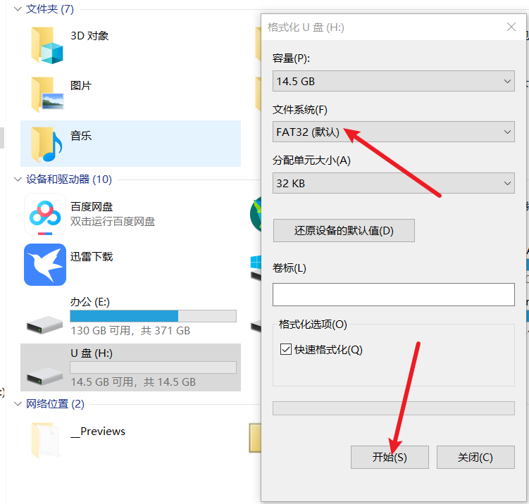
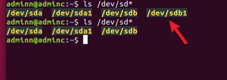
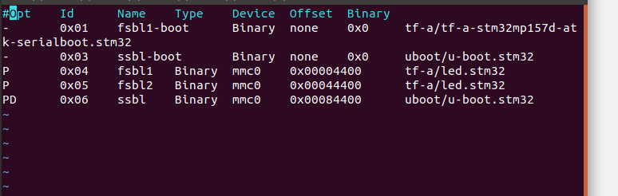
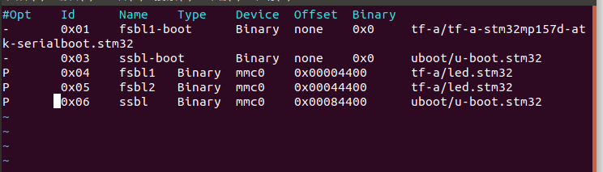
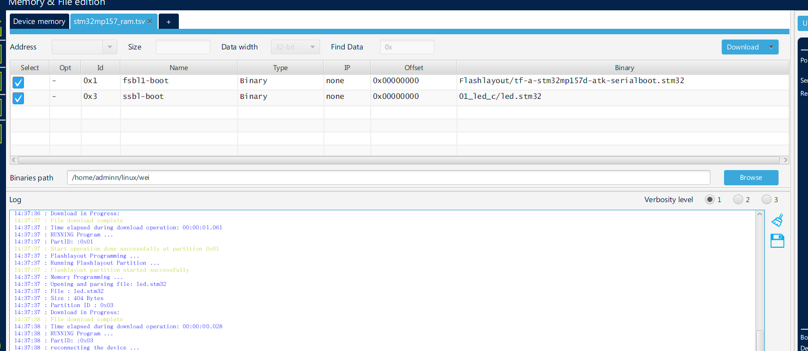
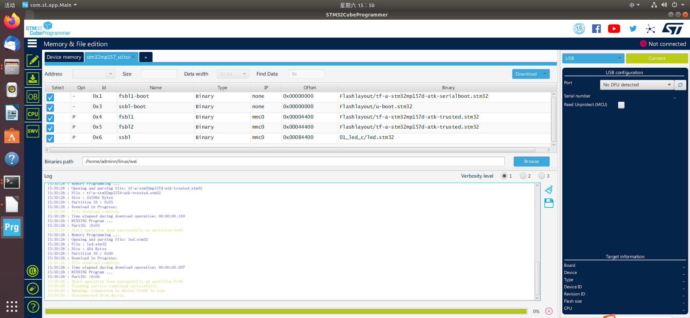
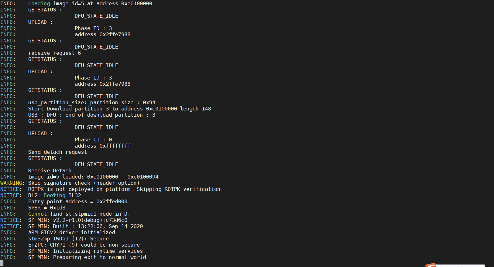

# 裸机开发

## 为什么使用到汇编语言

1. 初始化一些SOC外设
2. 初始化DDR
3. 设置sp指针指向DDR，设置好C语言开发环境

sync

## 点灯

LED0:PI0

1. 使能时钟
2. 所有GPIO都有弱上拉下拉由寄存器GPIOx_PUPDR控制 
3. 复用功能 GPIOx_AFRL (for pin 0 to 7) and GPIOx_AFRH (for pin 8 to  15) 
4. 输出，输出，复用，或者模拟模式的控制寄存器 GPIOx_MODER 
5. GPIOx_OTYPER and GPIOx_OSPEEDR控制输出类型开漏还是推完
6. 输入寄存器GPIOx_IDR 输出寄存器 GPIOx_ODR
7. GPIOx_BSRR对ODR复位寄存器，是对位操作的，写0无效，写1复位BS(i) 复位设置第i位and BR(i)复位第i位
8. 所有端口均支持外部，使用外部中断的时候不能设置为模拟输入模式
9. 设置GPIO的时钟源RCC_CSR（LSE,HSE）
10. 地址分布162页 0x50002000 GPIOA  GPIOI 0x5000A000 

## 程序写好后

```
PS: .global _start 不能大写
```

```
.text
.global _start
_start:
	@1、设置RCC_MC_AHB4ENSETR寄存器，使能GPIOI时钟
	LDR		R0,	=0x50000A28
	LDR		R1, [R0]				@读取RCC_MC_AHB4ENSETR寄存器的值到R1
	ORR		R1, #(1 << 8)			@bit8置1,使能GPIOI时钟
	STR		R1,	[R0]				@写入到RCC_MC_AHB4ENSETR寄存器
	
	@2、GPIOI_MODER寄存器，设置GPIOI_0输出模式
	LDR		R0,	=0x5000A000
	LDR		R1, [R0]				@读取GPIOI_MODER寄存器的值到R1
	BIC		R1, #(3 << (2 * 0))		@bit1:0			清零
	ORR		R1, #(1 << (2 * 0))		@bit1:0			设置为01
	STR		R1,	[R0]				@写入到GPIOI_MODER寄存器
	
	@3、GPIOI_OTYPER寄存器，设置GPIOI_0为推挽模式
	LDR		R0,	=0x5000A004		
	LDR		R1, [R0]				@读取GPIOI_OTYPER寄存器值到R1
	BIC		R1, #(1 << 0)			@bit0	清零,设置为上拉
	STR		R1,	[R0]				@写入到GPIOI_OTYPER寄存器	
	
	@4、GPIOI_OSPEEDR寄存器，设置GPIOI_0为高速
	LDR		R0,	=0x5000A008
	LDR		R1, [R0]				@读取GPIOI_OSPEEDR寄存器的值到R1
	BIC		R1, #(3 << (2 * 0))		@bit1:0		清零
	ORR		R1, #(2 << (2 * 0))		@bit1:0		设置为10
	STR		R1,	[R0]				@写入到GPIOI_OSPEEDR寄存器	
	
	@5、GPIOI_PUPDR寄存器，设置GPIOI_0上拉
	LDR		R0,	=0x5000A00C
	LDR		R1, [R0]				@读取GPIOI_PUPDR寄存器的值到R1
	BIC		R1, #(3 << (2 * 0))		@bit1:0		清零
	ORR		R1, #(1 << (2 * 0))		@bit1:0		设置为01
	STR		R1,	[R0]				@写入到GPIOI_PUPDR寄存器	

  @灯亮
	LDR		R0,	=0x5000A018
	LDR		R1, [R0]				@读取GPIOI_BSRR寄存器的值到R1
	ORR		R1, #(1 << 16)	@第16位置一 复位BSRR寄存器，灯亮
	@ORR		R1, #(1 << 0)	  @第0位置一 设置BSRR寄存器，灯灭
	STR		R1,	[R0]				@写入到GPIOI_BSRR寄存器

Loop:
	B Loop
  
```


1. 编译将.c .s编译为.o

```c++
arm-linux-gnueabihf-gcc -g -c led.s -o led.o
```

12. 链接将所有的.o文件链接生成可执行文件，要指定链接起始地址，就是代码运行的起始的地址

    链接起始地址选择DDR的0x8780000地址开始

    要使用DDR就要初始化DDR，还需要利用外部内存(SD，EMMC等)，将bin文件复制到DDR中，

    内部的ROM会将外部内存的可执行程序复制到DDR（也不一定是DDR，准确的来说，是你链接时候的地址）

    DDR的地址（0xC0000000）

```
arm-linux-gnueabihf-ld -Ttext 0xC8000000 led.o -o led.elf
```

```
arm-linux-gnueabihf-ld -Ttext led.o -o led.elf
arm-linux-gnueabihf-ld led.o -o led.elf现在用的
```


13. 生成bin文件

```
arm-linux-gnueabihf-objcopy -O binary -g -S led.elf led.bin
```

## 开始烧写

格式化SD卡32k



在linux向sd卡烧写bin文件

确定sd的设备号

使用df -H可以查看设备的储存大小



烧写到sd卡,这条命令无效

```
sudo dd if=led.stm32 of=/dev/sdb1 conv=fsync
```

## stm32image

给bin文件添加头部，作用st公司要求的

```
gcc stm32image.c -o stm32image
```

生成.32

```
./stm32image -l 0xC0100000 -e 0xC0100000 -s led.bin -d led.stm32
```

程序烧录到SD卡

01和03都是为了能将程序下载到sd卡做准备的程序

0405才是要下的程序

06是（uboot）

出错只有一个D 的差别



正确



GPIO配置输出模式

1. 使能时钟自己
2. 使能GPIOI
3. 设置PI0为GPIO模式，并且为输出模式

## 编译遇到的问题

|                                                              |                    |           |
| ------------------------------------------------------------ | ------------------ | --------- |
| [编译时“-nostdlib”的使用_clbiao的博客-CSDN博客](https://blog.csdn.net/clb1609158506/article/details/41381561) | 不连接标准启动文件 | -nostdlib |
|                                                              |                    |           |
|                                                              |                    |           |

总结编译流程

生成.o

```
arm-linux-gnueabihf-gcc -g -c led.s -o led.o
```

生成.elf

```
arm-linux-gnueabihf-ld led.o -o led.elf
```

生成.bin

```
arm-linux-gnueabihf-objcopy -O binary -g -S led.elf led.bin
```

加入头部生成.stm32 

将stm32image加入-a开始地址0xC0100000，-e结束地址0xC0100000，-d制作出image对于MP157就是制作出.stm32文件

```
mkimage -T stm32image -a 0xC0100000 -e 0xC0100000 -d led.bin led.stm32
```

```
PS:这个指令不理解怎么回事，按照韦东山老师的编译复制过来的
我理解的应该是这样的
./stm32image -l 0xC0100000 -e 0xC0100000 -s led.bin -d led.stm32
```

闪烁led0

烧录界面ram烧录



sd卡烧录



串口界面



## makefile部分

第一个版本

```
all:
	arm-linux-gnueabihf-gcc -g -c start.S -o led.o
	arm-linux-gnueabihf-ld led.o -o led.elf
	arm-linux-gnueabihf-objcopy -O binary -g -S led.elf led.bin
	mkimage -T stm32image -a 0xC0100000 -e 0xC0100000 -d led.bin led.stm32
clean:
	rm *.o
	rm *.elf
	rm *.bin
```

第二个版本

```
all:
	arm-none-linux-gnueabihf-gcc -g -c start.S -o led.o
	arm-none-linux-gnueabihf-ld led.o -o led.elf
	arm-none-linux-gnueabihf-objcopy -O binary -g -S led.elf led.bin
	mkimage -T stm32image -a 0xC0100000 -e 0xC0100000 -d led.bin led.stm32
clean:
	rm *.o
	rm *.elf
	rm *.bin
```


```
PS:区别是交叉编译工具选择不同
```

