# RS232 RS455

## 设备树的修改

### 一查看原理图

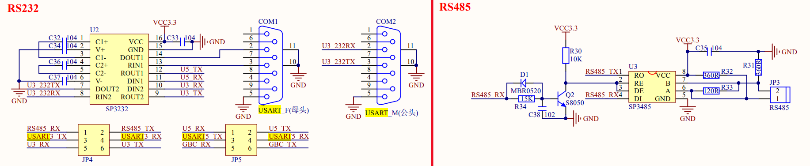

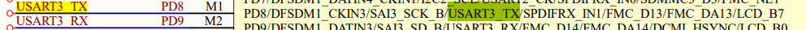

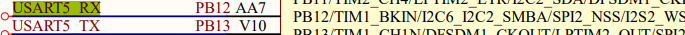

```
由原理图可以得知
串口3使用的是PD8 PD9
串口3使用的是PB12 PB13
```

### 二查看设备树

```
查看设备树vi stm32mp151.dtsi
我们可以看到串口3和串口4已经被定义了
我们就不需要编写这一部分代码了
```

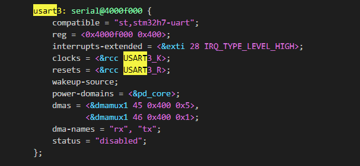

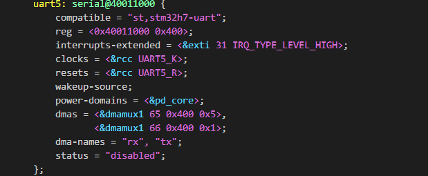

### 三查看pinctrl子系统

```
在pinctrl子系统中我们发现串口3的引脚并不是我们需要的（截图有缺省）
原来的只有usart3_a  usart3_b
仿照ab写一个c
```

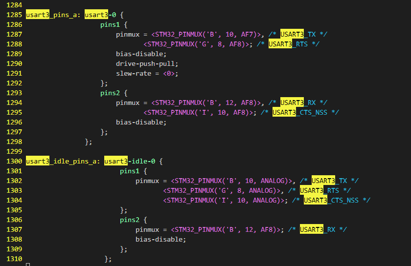

```
usart3_pins_c: usart3-1 {
1358                         pins1 {
1359                             pinmux = <STM32_PINMUX('D', 8, AF7)>; /* USART3_TX */
1360                             bias-disable;
1361                             slew-rate = <0>;
1362                             drive-push-pull;
1363 
1364                         };
1365                         pins2 {
1366                             pinmux = <STM32_PINMUX('D', 9, AF7)>; /* USART3_RX */
1367                             bias-disable;
1368                         };
1369                     };
```


### 四在自己的设备树下开启外设功能

#### 串口的特殊配置在根节点下增加


```
118 &usart3 { 
119     pinctrl-names = "default";
120     pinctrl-0 = <&usart3_pins_c>;
121     status = "okay";
122 };
123 
124 &uart5 {
125     pinctrl-names = "default";
126     pinctrl-0 = <&uart5_pins_a>; 
127     status = "okay";
128 };
```


### 五内核使能外设控制器

```
串口不需要
```

### 六查看原先的外设目录

```
ls /dev/ttyST*
```


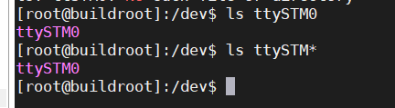

### 七查看现在的外设目录

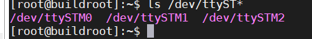

### 八配置串口的波特率等等

```
minicom -s
文件名和路径
文件传输协议
串口设置
调制解调器和拨号
屏幕和键盘
将配置保存为dfl
将配置保存
退出
退出小型计算机
```

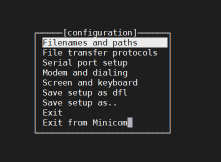

#### RS232配置

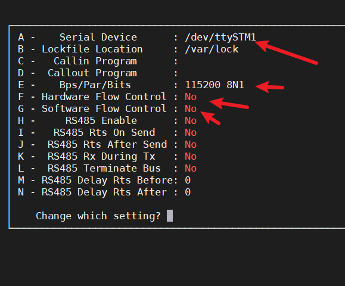

回车保存，exit退出

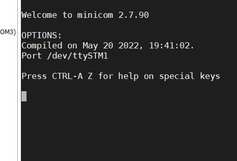

#### RS485配置

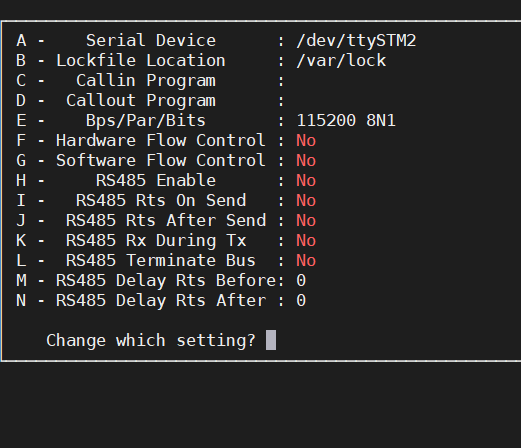

跳帽连接RS485

将USB转485连接到板子的AB

进行收发测试

```
查看串口的配置
stty -F /dev/ttyS0 -a
```


## 驱动代码的编写

串口不需要编写

## 应用编程

struct termios 结构体

termios API 中提供了 cfgetispeed()和 cfsetispeed()函数分别用于获取和设置串口
的波特率。
