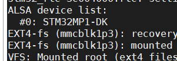

# 音频

对于外界来说产生的信号都是模拟信号，单片机能识别的就是数字也就是数字信号

模拟信号的采集使用ADC

```cpp
利用ADC就将模拟信号转换为单片机可识别的数字信号
```

数字信号选用DAC

```cpp
利用DAC就可以将单片机设置的数字信号转为换模拟信号
可以理解为数字设置电压值
```

只有ADC/DAC不能满足声音的动听

```cpp
我们往往需要听到的声音动听、
录进去的语音贴近真实、可以调节音效、对声音能够进行一些处理(需要 DSP 单元)、拥有统一
的标准接口，方便开发等等。将这些针对声音的各种要求全部叠加到 DAC 和 ADC 芯片上，那
么就会得到一个专门用于音频的芯片，也就是音频编解码芯片，英文名字就是 Audio CODEC
```

## IIS

```cpp
I2S 总线用于主控制器和音频 芯片之间传输音频数据
```

IIS三线和四线

IIS三线：SCK时钟线 WS声道选择（0右声道 1左声道 频率等于采样率 ）SD串行数据信号线（实际的音频数据传输，放声或者录音）

IIS四线：比三线多了一根SD线（两根SD线支持调试放声，录音）

另外，有时候为了使音频 CODEC 芯片与主控制器之间能够更好的同步，会引入另外一个 叫做 MCLK 的信号，也叫做主时钟或系统时钟，一般是采样率的 256 倍或 384 倍

SD数据线支持左对齐/右对齐

## SAI 接口

SAI 接口(串行音频接口)灵活性高、配置多样，可支持多种音频协议。该接口适用许多立体 声或单声道应用。支持 I2S 标准、LSB 或 MSB 对齐、PCM/DSP、TDM 等等协议。全称为 Synchronous Audio Interface，SAI 的特性

## CS42L51模块

查看原理图


```
八个引脚均连接到157D芯片上//其中CS42L51用到了5根用于157与CS42L51之间的音频发送
I2C用的是IC4
```


ST 官方已经写好了 CS42L51 驱动，因此我们直接配置内核使能 CS42L51 驱动即可，按照 如下所示步骤使能 CS42L51 驱动

首先驱动文件时写好的

```cpp
sound/soc/codecs/cs42l51.c//在这个路径下
```

打开设备树文件

```cpp
cd /root/MP157/my_linux/linux-5.4.31/arch/arm/boot/dts
vim stm32mp157d-atk.dts
```

创建I2C4节点将vim stm32mp15xx-dkx.dtsi下的cs42151节点复制到I2C4节点中


查看stm32mp15-pinctrl.dtsi子系统中i2c4对应的引脚PZ4 PZ5与原理图对应所以不需要修改


根节点下增加1.8v电源节点


至此，关于 cs42l51 的 I2C 配置接口设备树就已经添加好了

将sai节点复制到我们的设备树


查看pinctrl子系统，引脚与板子一致不需要更改


根几点下添加sound节点此节点用作控制音频数据 的收发


compatible：非常重要，用于匹配相应的驱动文件，在整个 linux 内核源码中搜索这“audiograph-card”属性值即可找到对应的驱动文件，这里找到的驱动文件为：sound/soc/generic/audiograph-card.c。

至此设备树修改完成

使能模块

make menuconfig

使能完以后重新编译设备树，编译内核

```cpp
make dtbs uImage LOADADDR=0XC2000040 -j32
cp /root/MP157/my_linux/linux-5.4.31/arch/arm/boot/uImage /root/MP157/my_linux/bootfs

```

```
cp /root/MP157/my_linux/linux-5.4.31/arch/arm/boot/dts/stm32mp157d-atk.dtb /root/MP157/my_linux/bootfs
```

```cpp

cd /root/MP157/my_linux/bootfs//制作镜像
```


烧录


启动看logo





修改bootbuild

图形化

```cpp
make menuconfig
```

配置完成以后保存

```cpp
./configs/stm32mp1_atk_defconfig
```

保存之后编译

```cpp
make stm32mp1_atk_defconfig
sudo make
```

编译完成以后制作镜像

```
cp rootfs.tar /root/MP157/bootbuild/rootfs/nfs1
tar -xvf rootfs.tar
cd /root/MP157/bootbuild/rootfs
./rootfs.sh
```

烧录查看

