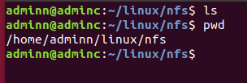
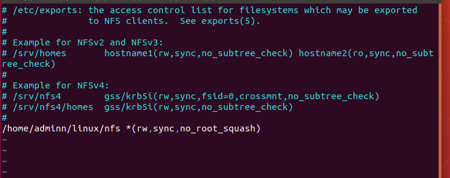
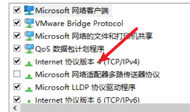
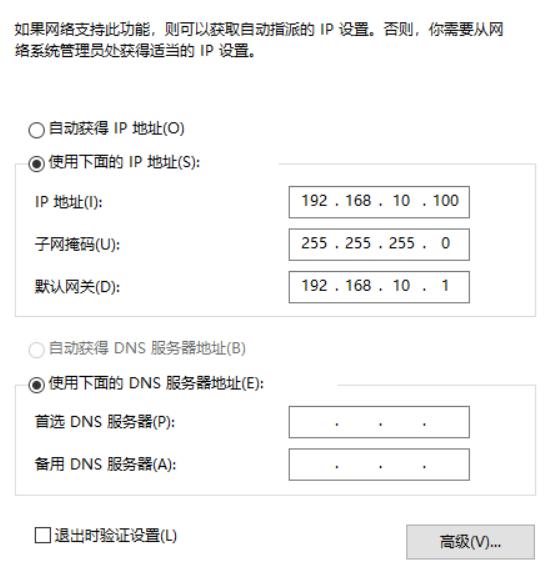
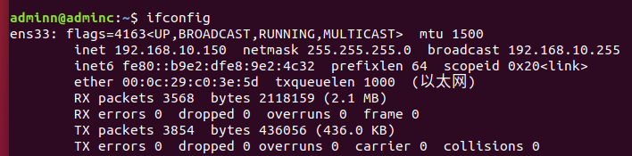
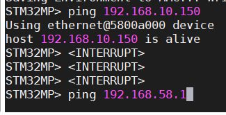
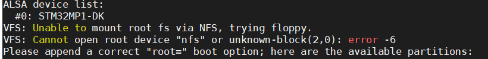

## NFS文件系统配置

## ubuntu安装nfs服务

```cpp
sudo apt-get install nfs-kernel-server rpcbind
```

创建nfs文件夹



配置nfs

```cpp
sudo vi /etc/exports
```



重启nfs服务

```cpp
sudo /etc/init.d/nfs-kernel-server restart
```

利用网线连接电脑和开发板





ubuntu桥接这个网口


设置ubuntu  ip地址



设置开发板

```cpp
setenv ipaddr 192.168.10.200
setenv gatewayip 192.168.10.1
setenv serverip 192.168.10.150
setenv ethaddr 00:04:9f:04:d2:35
setenv netmask 255.255.255.0
saveenv

```



使用命令

```cpp
setenv bootargs 'root=/dev/nfs nfsroot=192.168.10.150:/home/adminn/linux/nfs/rootfs,proto=tcp rw ip=192.168.10.200:192.168.10.150:192.168.10.1:255.255.255.0::eth0:off'
```

```cpp
nfs C2000000 192.168.10.150:/home/adminn/linux/nfs/rootfs/uImage
```

出现的问题



Ubuntu18 的 nfs 默认只支持 3 和 4 版本的 nfs，uboot 默认使用的是版本 2，所以直 接需要修改 Ubuntu18 的 nfs 配置，否则 nfs 根文件系统会报如图 18.3.1.1 所示错误，导致无法 挂载。

打开 Ubuntu 下的/etc/default/nfs-kernel-server 文件，然后在最后面添加下 面这一行：

```
RPCNFSDOPTS="--nfs-version 2,3,4 --debug --syslog"
```

```
sudo /etc/init.d/nfs-kernel-server restart
```

