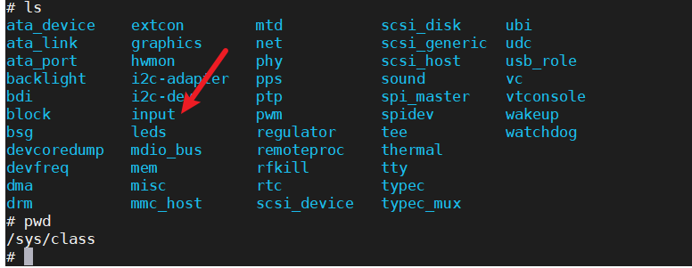

# 搭建tftp来挂载内核

在ubuntu上安装tftp服务器

```
sudo apt-get install tftp-hpa tftpd-hpa
```

```
sudo apt-get install xinetd
```

创建tftp目录

给权限

```
chmod 777 tftpboot
```


在/etc/xinetd.d/新建tftp

```

 server tftp
 {
 socket_type = dgram
 protocol = udp
 wait = yes
 user = root
 server = /usr/sbin/in.tftpd
 server_args = -s /home/adminn/linux/tftpboot/
 disable = no
 per_source = 11 
 cps = 100 2
 flags = IPv4
 }
```

重启服务

```
sudo service tftpd-hpa start
```

打开/etc/default/tftpd-hpa 文件


重启

```
sudo service tftpd-hpa start
```

将linux的镜像文件下载到c2000000位置和设备树文件下载到c4000000位置

```
setenv bootcmd 'tftp c2000000 uImage;tftp c4000000 stm32mp157d-atk.dtb;bootm c2000000 - c4000000' 
saveenv
boot
```


内核注册的input类

