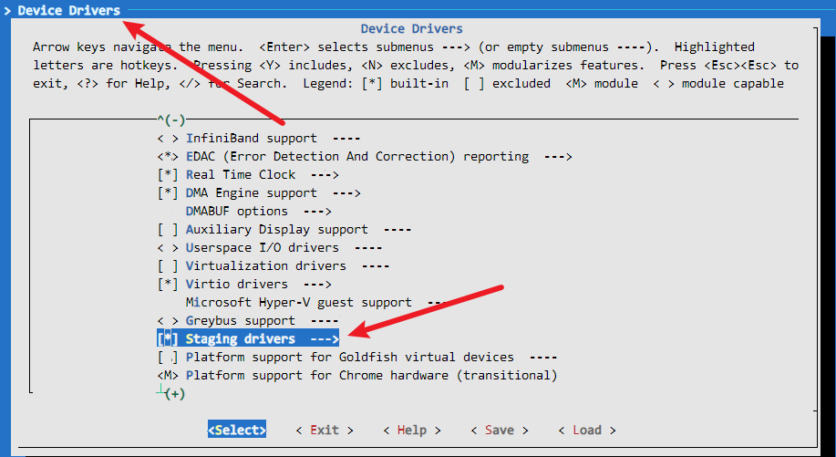
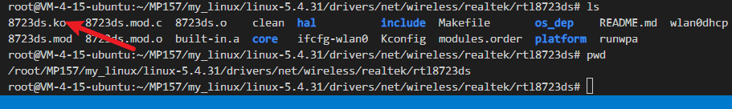

# WIFI驱动

在uboot阶段我们通过移植网卡驱动使得uboot可以连接网络。

在内核阶段我们通过向内核中添加网卡驱动使得整个系统可以连接网络

以上均为有线网络，下面进行WIFI的配置

1. 获取WIFI驱动的源码

```
由WIFI厂商提供（E:\BaiduNetdiskDownload\【正点原子】STM32MP157开发板（A盘）-基础资料\01、程序源码\02、Linux驱动例程\29_WIFI）
```

2. 将源码添加至内核

```
/root/MP157/my_linux/linux-5.4.31/drivers/net/wireless/realtek
//在该目录下所有realtek 公司的 WIFI 驱动文件，将我们的驱动源码（rtl8723ds）也放入该目录下
```


配置Kconfig

```
vim Kconfig
```


配置Makefile


3. 配置内核


内核保存路径

```
./arch/arm/configs/stm32mp1_atk_defconfig
```

配置支持 WIFI 设备


配置支持 IEEE 802.11(无线局域网)



## 设备树配置

```
vim stm32mp15-pinctrl.dtsi
```

查看 stm32mp151.dtsi中的sdmm3节点


在我们的设备节点下引用sdmm3节点

```c++
 &sdmmc3 {
 pinctrl-names = "default", "opendrain", "sleep";
 //pinctrl-names属性对应pinctrl-0 pinctrl-1 pinctrl-2
 pinctrl-0 = <&sdmmc3_b4_pins_a>;
 pinctrl-1 = <&sdmmc3_b4_od_pins_a>;
 pinctrl-2 = <&sdmmc3_b4_sleep_pins_a>;
 //表示该节点用 pinctrl-0io控制系统还是pinctrl-1还是pinctrl-2
 non-removable;//non-removable  表示不能进行热插拔，设备一直连接(比如eMMC)
 st,neg-edge;//
 bus-width = <4>;//数据总线位宽（4根数据线）
 vmmc-supply = <&v3v3>;//
 status = "okay";
 keep-power-in-suspend;//电源一直挂起
 };

```


编译 WIFI 驱动

rtl8723ds 驱动配置


## 编译

```c++
 make stm32mp1_atk_defconfig
 make uImage dtbs LOADADDR=0XC2000040 -j16
 //编译模块
 make modules
```

模块编译完成以后得到.ko文件

```
cfg80211.ko
8723ds.ko
```




## 测试


将上述的.db文件加入重新加载模块


加载8723ds.ko模块，查看


## buildroot WIFI 工具配置


保存编译

```
./configs/stm32mp1_atk_defconfig//根文件系统的保存路径
make stm32mp1_atk_defconfig
sudo make
```


```
MP157/bootbuild/buildroot-2020.02.6/output/build/busybox-1.31.1/libbb//中文替换
```

编译根文件系统的时候出现如下错误


猜测是因为arm-...-gcc编译器的路径改变导致的

```
make clean//清除以后重新编译，
```

经过上述操作后busybox的配置就没有了

编译完成之后挂载系统执行命令

```
iwlist --help
```


wifi联网测试

将wifi天线安装在开发板上后执行如下命令

```
iwlist wlan0 scanning
```

