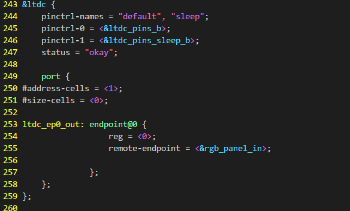
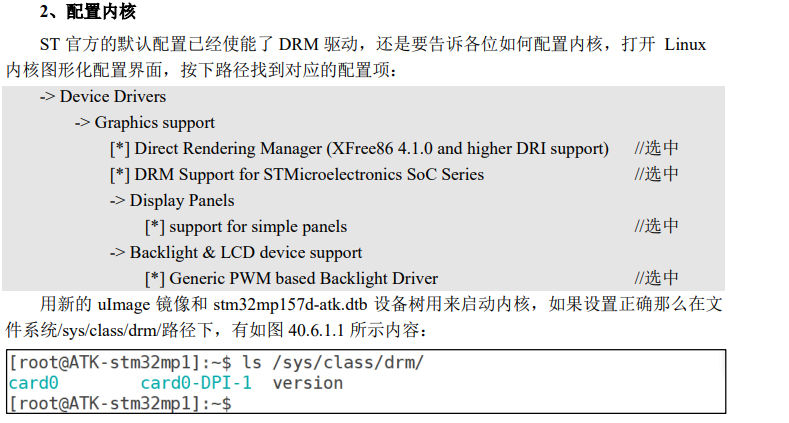
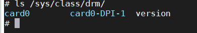

# rgbLCD屏幕

stm32mp15-pinctrl.dtsi找到以下节点


添加屏幕节点

stm32mp157d-atk.dts



根节点下添加

stm32mp157d-atk.dts


panel-simple.c

```
static const struct drm_display_mode ATK7016_mode = {
	.clock = 51200,
	.hdisplay = 1024,
	.hsync_start = 1024 + 140,
	.hsync_end = 1024 + 140 + 20,
	.htotal = 1024 + 140 + 20 + 160,
	.vdisplay = 600,
	.vsync_start = 600 + 20,
	.vsync_end = 600 + 20 + 3,
	.vtotal = 600 + 20 + 3 + 12,
	.vrefresh = 60,
	//.flags = DRM_MODE_FLAG_NVSYNC | DRM_MODE_FLAG_NHSYNC,
};

static const struct panel_desc alientek_desc = {
	.modes = &ATK7016_mode,
	.num_modes = 1,
	.bpc = 8,
	// .size = {
	// 	.width = 70,
	// 	.height = 53,
	// },
	.bus_format = MEDIA_BUS_FMT_RGB888_1X24,
};

```


pwm控制背光


添加pwm节点

```
 &timers4 {
status = "okay";
/* spare dmas for other usage */
/delete-property/dmas;
 /delete-property/dma-names;
 pwm4: pwm {
 pinctrl-0 = <&pwm4_pins_b>;
 pinctrl-1 = <&pwm4_sleep_pins_b>;
 pinctrl-names = "default", "sleep";
 #pwm-cells = <2>;
 status = "okay";
 };
 };

```

添加pwm控制LCD背光之间联系得节点

```
 backlight: backlight {
 compatible = "pwm-backlight";
 pwms = <&pwm4 1 5000000>;
 brightness-levels = <0 4 8 16 32 64 128 255>;
 power-supply = <&v3v3>;
 default-brightness-level = <7>;
 status = "okay";
 };
```

修改为0灭屏


配置内核



查看drm目录


加载新的设备树后



文件系统室内libdrm

执行以下命令

```
modetest -M stm -s 32@35:1024x600
```


使能FB


设置屏幕作为控制台（必须是FB）

1. 设置 uboot 中的 bootargs

```
setenv bootargs 'console=tty1 console=ttySTM0,115200 root=/dev/nfs nfsroot=192.168.10.150:/home/adminn/linux/nfs/rootfs,proto=tcp rw ip=192.168.10.200:192.168.10.150:192.168.10.1:255.255.255.0::eth0:off'

setenv bootargs 'console=ttySTM0,115200 root=/dev/nfs nfsroot=192.168.10.150:/home/adminn/linux/nfs/rootfs,proto=tcp rw ip=192.168.10.200:192.168.10.150:192.168.10.1:255.255.255.0::eth0:off'


saveenv
```

2. 修改/etc/inittab 

```
tty1::askfirst:-/bin/sh//打开tty1，设备lcd作为控制台
```

