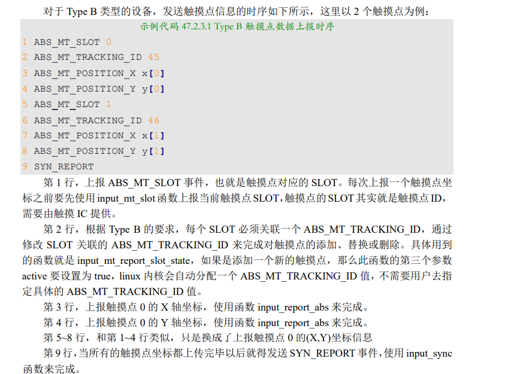
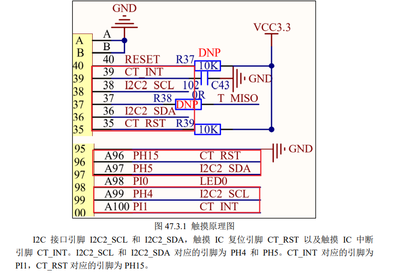
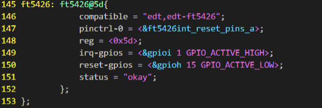
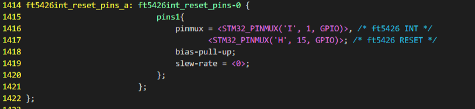
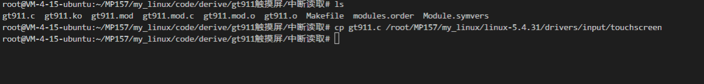
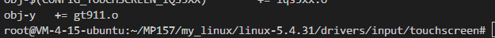
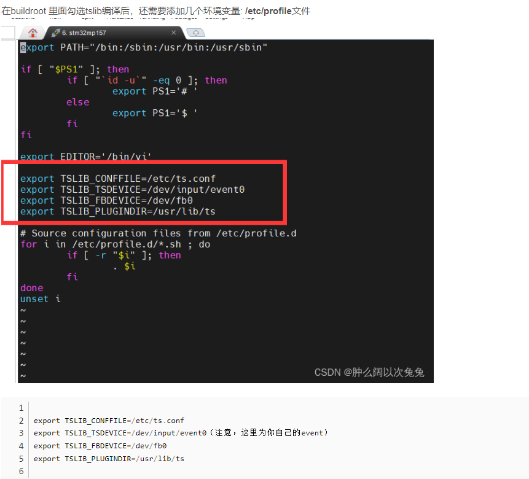
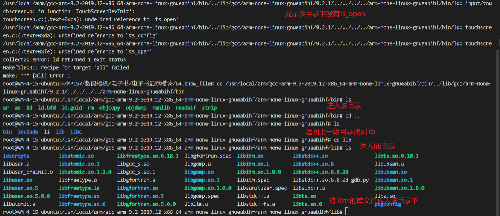
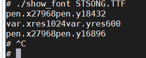

# 触摸屏

1. 电容触摸 IC 基本都是 IIC 接口的，本次使用的芯片为FT5426
2. 芯片提供中断引脚，可以在中断服务函数上报坐标
3. 触摸屏的坐标信息、屏幕按下和抬起信息都属于 linux 的 input 子系统，因此向 linux 内 核上报触摸屏坐标信息就得使用 input 子系统。只是，我们得按照 linux 内核规定的规则来上报 坐标信息
4. MT协议 Type B：适用于有硬件追踪并能区分触摸点的触摸设备，此类型设备通过 slot 更新某一个 触摸点的信息，FT5426 就属于此类型，一般的多点电容触摸屏 IC 都有此能力。
5. 在 上 面 这 些 众 多 的 ABS_MT 事 件 中 ， 我 们 最 常 用 的 就 是 ABS_MT_SLOT 、 ABS_MT_POSITION_X 、 ABS_MT_POSITION_Y 和 ABS_MT_TRACKING_ID 。其中 ABS_MT_POSITION_X 和 ABS_MT_POSITION_Y 用 来 上报 触 摸点 的 (X,Y) 坐 标 信息 ， ABS_MT_SLOT 用 来 上 报 触 摸 点 ID ，对于 Type B 类 型 的 设 备 ， 需 要 用 到 ABS_MT_TRACKING_ID 事件来区分触摸点
6. 对于 Type B 类型的设备，上报触摸点信息的时候需要通过 input_mt_slot()函数区分是哪一 个触摸点，input_mt_slot()函数原型如下所示
7. input_mt_slot()函数会触发 ABS_MT_SLOT 事件，此事件会告诉接收者当前 正在更新的是哪个触摸点(slot)的数据
8. 
9. 使用“devm_”前缀的函数申请到的资源可以由系统自动释放，不需要我们手动处理。该中断的优先级可以比任务优先级低
10. 

修改设备树





## 将源码添加到内核

```
/root/MP157/my_linux/linux-5.4.31/drivers/input/touchscreen
```



修改该目录的makefile



这样就添加成功了，编译内核运行

移植tslib



```

export TSLIB_CONFFILE=/etc/ts.conf
export TSLIB_TSDEVICE=/dev/input/event0（注意，这里为你自己的event）
export TSLIB_FBDEVICE=/dev/fb0
export TSLIB_PLUGINDIR=/usr/lib/ts
```

将库文件放在指定位置



编译的时候指定-lts即可

freetype配置

将库文件放入板子的lib



```
./show_file -s 24 -d fb -f STSONG.TTF 1.txt
```

