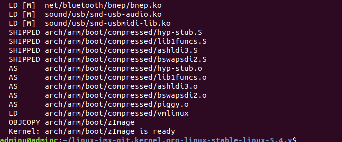

## 获取源码

[nxp-imx/linux-imx at git.kernel.org/linux-stable/linux-5.4.y (github.com)](https://github.com/nxp-imx/linux-imx/tree/git.kernel.org/linux-stable/linux-5.4.y)

## 编译测试

编译测试主要测试ubuntun的环境是否搭建成功，是否可以正常编译linux内核

初次编译源码


下载成功以后压缩包直接复制到Ubuntu下不能解压缩，否则到ubuntun下会出现编码方式的差异导致不能编译成功

修改顶层Makefile文件

```
make imx_v6_v7_defconfig
make -j 12
```



编译成功。

这是编译的imx6ull自带的配置文件

编译一个sh文件将编译过程写成脚本并编译测试

```shell
#!/bin/sh
make ARCH=arm CROSS_COMPILE=arm-linux-gnueabihf- distclean
make ARCH=arm CROSS_COMPILE=arm-linux-gnueabihf- imx_v6_v7_defconfig
make ARCH=arm CROSS_COMPILE=arm-linux-gnueabihf- menuconfig
make ARCH=arm CROSS_COMPILE=arm-linux-gnueabihf- all -j16
```

## 修改配置文件

根据imx6ull自带的配置文件修改自己的配置文件

```shell
cp arch/arm/configs/imx_v6_v7_defconfig imx_self_defconfig
```

imx6ull是V7架构所以屏蔽v6


创建imx6ull_self.sh

```shell
#!/bin/sh
make ARCH=arm CROSS_COMPILE=arm-linux-gnueabihf- distclean
make ARCH=arm CROSS_COMPILE=arm-linux-gnueabihf- imx_self_defconfig
make ARCH=arm CROSS_COMPILE=arm-linux-gnueabihf- menuconfig
make ARCH=arm CROSS_COMPILE=arm-linux-gnueabihf- all -j16
```

## 设备树修改

复制nxp默认的设备树文件


```
cp imx6ul-14x14-evk.dtsi imx6ull-self.dtsi

```


```
imx6ul-14x14-evk.dtsi对evk的开发板用到的外设进行了定义
```


再当前目录的Makefile中加入


编译测试

```
./imx6ull_self.sh
```

将生成的镜像放入tftpboot下


```
setenv bootcmd 'tftp 80800000 zImage; tftp 83000000 imx6ull-self.dtb;bootz 80800000 - 83000000'
```

```
saveenv
```

```
boot
```

移植完成，linux主要初始化了EMMC,LCD

