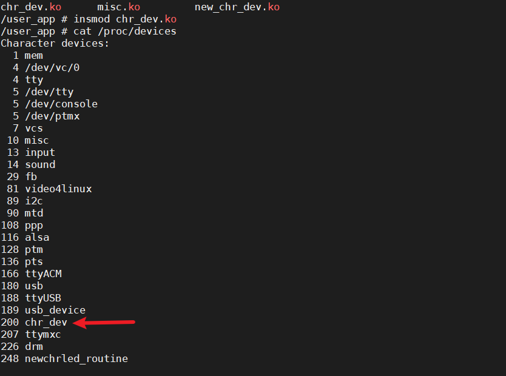
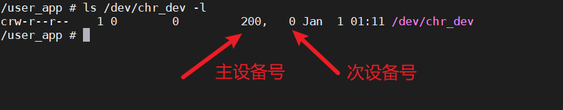
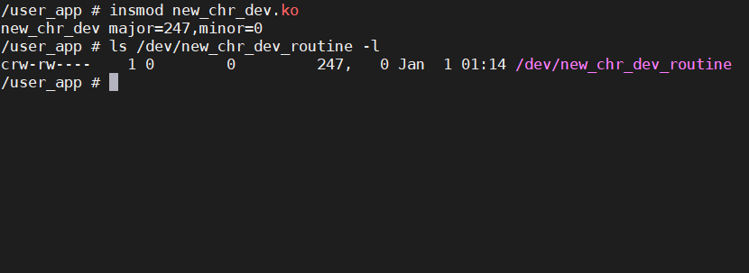
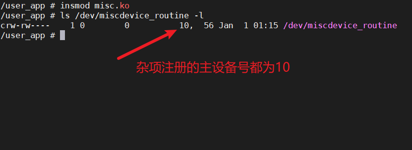

# 字符设备创建

## 早期字符设备

```c
#include <linux/types.h>
#include <linux/kernel.h>
#include <linux/delay.h>
#include <linux/ide.h>
#include <linux/init.h>
#include <linux/module.h>
#include <linux/errno.h>
#include <linux/gpio.h>
#include <asm/mach/map.h>
#include <asm/uaccess.h>
#include <asm/io.h>

#define CHR_DEV_MAJOR 200      /* 主设备号 */
#define CHR_DEV_NAME "chr_dev" /* 设备名字 */

static int routine_open(struct inode *inode, struct file *filp)
{
    return 0;
}

static ssize_t routine_read(struct file *filp, char __user *buf, size_t cnt, loff_t *offt)
{
    return 0;
}

static ssize_t routine_write(struct file *filp, const char __user *buf, size_t cnt, loff_t *offt)
{
    return 0;
}

static int routine_release(struct inode *inode, struct file *filp)
{
    return 0;
}

/* 设备操作函数 */
static struct file_operations routine_fops = {
    .owner = THIS_MODULE,
    .open = routine_open,
    .read = routine_read,
    .write = routine_write,
    .release = routine_release,
};

static int __init routine_init(void)
{
    uint8_t ret_value;
    /* 注册字符设备驱动 */
    ret_value = register_chrdev(CHR_DEV_MAJOR, CHR_DEV_NAME, &routine_fops);
    if (ret_value < 0)
    {
        printk("register chrdev failed!\r\n");
        return -EIO;
    }
    return 0;
}

static void __exit routine_exit(void)
{
    /* 注销字符设备驱动 */
    unregister_chrdev(CHR_DEV_MAJOR, CHR_DEV_NAME);
}

module_init(routine_init);
module_exit(routine_exit);
MODULE_LICENSE("GPL");

```

```
cat /proc/devices
```



```
mknod /dev/chr_dev c 200 0
```

```
ls /dev/chr_dev 
```



## 新字符设备

```c
#include <linux/types.h>
#include <linux/kernel.h>
#include <linux/ide.h>
#include <linux/init.h>
#include <linux/module.h>
#include <linux/errno.h>
#include <linux/cdev.h>
#include <linux/device.h>

#define NEWCHRDEV_CNT 1                      /* 设备号个数 */
#define NEWCHRDEV_NAME "new_chr_dev_routine" /* 名字 */


static int routine_open(struct inode *inode, struct file *filp)
{
    return 0;
}

static ssize_t routine_read(struct file *filp, char __user *buf, size_t cnt, loff_t *offt)
{
    return 0;
}

static ssize_t routine_write(struct file *filp, const char __user *buf, size_t cnt, loff_t *offt)
{
    return 0;
}

static int routine_release(struct inode *inode, struct file *filp)
{
    return 0;
}

/* 设备操作函数 */
static struct file_operations routine_fops = {
    .owner = THIS_MODULE,
    .open = routine_open,
    .read = routine_read,
    .write = routine_write,
    .release = routine_release,
};

/* new_chr_dev_t设备结构体 */
struct new_chr_dev_t
{
    dev_t devid;           /* 设备号 	 */
    struct cdev cdev;      /* cdev 	*/
    struct class *class;   /* 类 		*/
    struct device *device; /* 设备 	 */
    int major;             /* 主设备号	  */
    int minor;             /* 次设备号   */
};

struct new_chr_dev_t new_chr_dev; /*  */
/**
 * @brief 加载函数
 *
 * @return int
 */
static int __init routine_init(void)
{
    /* 注册字符设备驱动 */
    /* 1、创建设备号 */
    if (new_chr_dev.major)
    { /*  定义了设备号 */
        new_chr_dev.devid = MKDEV(new_chr_dev.major, 0);
        register_chrdev_region(new_chr_dev.devid, NEWCHRDEV_CNT, NEWCHRDEV_NAME);
    }
    else
    {                                                                                        /* 没有定义设备号 */
        alloc_chrdev_region(&new_chr_dev.devid, 0, NEWCHRDEV_CNT, NEWCHRDEV_NAME); /* 申请设备号 */
        new_chr_dev.major = MAJOR(new_chr_dev.devid);                                        /* 获取分配号的主设备号 */
        new_chr_dev.minor = MINOR(new_chr_dev.devid);                                        /* 获取分配号的次设备号 */
    }
    printk("new_chr_dev major=%d,minor=%d\r\n", new_chr_dev.major, new_chr_dev.minor);

    /* 2、初始化cdev */
    new_chr_dev.cdev.owner = THIS_MODULE;
    cdev_init(&new_chr_dev.cdev, &routine_fops);

    /* 3、添加一个cdev */
    cdev_add(&new_chr_dev.cdev, new_chr_dev.devid, NEWCHRDEV_CNT);

    /* 4、创建类 */
    new_chr_dev.class = class_create(THIS_MODULE, NEWCHRDEV_NAME);
    if (IS_ERR(new_chr_dev.class))
    {
        return PTR_ERR(new_chr_dev.class);
    }
    /* 5、创建设备 */
    new_chr_dev.device = device_create(new_chr_dev.class, NULL, new_chr_dev.devid, NULL, NEWCHRDEV_NAME);
    if (IS_ERR(new_chr_dev.device))
    {
        return PTR_ERR(new_chr_dev.device);
    }
    return 0;
}

/**
 * @brief 卸载函数
 *
 */
static void __exit routine_exit(void)
{
    /* 注销字符设备驱动 */
    cdev_del(&new_chr_dev.cdev);                                /*  删除cdev */
    unregister_chrdev_region(new_chr_dev.devid, NEWCHRDEV_CNT); /* 注销设备号 */

    device_destroy(new_chr_dev.class, new_chr_dev.devid);
    class_destroy(new_chr_dev.class);
}

module_init(routine_init);
module_exit(routine_exit);
MODULE_LICENSE("GPL");

```

```
ls /dev/new_chr_dev_routine -l
```



## 杂项字符

```c
// 参考linux源码drivers/char/bfin-otp.c
#include <linux/device.h>
#include <linux/errno.h>
#include <linux/fs.h>
#include <linux/init.h>
#include <linux/miscdevice.h>
#include <linux/module.h>
#include <linux/mutex.h>
#include <linux/types.h>
#include <mtd/mtd-abi.h>

#define DRIVER_NAME "miscdevice_routine"
#define PFX DRIVER_NAME ": "

static int routine_open(struct inode *inode, struct file *filp)
{
    return 0;
}

static ssize_t routine_read(struct file *filp, char __user *buf, size_t cnt, loff_t *offt)
{
    return 0;
}

static ssize_t routine_write(struct file *filp, const char __user *buf, size_t cnt, loff_t *offt)
{
    return 0;
}

static int routine_release(struct inode *inode, struct file *filp)
{
    return 0;
}

/* 设备操作函数 */
static struct file_operations routine_fops = {
    .owner = THIS_MODULE,
    .open = routine_open,
    .read = routine_read,
    .write = routine_write,
    .release = routine_release,
};

static struct miscdevice routine_device = {
    .minor = MISC_DYNAMIC_MINOR,
    .name = DRIVER_NAME,
    .fops = &routine_fops,
};

/**
 *	加载模块
 */
static int __init routine_init(void)
{
    int ret;
    ret = misc_register(&routine_device);
    if (ret)
    {
        printk(PFX "unable to register a misc device\n");
        return ret;
    }
    return 0;
}

/**
 *	卸载模块
 */
static void __exit routine_exit(void)
{
    misc_deregister(&routine_device);
}

module_init(routine_init);
module_exit(routine_exit);
MODULE_LICENSE("GPL");

```



