# shell脚本

makefile基本格式为

```
目标：依赖
	命令
```

基本用法

```
变量名=
$@ 引用目标
$^ 引用所有依赖
$(变量名)
```

## 变量的定义

$my_name 和${my_name}两种引用都可以

```sh
#!/bin/sh
my_name="韦zz123"
echo $my_name
echo ${my_name}
```

已定义的变量可以被重新定义

```sh
#!/bin/sh
my_name="韦zz123"
echo $my_name
echo ${my_name}
my_name="韦z"
echo $my_name
echo ${my_name}
```

将变量设置为只读变量

```sh
#!/bin/sh
my_name="韦zz123"
echo $my_name
echo ${my_name}
readonly my_name#设置变量为只读变量
my_name="韦z"
echo $my_name
echo ${my_name}
```

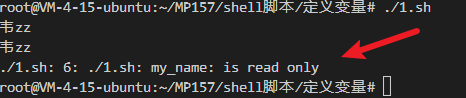

uset删除变量

```sh
#!/bin/sh
my_name="韦zz123"
echo $my_name
echo ${my_name}

my_name="韦z"
unset my_name
echo $my_name
echo ${my_name}
```

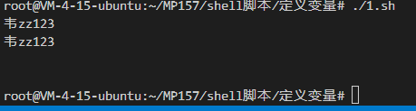

单引号中不能引用变量

```sh
#!/bin/sh
str='韦zz123'
buf='韦zz $str'
echo $str
echo $buf
```

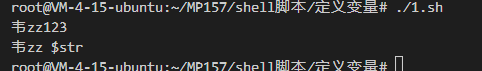

双引号可以引用变量

```sh
#!/bin/sh
str='韦zz123'
buf="韦zz $str"
echo $str
echo $buf
```

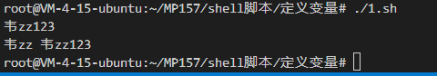

获取字符串长度

```sh
#!/bin/sh
str='韦zz123'
buf="韦zz $str"
echo $str
echo $buf
str_len=${#str}
echo $str_len
```

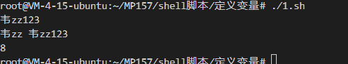

查找字符在字符串中的位置哪个字符先出现就显示哪个字符的位置

```sh
#!/bin/sh
string="runoob is a great site"
echo `expr index "$string" go`
```

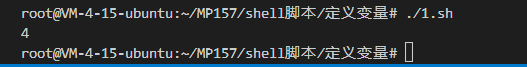

## 数组

```sh
#!/bin/bash
str_value=(0 1 2 3 "123" "韦zz")
echo ${str_value[@]}
```

```sh
#!/bin/bash
str_value=(0 1 2 3)
#将数组第0个元素元素赋值给val_0
val_0=$str_value[0]
echo $val_0
#输出元素
echo ${str_value[1]}
echo ${str_value[2]}
echo ${str_value[3]}
#输出全部的元素
echo ${str_value[@]}

```

获取数组的个数

```sh
#!/bin/bash
str_value=(0 1 2 3)
length=${#str_value[@]}
echo $length
```

块注释

```sh
#!/bin/bash
:<<EOF
str_value=(0 1 2 3 "123" "韦zz")
echo ${str_value[@]}
EOF
```

## 传参

```sh
#!/bin/bash
echo $0
echo $1
echo $2
echo $3
```

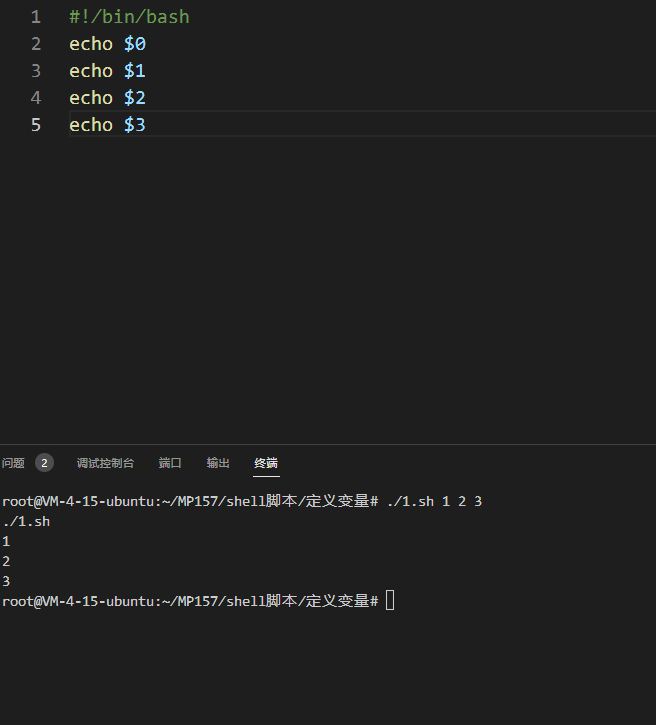

循环打印所有参数

```sh
#!/bin/bash
echo " \$* 相当于传递了一个参数"
for i in "$*"; do
    echo $i
done

echo "\$@传递了三个参数"
for i in "$@"; do
    echo $i
done

```

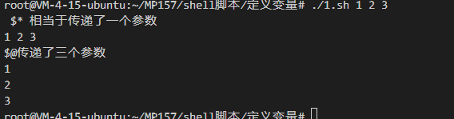

打印当前目录下的文件夹

```sh
#!/bin/bash

for i in $(ls -l ./ |awk '/^d/ {print $NF}')
do
    echo $i
done 
```

## 运算符

数字相加 

```sh
#!/bin/bash
a=1
b=1
val=`expr $a + $b`
echo $val
#PS:expr后面有个空格 +号两边有空格，``不是单引号
```

数字相减 取余 相除 相乘需要加\

```sh
#!/bin/bash
a=1
b=1
c=1
val=`expr $a - $b + $c`#相减
echo $val
val=`expr $a % $b + $c`#取余
echo $val
val=`expr $a / $b + $c`#相除
echo $val
val=`expr $a \* $b + $c`#相乘需要加\
echo $val
```

关系运算符

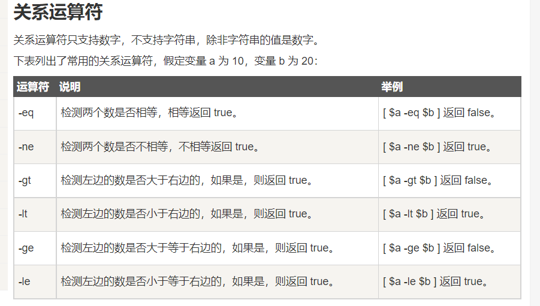

### 字符串运算符

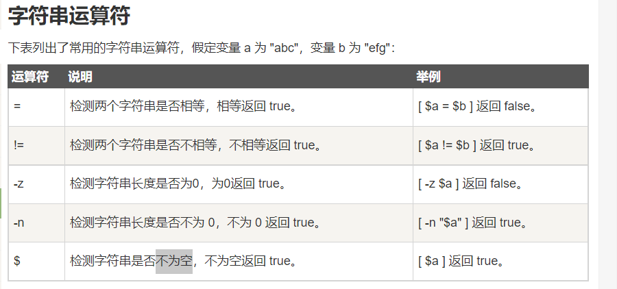

字符串拼接

```sh
#!/bin/sh
read str1
read str2
echo $str1$str2
```

### 文件操作符

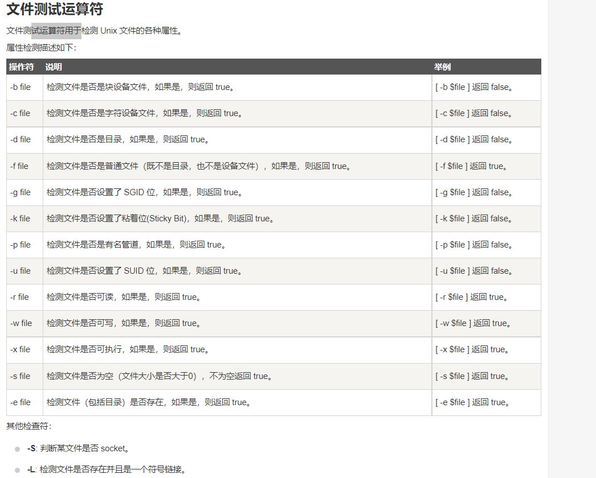

判断文件可读

```sh
#!/bin/bash
file_path=${./1.sh}
if [ -r $file ]
then
   echo "文件可读"
else
   echo "文件不可读"
fi

if [ -w $file ]
then
   echo "文件可写"
else
   echo "文件不可写"
fi

if [ -b $file ]
then
   echo "是块文件"
else
   echo "不是块文件"
fi
```

获取终端输入的一行数据

```sh
#!/bin/sh
read name 
echo "输入的是:$name"
```

## test命令

```sh
#!/bin/sh
str_1="str_1"
str_2="str_2"
a=1
b=1
if test $str_1 = $str_2
then
    echo '两个字符串相等!'
else
    echo '两个字符串不相等!'
fi

if test $a = $b
then
    echo '两个数字相等!'
else
    echo '两个数字不相等!'
fi
```

文件判断

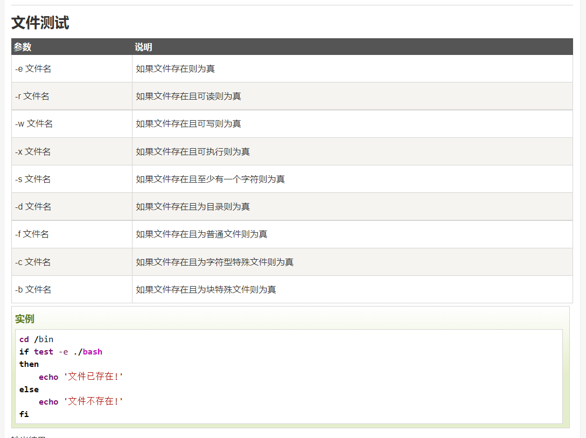

## 函数

```sh
#!/bin/sh
fun(){
    echo "fun函数"
}

echo "进入函数"
fun#必须另起一行
#echo fun这样调用函数不正确
```

函数的返回值用$?来获取

```sh
#!/bin/sh
fun(){
    echo "fun函数"
    read num_1
    read num_2
    return `expr $num_1 + $num_2`
}

echo "进入函数"
fun
echo "fun函数的返回值$?"
```

