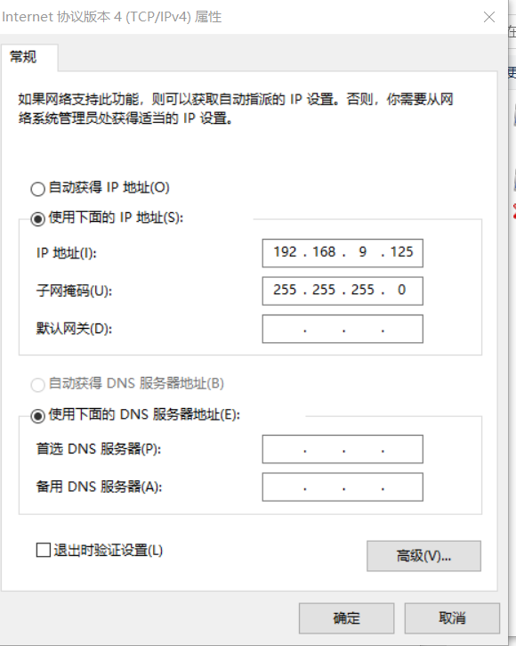
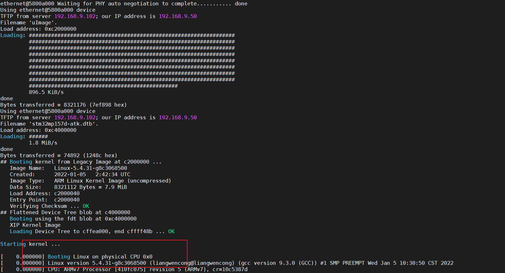

## 内部rom

主要是判断拨码开关的电平，处理将从哪个Falsh进行启动


## 拨码开关对应的启动方式


第一步：

rom首先会启动FSBL镜像，需要对镜像加**头部信息**，因为ROM要从选定的Falsh内读取镜像到DDR(因为程序都是运行在DDR上的，就是SRAM)，但是此时DDR还没有初始化，怎么办呢？157内部自带256KB的RAM

## USB烧录

利用STM32CubePro软件，进行USB OTG接口向157进行烧写系统

## 串口烧录

配置要求，因为要想进行串口下载肯定需要进行串口初始化，这段代码在ROM内已将固化，所有利用以下接口才可以进行正常烧录


## Flash烧录

需要一个萝卜一个坑


## 从NAND启动

选型要求


## 从SD卡启动


## 整个启动流程

1. ROM从选定的FSBL读取代码
2. FSBL初始化DDR一般放Uboot
3. SSBL加载linux内核（因为内核是运行在DDR上的，所以需要UBOOT先对DDR进行初始化）
4. 挂载根文件系统
5. APP用户的空间


官方提供的uboot linux 根文件系统源码

[STM32MP1Dev - STM32MP1 OpenSTLinux Developer Package - STMicroelectronics](https://www.st.com/content/my_st_com/en/products/embedded-software/mcu-mpu-embedded-software/stm32-embedded-software/stm32-mpu-openstlinux-distribution/stm32mp1dev.html)

## uboot的移植

编译辅助工具的安装

在编译完U-boot.bin文件后，在编译Linux内核时，为了能够 make menuconfig ，所以要使用sudo apt-get install libncurses5-dev

```
sudo apt-get install libncurses5-dev bison flex
```


测试编译正点原子提供的uboot源码存放路径E:\BaiduNetdiskDownload\【正点原子】STM32MP157开发板（A盘）-基础资料\01、程序源码\01、正点原子Linux出厂系统源码

```
tar -xvf u-boot-stm32mp-2020.01-g00f14581-v1.4.tar.bz2
```


## 执行命令

```
make distclean
```

```
make ARCH=arm CROSS_COMPILE=arm-none-linux-gnueabihf- stm32mp157d_atk_defconfig
```

ARCH使用的平台架构

CROSS_COMPILE交叉编译器前缀

```
make V=1 ARCH=arm CROSS_COMPILE=arm-none-linux-gnueabihf- DEVICE_TREE=stm32mp157d-atk all
这里的话不加none
查阅百度说arm-none-linux-gnueabihf的软连接为arm-linux-gnueabihf，但是我用arm-none-linux-gnueabihf不行，就只能使用arm-linux-gnueabihf
```

DEVICE_TREE设备树文件

原子推荐的为了方便编译将ARCH 和CROSS_CONFIG的值写到了makefile中


但是我这样配置不行

```
我将arm-none-linux修改为arm-linux就可以
```

配置完成后就可以简化编译代码

```
make distclean //清除
make stm32mp157d_atk_defconfig //配置 uboot
make V=1 DEVICE_TREE=stm32mp157d-atk all //编译
```

编译完成

我的编译流程

```
make distclean
```

```
make ARCH=arm CROSS_COMPILE=arm-none-linux-gnueabihf- stm32mp157d_atk_defconfig
```

```
make V=1 ARCH=arm CROSS_COMPILE=arm-linux-gnueabihf- DEVICE_TREE=stm32mp157d-atk all
```


## 网络配置


## 正式开始移植

### 文件介绍

```
stm32mp157d-atk.dts 添加节点
stm32mp157d-atk.dtsi 添加了网络和USBOTU
stm32mp157d-atk.dtb 生成的设备树
```


1. [获取ST官方uboot](https://www.st.com/content/my_st_com/en/products/embedded-software/mcu-mpu-embedded-software/stm32-embedded-software/stm32-mpu-openstlinux-distribution/stm32mp1dev.html#st_all-features_sec-nav-tab)

```
PS 官方的5-4版本最终可以生成.stm32文件
   官方的5-10版本生成不来.stm32文件
```

```
.patch都是补丁文件
README uboot的说明
Makefile编译
u-boot源码压缩包
```

打补丁

```
for p in `ls -1 ../*.patch`;do patch -p1 < $p;done
```

修改Makefile


找到st公司提供的编译工具stm32wrapper4dbg-master.zip

将可执行文件放入/bin目录下

编译

```
make stm32mp15_trusted_defconfig
make DEVICE_TREE=stm32mp157d-ev1 all -j8
```


生成结果


复制配置文件

```
cd configs //进入 uboot 的 configs 目录
cp stm32mp15_trusted_defconfig stm32mp15_atk_trusted_defconfig //拷贝
```

创建设备树

```
cd arch/arm/dts/ //进入 uboot 设备树目录
cp stm32mp157d-ed1.dts stm32mp157d-atk.dts //复制.dts
cp stm32mp15xx-edx.dtsi stm32mp157d-atk.dtsi //复制.dtsi
cp stm32mp157a-ed1-u-boot.dtsi stm32mp157d-atk-u-boot.dtsi //复制.dtsi

```

修改dts


修改stm32mp157d-atk.dtsi 文件，找到如下所示代码


添加电源模块

屏幕OTG

修改Makefile

```
cd arch/arm/dts
```


制作.sh脚本文件

```
vim stm32mp157d_alientek.sh
```

```
//脚本内容
#!/bin/bash
make distclean
make stm32mp15_atk_trusted_defconfig
make DEVICE_TREE=stm32mp157d-atk all -j12
```

执行脚本

```
./stm32mp157d_alientek.sh
```

编译成功


烧录运行


### 加入网络节点

```
cd arch/arm/dts/
vim stm32mp157d-atk.dtsi
```

在最后加入

```
1 &ethernet0 {
2 status = "okay";
3 pinctrl-0 = <&ethernet0_rgmii_pins_a>;
4 pinctrl-1 = <&ethernet0_rgmii_pins_sleep_a>;
5 pinctrl-names = "default", "sleep";
6 phy-mode = "rgmii-id";
7 max-speed = <1000>;
8 phy-handle = <&phy0>;
9 
10 mdio0 {
11 #address-cells = <1>;
12 #size-cells = <0>;
13 compatible = "snps,dwmac-mdio";
14 phy0: ethernet-phy@0 {
15 reg = <0>;
16 };
17 };
18 };

```

替换phy.c用原子提供的phy.c在

```
E:\BaiduNetdiskDownload\【正点原子】STM32MP157开发板（A盘）-基础资料\01、程序源码\08、模块驱动源码\01、YT8511驱动源码\uboot下修改方法
```

替换掉

```
/root/MP157/led/my_uboot/drivers/net/phy
```

然后编译下载


```
这里就发生了变换，之前是没有找到以太网，现在是以太网没有设置，所以我们需要设置以太网423
```

### 设置网络

测试已经设置

```
setenv ipaddr 192.168.9.50
setenv ethaddr b8:ae:1d:01:01:01 
setenv gatewayip 192.168.9.1
setenv netmask 255.255.255.0
setenv serverip 192.168.9.102
saveenv
```


ubuntu

```
iface ens33 inet static

address 192.168.9.100

netmask 255.255.255.0

gateway 192.168.9.1
```


```
setenv ipaddr 192.168.1.250
setenv ethaddr b8:ae:1d:01:01:00 //开发板的 MAC 地址，一定要设置
setenv gatewayip 192.168.1.1//网关地址
setenv netmask 255.255.255.0//子网掩码。
setenv serverip 192.168.1.249//服务器 IP 地址，也就是 Ubuntu 主机 IP 地址，用于调试代码
saveenv
```

重启配置network

```
sudo /etc/init.d/networking restart
```

首先找到你插入网线的以太网口，给他一个ip，要求在同一网段下设置方法如下


ip地址的设置要根据自己的网段进行设置，如果不知道，可以在windows下打开命令输入ipconfig，默认网关就是了




在ubuntu下要进行设置

1. 虚拟机设置-网络设置-使用桥接模式-并且复制物理网络连接状态


2. 修改桥接模式配置，已连接至要选择我们刚刚记住的名字


如果想让板子ping通windows必须关闭防护墙

### 添加USB_OTG

```
cd arch/arm/dts/
vim stm32mp157d-atk.dtsi
```

```
添加usb功能节点
```

```
添加驱动usb芯片的节点424页 
```

```
添加usb接口节点
```

```
cd arch/arm/dts/
vim stm32mp157d-atk-u-boot.dtsi
```

添加usbotg_hs节点

[【正点原子】STM32MP1嵌入式Linux驱动开发指南V2.0.pdf](file:///E:/BaiduNetdiskDownload/【正点原子】STM32MP157开发板（A盘）-基础资料/09、文档教程(非常重要)/【正点原子】STM32MP1嵌入式Linux驱动开发指南V2.0.pdf)

烧录运行

```
ums 0 mmc 1
```

执行完后电脑上会出现一个U盘则完成

### 使能boot，bootd命令

```
cd my_uboot/include/configs
```

```
include/configs/stm32mp1.h
```

添加宏

```
#define CONFIG_CMD_BOOTD
```

验证


### 添加LCD

```
cd arch/arm/dts/
vim  stm32mp157d-atk.dts //设备树
```

在/（根）节点加入加入屏幕节点

```
panel_backlight: panel-backlight {
      compatible = "gpio-backlight";
      gpios = <&gpiod 13 GPIO_ACTIVE_HIGH>;
      default-on;
      status = "okay";
};

panel_rgb: panel-rgb {
      compatible = "simple-panel";
      pinctrl-names = "default", "sleep";
      pinctrl-0 = <&ltdc_pins_b>;
      pinctrl-1 = <&ltdc_pins_sleep_b>;
      backlight = <&panel_backlight>;
      status = "okay";

      port {
            panel_in_rgb: endpoint {
                  remote-endpoint = <&ltdc_ep0_out>;
            };
      };

      display-timings {
            native-mode = <&timing0>; /* 时序信息 */
            timing0: timing0 { /* 7 寸 1024*600 分辨率 */
            hactive = <1024>; /* LCD X 轴像素个数 */
            vactive = <600>; /* LCD Y 轴像素个数 */
            hfront-porch = <160>; /* LCD hfp 参数 */
            hback-porch = <140>; /* LCD hbp 参数 */
            hsync-len = <20>; /* LCD hspw 参数 */
            vback-porch = <20>; /* LCD vbp 参数 */
            vfront-porch = <12>; /* LCD vfp 参数 */
            vsync-len = <3>; /* LCD vspw 参数 */
            };
      };
 };


```

根节点外追加

```
 
  &ltdc {
      status = "okay";
      pinctrl-names = "default";
      port {
          #address-cells = <1>;
          #size-cells = <0>;

            ltdc_ep0_out: endpoint@0 {
                  reg = <0>;
                  remote-endpoint = <&panel_in_rgb>;
            };
      };
 };
```

### 测试我们的uboot是否可以使用

#### 从EMMC启动


烧录完成后先查看EEMC是否有image和.dbt设备树

```
ext4ls mmc 1:2
```


```
setenv bootcmd 'ext4load mmc 1:2 c2000000 uImage;ext4load mmc 1:2 c4000000 stm32mp157d-atk.dtb;bootm c2000000 - c4000000'
```

```
saveenv
```

```
boot
```

出现下图就是启动成功


然后继续运行就会卡在下图的位置，并且出现无法连接USB设备，但是原子教程特别说明，出现上图即为成功，现在不知道为什么接着先往下做


#### 从tftp启动

ubuntu安装tftp

```
sudo apt-get install tftp-hpa tftpd-hpa
sudo apt-get install xinetd
cd linux
mkdir tftpboot
chmod 777 tftpboot
```

在/etc/xinetd.d/创建tftp配置文件

```
server tftp
{
      socket_type = dgram
      protocol = udp
      wait = yes
      user = root
      server = /usr/sbin/in.tftpd
      server_args = -s /home/adminn/linux/tftpboot/
      disable = no
      cps = 100 2
      flags = IPv4
 }

```

重启tftp服务

```
sudo service tftpd-hpa start
```

修改

```
vim /etc/default/tftpd-hpa
```

```
# /etc/default/tftpd-hpa

TFTP_USERNAME="tftp"
TFTP_DIRECTORY="/home/adminn/linux/tftpboot"
TFTP_ADDRESS=":69"
TFTP_OPTIONS="-l -c -s"

```

重启

```
sudo service tftpd-hpa start
```

搭建tftp服务器完成

```
将要下载的东西放入tftpboot中，并且给予权限
```


```
setenv bootcmd 'tftp c2000000 uImage;tftp c4000000 stm32mp157d-atk.dtb;bootm c2000000 - c4000000'

saveenv

boot
```

结果展示同样运行到后面就卡住了



#### LCD显示图片没测试

测试先不做了教程440页

## 环境变量

bootcmd就是当uboot倒计时完以后要执行的地址

bootargs指的是uboot传给linux内核的参数

​	bootargs的参数介绍

```
console 指的是与linux交互的是串口还是屏幕
root 用来设置根文件系统的位置
rootfstype 此选项一般配合 root 一起使用，rootfstype 用于指定根文件系统类型，如果根文件系统为
ext 格式的话此选项无所谓。如果根文件系统是 yaffs、jffs 或 ubifs 的话就需要设置此选项，指
定根文件系统的类型。
```

## Uboot图形化界面

安装根据

```
sudo apt-get install build-essential
sudo apt-get install libncurses5-dev
```

进入uboot

```
make ARCH=arm CROSS_COMPILE=arm-none-linux-gnueabihf- stm32mp15_atk_trusted_defconfig

make ARCH=arm CROSS_COMPILE=arm-none-linux-gnueabihf- menuconfig
make menuconfig
//执行完后就会出出现如下的交互界面
```


