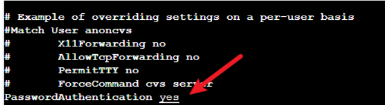
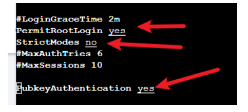

# 腾迅服务器安装ubuntu使用vscode连接

[网络教程](https://blog.csdn.net/m0_37677536/article/details/105205741)

## 基本命令

```
设置密码
sudo passwd root
需改使用密码登录
vim  /etc/ssh/sshd_config
两个yes一个no
重启
service sshd restart 


sudo apt-get install ssh
cd ~/.ssh
ssh-keygen
service sshd status
service sshd start
netstat -ntlp
```

## 设置可以使用密码登录





## 秘钥的解释

```
id_rsa 私钥
id_rsa.pub 公钥 
A把自己的公钥给B，B就可以通过公钥访问A
A把私钥给B，A就可以通过自己的私钥访问B
ssh-rsa AAAAB3NzaC1yc2EAAAADAQABAAABAQCn7GRByJuTY7KQXtBH6tPDxqTcNmU9LpcYqekC600pJivkX5HX/FX8ViwZykWW5+fp4NUAaCMawmzQC5+8ifsmaBoNPhIVIFfKwITUasfUQiR4pVTji8yaYKVWE3Tfa5iN1tKi46HRVHh2D0UxRE8K8p3BjAy1M3oPoOlTNwKFqQ38783a6BdleLxI6BJ7UQ4t/kUnUB2a1W7g6/4kRI/Cy0mlGZ4psfPg7ssVkfrtyv1vj/WEcUc8vNY06HfzAD7rwygdYHg8vg2Uq2Ajfuso43R8ZuQLSq041LA6tSyOv7u3b9kV2Jlc1GvID/n73NsCisBYpj71o/ZrujSjY6F1=
要添加最后一个等号，在ubuntu下查看的是没有等号的
```

