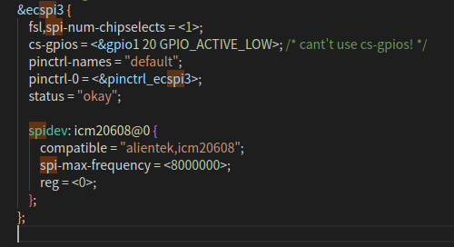
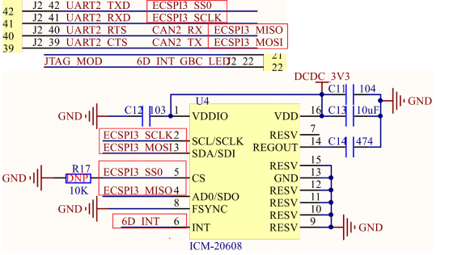
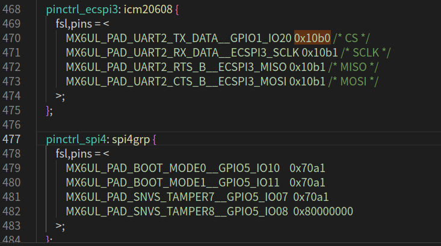
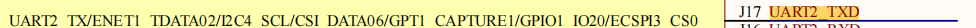
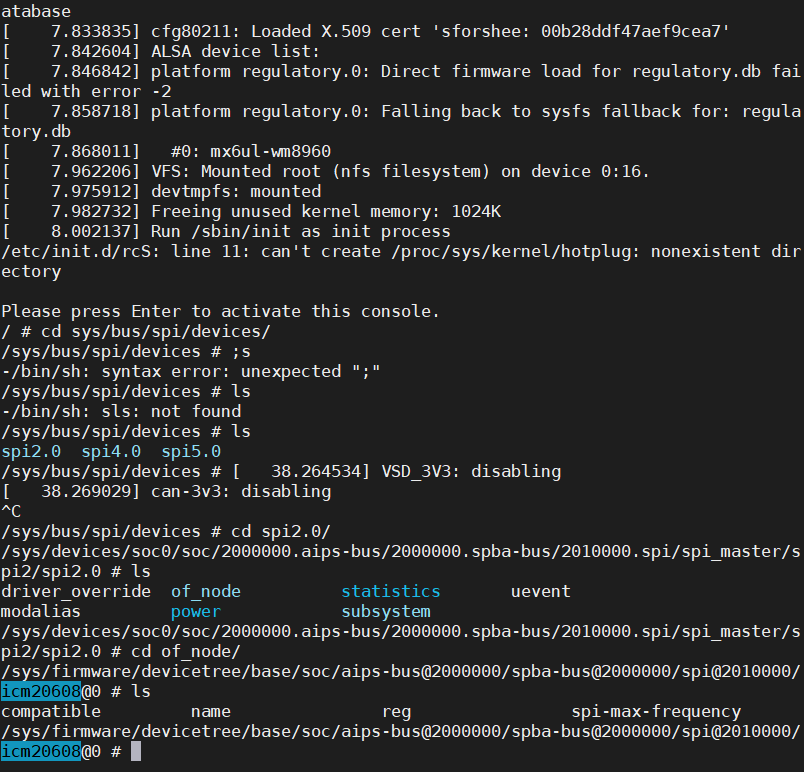

## SPI控制器驱动

以下是笔者对IMX SPI的控制器驱动代码分析笔记(源代码路径drivers/i2c/busses/spi-imx.c)

从以下结构体中可以看出控制器的驱动注册利用的是platform框架，那么控制器驱动肯定就是围绕着platform框架进行的。

platform框架就是platform驱动，platform总线，platform设备（一般都是设备树实现）

```c
static struct platform_driver spi_imx_driver = {
	.driver = {
		   .name = DRIVER_NAME,
		   .of_match_table = spi_imx_dt_ids,
		   .pm = IMX_SPI_PM,
	},
	.id_table = spi_imx_devtype,
	.probe = spi_imx_probe,
	.remove = spi_imx_remove,
};
```

根据这个结构体在源码中找一下platform设备,一共有4个设备节点，不用看芯片手册大概就可以猜到，imx6ull这款芯片有4个spi外设

```dtd
ecspi1: ecspi@02008000 {
					#address-cells = <1>;
					#size-cells = <0>;
					compatible = "fsl,imx6ul-ecspi", "fsl,imx51-ecspi";
					reg = <0x02008000 0x4000>;
					interrupts = <GIC_SPI 31 IRQ_TYPE_LEVEL_HIGH>;
					clocks = <&clks IMX6UL_CLK_ECSPI1>,
						 <&clks IMX6UL_CLK_ECSPI1>;
					clock-names = "ipg", "per";
					dmas = <&sdma 3 7 1>, <&sdma 4 7 2>;
					dma-names = "rx", "tx";
					status = "disabled";
				};

				ecspi2: ecspi@0200c000 {
					#address-cells = <1>;
					#size-cells = <0>;
					compatible = "fsl,imx6ul-ecspi", "fsl,imx51-ecspi";
					reg = <0x0200c000 0x4000>;
					interrupts = <GIC_SPI 32 IRQ_TYPE_LEVEL_HIGH>;
					clocks = <&clks IMX6UL_CLK_ECSPI2>,
						 <&clks IMX6UL_CLK_ECSPI2>;
					clock-names = "ipg", "per";
					dmas = <&sdma 5 7 1>, <&sdma 6 7 2>;
					dma-names = "rx", "tx";
					status = "disabled";
				};

				ecspi3: ecspi@02010000 {
					#address-cells = <1>;
					#size-cells = <0>;
					compatible = "fsl,imx6ul-ecspi", "fsl,imx51-ecspi";
					reg = <0x02010000 0x4000>;
					interrupts = <GIC_SPI 33 IRQ_TYPE_LEVEL_HIGH>;
					clocks = <&clks IMX6UL_CLK_ECSPI3>,
						 <&clks IMX6UL_CLK_ECSPI3>;
					clock-names = "ipg", "per";
					dmas = <&sdma 7 7 1>, <&sdma 8 7 2>;
					dma-names = "rx", "tx";
					status = "disabled";
				};

				ecspi4: ecspi@02014000 {
					#address-cells = <1>;
					#size-cells = <0>;
					compatible = "fsl,imx6ul-ecspi", "fsl,imx51-ecspi";
					reg = <0x02014000 0x4000>;
					interrupts = <GIC_SPI 34 IRQ_TYPE_LEVEL_HIGH>;
					clocks = <&clks IMX6UL_CLK_ECSPI4>,
						 <&clks IMX6UL_CLK_ECSPI4>;
					clock-names = "ipg", "per";
					dmas = <&sdma 9 7 1>, <&sdma 10 7 2>;
					dma-names = "rx", "tx";
					status = "disabled";
				};
```

最后在目录下spi_imx目录下就会创建对应的节点。当驱动与设备树匹配后就会执行i2c_imx_probe函数

```
/sys/bus/platform/drivers/spi_imx
```


在该路径下只有一个spi节点是因为我们在配置自己的设备树时只引用了这一个设备节点

查看imx6ull-alientek-emmc.dts设备树

```
arch/arm/boot/dts/imx6ull-alientek-emmc.dts
```



probe函数做了哪些事情

```c
spi_imx->bitbang.chipselect = spi_imx_chipselect;//利用片选信号，选择芯片
spi_imx->bitbang.setup_transfer = spi_imx_setupxfer;//初始化用于传输的函数，用不用dma，用8bit还是16位
spi_imx->bitbang.txrx_bufs = spi_imx_transfer;//txrx_bufs()可以处理没有dma映射的传输。在spi_bitbang_transfer_one中被调用
spi_imx->bitbang.master->setup = spi_imx_setup;//设置模式和时钟等（spi驱动可能多次调用)
spi_imx->bitbang.master->cleanup = spi_imx_cleanup;//释放内存
spi_imx->bitbang.master->prepare_message = spi_imx_prepare_message;//准备消息
spi_imx->bitbang.master->unprepare_message = spi_imx_unprepare_message;//取消准备的消息
spi_imx->bitbang.master->slave_abort = spi_imx_slave_abort;
spi_imx->bitbang.master->mode_bits = SPI_CPOL | SPI_CPHA | SPI_CS_HIGH;//设置SPI模式

spi_bitbang_start();//transfer_one_message对应spi_bitbang_transfer_one
spi_register_master()//注册主机

```

我们主要分析一下发送函数spi_imx_transfer里面的普通发送spi_imx_pio_transfer

这个函数有两个参数

```c
spi_device 
spi_transfer//linux的内核SPI发送接收
```

```c
static int spi_imx_pio_transfer(struct spi_device *spi,
				struct spi_transfer *transfer)
{
	struct spi_imx_data *spi_imx = spi_master_get_devdata(spi->master);

	spi_imx->tx_buf = transfer->tx_buf;
	spi_imx->rx_buf = transfer->rx_buf;
	spi_imx->count = transfer->len;
	spi_imx->txfifo = 0;

	reinit_completion(&spi_imx->xfer_done);

	spi_imx_push(spi_imx);//向FIFO写数据

	spi_imx->devtype_data->intctrl(spi_imx, MXC_INT_TE);

	wait_for_completion(&spi_imx->xfer_done);

	return transfer->len;
}
```

## SPI设备描述

根据正点原子提供的原理图得知，icm20608是一个SPI设备并且该设备挂载在spi3上



设备树描述：打开arch/arm/boot/dts/imx6ull-self.dtsi设备树文件添加pinctrl_spi3节点（仿照pinctrl_spi4）

```dtd
	pinctrl_ecspi3: icm20608 {
		fsl,pins = <
			MX6UL_PAD_UART2_TX_DATA__GPIO1_IO20 0x10b0 /* CS */
			MX6UL_PAD_UART2_RX_DATA__ECSPI3_SCLK 0x10b1 /* SCLK */
			MX6UL_PAD_UART2_RTS_B__ECSPI3_MISO 0x10b1 /* MISO */
			MX6UL_PAD_UART2_CTS_B__ECSPI3_MOSI 0x10b1 /* MOSI */
		>;
	};
```



ps:将用到的pin全部注释

添加设备节点



```dtd
&ecspi3 {
		fsl,spi-num-chipselects = <1>;//片选数量为1代表只接了一个设备
		cs-gpios = <&gpio1 20 GPIO_ACTIVE_LOW>;//上图看出cs在GPIO1_IO20上
		pinctrl-names = "default";
 		pinctrl-0 = <&pinctrl_ecspi3>;//刚刚添加的pinctrl节点
 		status = "okay";
 
 	spidev: icm20608@0 {//在ecspi3节点下挂载SPI设备
 	compatible = "alientek,icm20608";
 	spi-max-frequency = <8000000>;//设备的频率
 	reg = <0>;
 	};
 };
```

查看节点



至此SPI设备描述就完成了