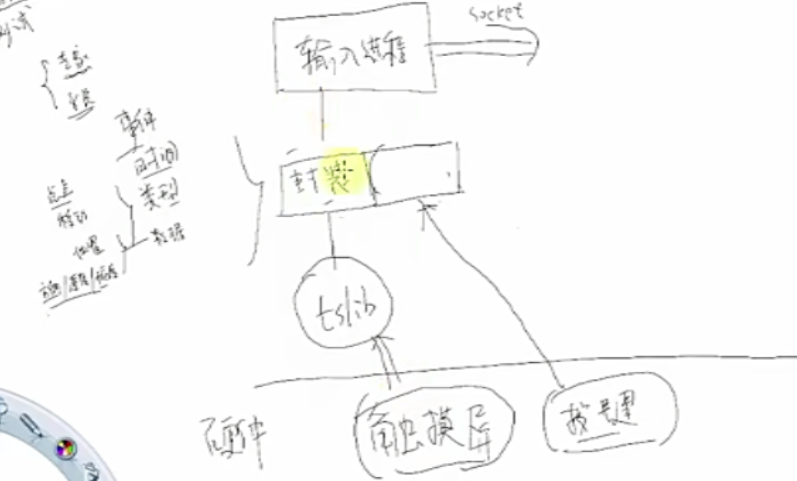
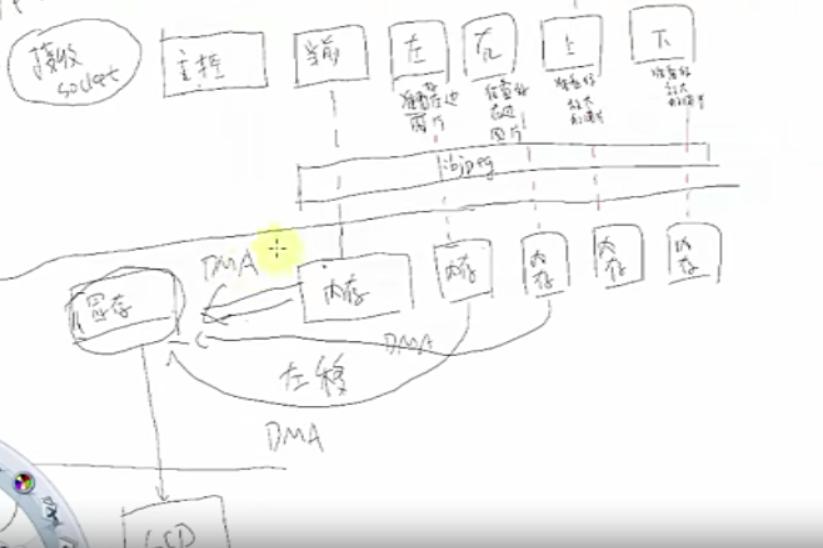
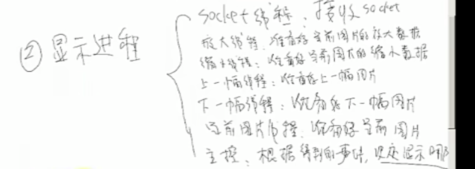

新项目

1. 弄清需求

```
1. 上电显示一张图片
2. 根据配置文件，决定停留还是自动显示下一张图片
3. 点击一下，出现对话框（包括手动显示 自动显示 ）
4. 上放大屏幕，下缩小屏幕，左下一张，右上一张
5. 左右滑动快的时候显示下下一张
```

2. 设计框架

3. 编写代码

4. 测试

输入进程

利用socket通信将时间发给显示进程



显示进程

7个线程接收socket，主控，当前，左，右，上，下



总结：



驱动程序：分配5块内存