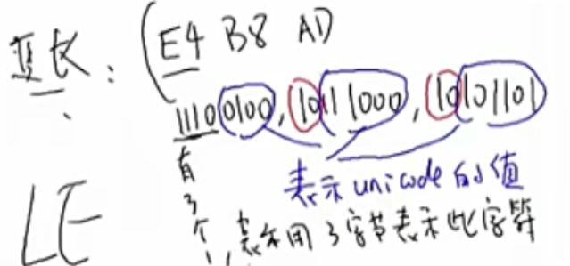

# 字符编码

三点：数字-代表什么-显示什么

计算机开始阶段：26个字母再加上一些符号不会太多，就使用ASCII来表示

中国，全世界使用阶段：中国文字太多一个字节不够用，用什么数字来代表哪一个汉字

字符编码（GBK）国标扩展就是规定了哪个数字代表哪个汉字

字符编码：就有ASCII GBK BIG5同一个数字代表的内容就不一致

全世界统一：unicode（可以表示0-0x10FFFF）字

ANSI（ASCII 汉字GBK） UTF-8（） UTF-16（使用的unicode编码代表汉字）的方法来代表unicode区别就是所使用的字节不同

UTF-8表示方式



## 指定字符集

源文件用不同的编码方式编写，导致执行结果不同

源文件编码方式默认UTF-8

```
 -finput-charset=charset
```

```
可执行程序的字以什么编码方式显示默认UTF-8
-fexec-chaeset=charset
```

```
 //源文件为GBK，输出文件为UTF-8
 gcc -finput-charset=GBK -fexec-chaeset=UTF-8
```

```
gcc -fexec-charset=GBK -finput-charset=UTF-8 1.c//表示输入的文件时utf-8类型，输出时GBK
```

总结：源码编写的时候用UTF-8


