# make DESTDIR=$PWD/tmp installfreetyte介绍

利用文字的取模方法我们显示的文字都是固定大小的

矢量字体：1.关键点若干条闭合曲线 2.使用数学曲线连接的关键点（也叫贝塞尔曲线）3.填充

## freetyte使用

包含头文件

1. 初始化库

2. 加载字体

3. 获取字体大小，设置大小

```c
FT_Set_Char_Size( face, 50 * 64, 0,
                            100, 0 );//
```


4. 根据编码加载glyph，取出glyph 

```c
FT_Load_Char( face, text[n], FT_LOAD_RENDER );//
```

5. 变换：移动，旋转

## freetyte在PC的使用

编译配置

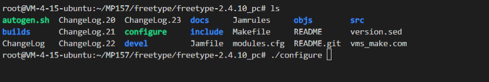

接着make

```
make
```

下载

```
sudo make install
```

编译文件显示没有该头文件

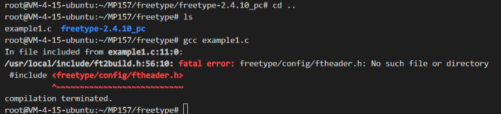

指定头文件目录

```
gcc example1.c -I /usr/local/include/freetype2/
```

函数未定义

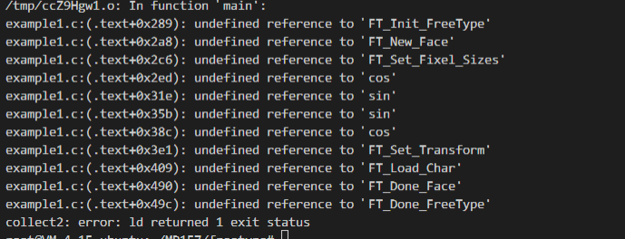

```c
gcc example1.c -I /usr/local/include/freetype2/ -lfreetype//指定库文件
```

数学函数没定义

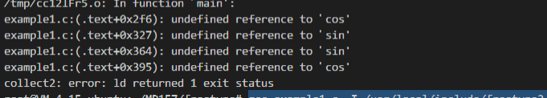

```
gcc example1.c -I /usr/local/include/freetype2/ -lfreetype -lm
```

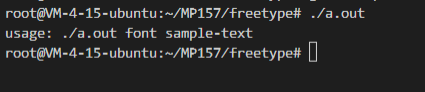

将win10的字体文件cp到可执行文件的目录下，执行后看不到abc是因为每行输出640个字符根本看不到

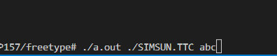

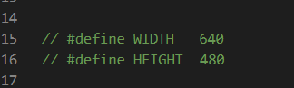

修改640 480为100,50，显示的位置修改为0,40

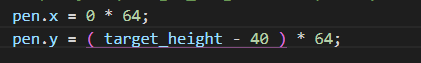

```
./a.out ./SIMSUN.TTC aaaa//可执行文件+字体文件+显示数据
```

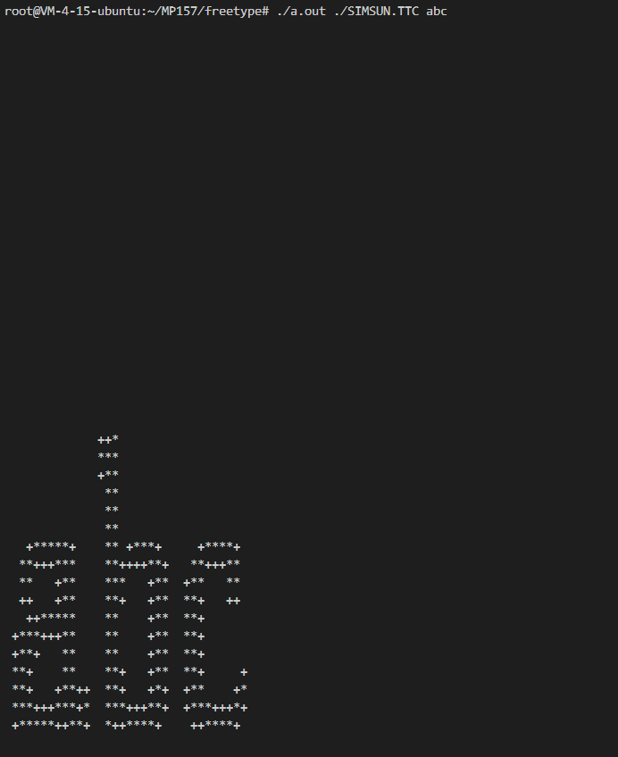

利用unicon显示汉字

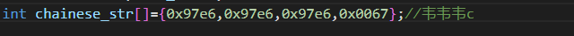


利用宽字符显示汉字

包含头文件

```
#include <stdlib.h>
```


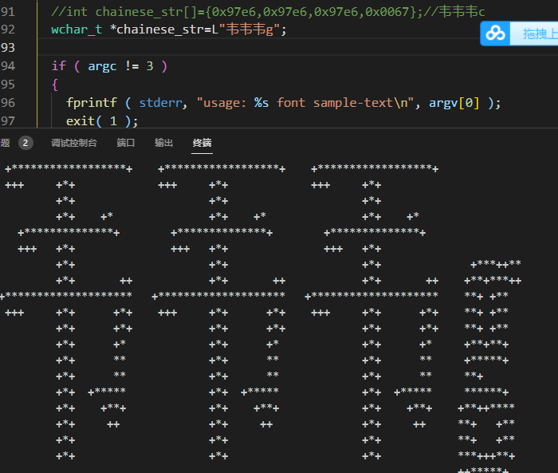

字符显示超过的原因

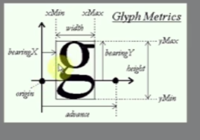

## ARM下使用freetype

第一步解压文件

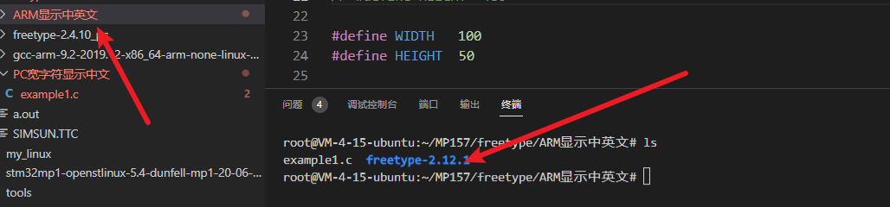

在根文件系统下新建freetype目录，并且新建include lib用来存放freetype的源码

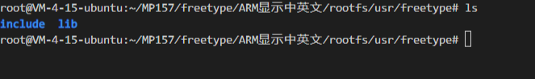

第二步配置

```
./configure --host=arm-none-linux-gnueabihf
```

第三步make

```
make
```

第三步安装，安装之前先创建临时目录用来暂时存放安装的数据

```
make DESTDIR=$PWD/tmp install
```

缺少lz，将libz.so放在arm-...bin下面

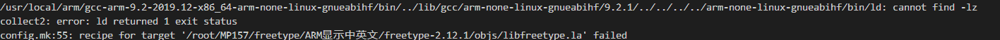

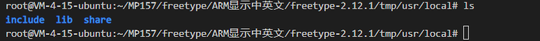

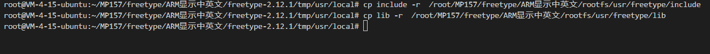

头文件不存在

```
arm-none-linux-gnueabihf-gcc example1.c -I /root/MP157/freetype/ARM显示中英文/rootfs/usr/freetype/include/include/freetype2
```

stdio.h的路径

```
/root/MP157/tools/gcc-arm-9.2-2019.12-x86_64-arm-none-linux-gnueabihf/arm-none-linux-gnueabihf/libc/usr/include/stdio.h
```

库文件放在这里

```
/usr/local/arm/gcc-arm-9.2-2019.12-x86_64-arm-none-linux-gnueabihf/arm-none-linux-gnueabihf/lib
```

缺少libz.so的动态库

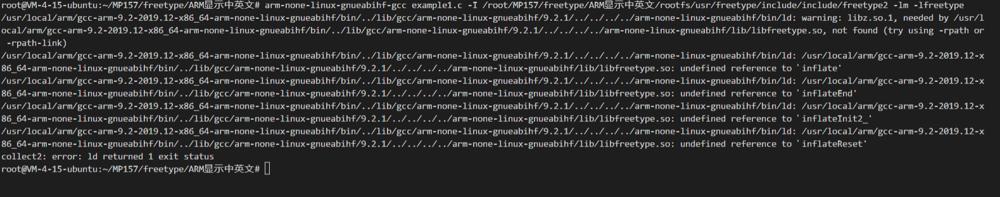

加上lz

```
arm-none-linux-gnueabihf-gcc example1.c -I /root/MP157/freetype/ARM显示中英文/rootfs/usr/freetype/include/include/freetype2 -lm -lfreetype -lz
```

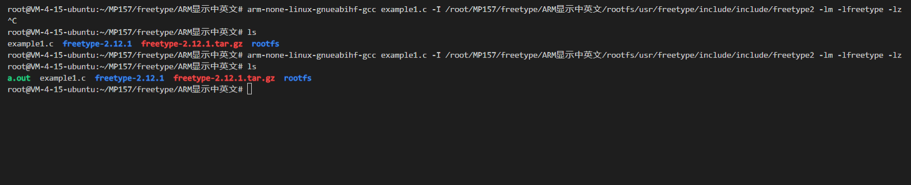

### 在开发板上运行

将上面的a.out放在开发板的根文件系统下，运行出现如下错误

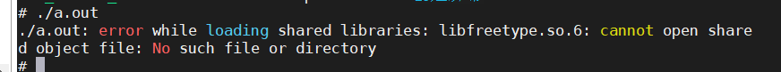

将lib里面的库文件都复制到板子的lib里面

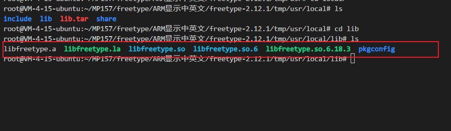

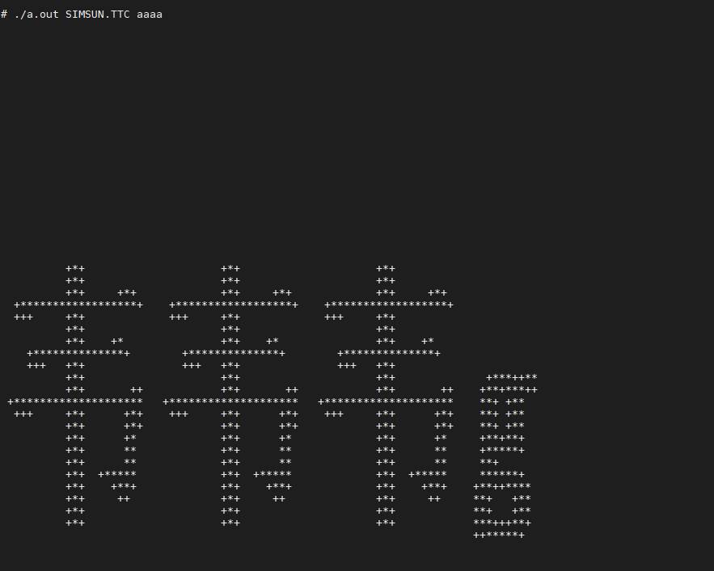

屏幕显示文字