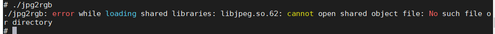
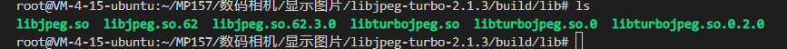
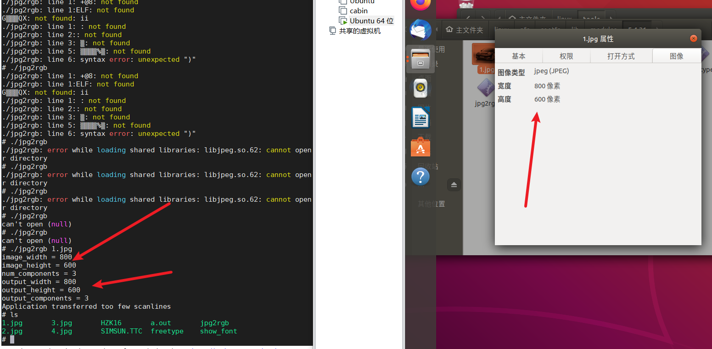

# 显示图片

把ipg图片解压出RGB原始数据

利用libjpg库解压jpg图片


安装libjpeg-turbo库

[官网获取](https://sourceforge.net/projects/libjpeg-turbo/)

[环境搭建](https://blog.csdn.net/qq_28525665/article/details/99869658)

新建build目录


进入以后创建makefile

基于x86

```
all:
	cmake -G"Unix Makefiles"  -DCMAKE_INSTALL_PREFIX=/root/MP157/数码相机/显示图片/libjpeg-turbo-2.1.3/build/libjpeg-turbo/build-arm/libs-build /root/MP157/数码相机/显示图片/libjpeg-turbo-2.1.3/build
```

```
make 
make -j 8
make install 
```

基于arm

```
all:
	cmake -G"Unix Makefiles"  -DCMAKE_INSTALL_PREFIX=/root/MP157/数码相机/显示图片/libjpeg-turbo-2.1.3/build/libjpeg-turbo/build-arm/libs-build /root/MP157/数码相机/显示图片/libjpeg-turbo-2.1.3/build -DCMAKE_C_COMPILER=arm-none-linux-gnueabihf-gcc -DCMAKE_SYSTEM_PROCESSOR=arm -DCMAKE_SYSTEM_NAME=Linux
```

编译

```
all:
	arm-none-linux-gnueabihf-gcc jpg2rgb.c -I /root/MP157/数码相机/显示图片/libjpeg-turbo-2.1.3/libjpeg-turbo/build-arm/libs-build/include/  -L /root/MP157/数码相机/显示图片/libjpeg-turbo-2.1.3/build -ljpeg -o jpg2rgb
```

执行缺少库文件





执行

